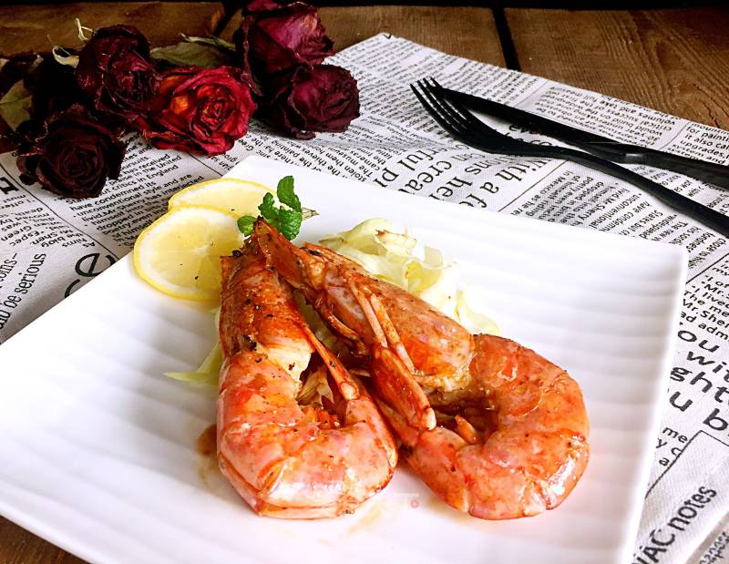

# 干煎阿根廷红虾的做法

平常所见到虾，只有赴“汤”蹈“火”后，才能红！阿根廷虾很任性，一红就红一辈子！跟它住在北极的亲戚，北极虾一样，天生红。

阿根廷红虾，之所以这么红，是因为它生活在深海中，使得它体内含有丰富的碘、磷及珍贵的虾青素等微量元素，能够增强人体免疫力，还对心脏活动具有重要调节作用，可以减少血液中的胆固醇含量。

阿根廷红虾，不仅个大肥美，虾肉白如凝脂，细腻腴滑，口感鲜嫩，味道甜香浓郁，是虾类料理界的宠儿，看着真让人垂(chao)涎(ji)欲(xiang)滴(chi)，快享受这大快朵颐的欢愉吧！

预估烹饪难度：★★★

## 必备原料和工具

- 阿根廷红虾（选用了 Costco 的速冻虾）
- 地中海海盐（研磨装）
- 黑胡椒（研磨装）
- 白葡萄酒
- 生抽
- 香菜
- 柠檬
- 洋葱
- 生姜
- 大蒜

## 计算

- 阿根廷红虾 2-3 只
- 地中海海盐 5g
- 黑胡椒（研磨装）
- 白葡萄酒 20ml
- 生抽 1ml
- 香菜 3 片
- 柠檬 1 片
- 洋葱 10g
- 生姜 10g
- 大蒜 10g

## 操作

- 阿根廷红虾解冻，最好是提前一天从速冻取出放到冷藏里自然解冻，能更好保持风味和口感。Costco 买的是已经开背去虾线的，节省了不少时间
- 解冻好的红虾洗净擦干备用，注意这里一定要沥干水分，赶时间可以用厨房用纸吸干水分
- 生姜切片，洋葱切小方块，香菜洗干净后，叶茎分离，把香菜叶切碎，大蒜压碎切成小块碎末
- 大火热锅，热锅后倒入两调羹橄榄油，等油温升高后，放入生姜片，洋葱块和香菜茎煸炒
- 约一分钟后取出生姜，洋葱和香菜茎，弃用
- 调中大火，放入红虾开始煎，注意所有虾需要单面都完整接触平底锅，煎约 2 分钟，同时给每只虾刷上一层油
- 待底面虾壳有微微焦黄时翻面，并撒入大蒜碎末，轻微晃动平底锅使得受热均匀
- 约 1 分钟后添加 20ml 白葡萄酒
- 再煎 1 分钟后调中小火，均匀撒上一层盐和黑胡椒
- 给每只虾滴上一滴生抽
- 撒上香菜叶，装盘
- 切好柠檬片，摆放到盘边即可

## 附加内容

- 柠檬可提升虾的口感，但偏酸，可以根据喜好添加，也可以不用
- 趁热吃

如果您遵循本指南的制作流程而发现有问题或可以改进的流程，请提出 Issue 或 Pull request 。
