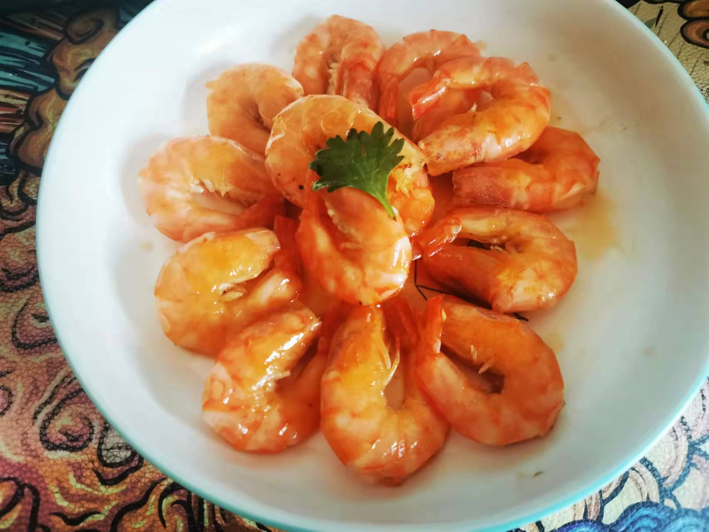

# 油焖大虾的做法

预估烹饪难度：★★★★

## 必备原料和工具

- 黑虎虾 or 明虾、
- 葱、姜
- 料酒、盐、冰糖、植物油

## 计算

 1 人食用的版本。

- 虾 10 只
- 花椒 5g
- 葱 50g
- 姜 20g
- 黄酒 30g
- 盐 3g
- 冰糖 10g
- 植物油

## 操作

- 剪虾枪到根上，虾须虾爪都剪掉，沙包挑掉，开背虾线挑出来，洗净备用
- 炸料油
  - 油温三成热放花椒，油热离火，放葱姜（不要让油变色最好）葱稍微变黄沥油 （葱油弄多了可以留着作为拌面使用）。
- 下油，虾摆放整齐，两面变色后轻轻摁虾头
  - 放姜米（姜切成细颗粒）
  - 黄酒 30g
  - 水两小碗
  - 盐 3g
  - 冰糖 10 克
- 大火烧开转小火盖盖子闷（中途不能再加汤水，不要开盖）
- 皮亮虾弯就可以起锅，虾摆盘
- 收汁（过滤后倒回锅里收浓，放葱油 ） 汤汁剩余 1/4 时。
- 浇汁
- 完成
- 
- 开吃✅

## 附加内容

- 做法参考：B 站老饭骨视频[从小吃到大的油焖大虾居然是假的？泰斗级大师还原真·味道](https://www.bilibili.com/video/BV17f4y1W7z9)

如果您遵循本指南的制作流程而发现有问题或可以改进的流程，请提出 Issue 或 Pull request 。
