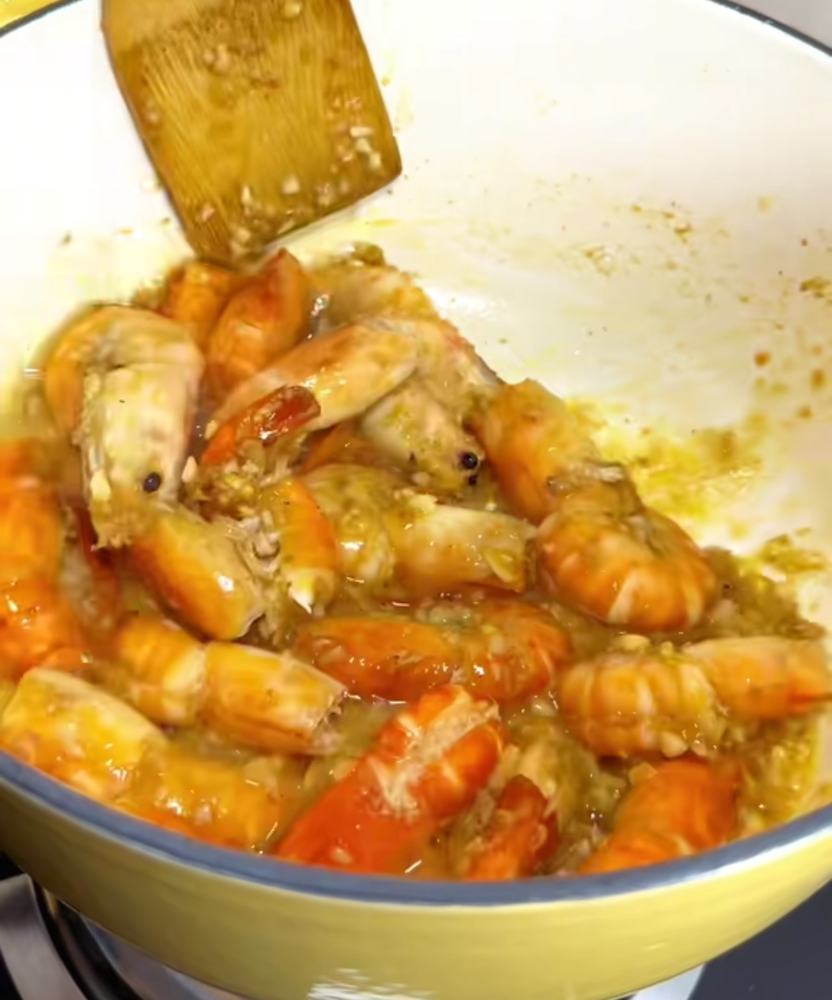

# 蒜香黄油虾的做法

蒜香黄油虾是一道经典的西式海鲜料理，以鲜虾为主料，配以蒜末和黄油烹制而成。口感鲜嫩，蒜香浓郁。制作简单，适合家庭日常烹饪。

预估烹饪难度：★★

## 必备原料和工具

- 大虾（推荐黑虎虾或基围虾）
- 无盐黄油（推荐安佳）
- 大蒜
- 白葡萄酒（可选）
- 柠檬
- 平底煎锅
- 厨房用夹

## 计算

每次制作前需要确定计划做几份。一份正好够 1-2 人食用。

每份：

- 大虾 8-10 只（约 200g）
- 无盐黄油 30g
- 大蒜 4 瓣（约 20g）
- 白葡萄酒 15ml（可选）
- 柠檬 1/4 个
- 橄榄油 10ml

## 操作

- 大虾去头去壳留尾，用牙签挑去虾线，洗净后用厨房纸吸干水分
- 大蒜切成蒜末，备用
- 中火加热平底锅，放入 10ml 橄榄油
- 油热后放入大虾，每面煎 1-1.5 分钟至变色，取出备用
- 同一锅中加入黄油，融化后放入蒜末，小火炒香（约 30 秒）
- 如使用白葡萄酒，此时加入并煮至酒精挥发（约 1 分钟）
- 将虾放回锅中，与蒜香黄油酱汁翻炒均匀（约 1 分钟）
- 挤入柠檬汁，翻炒均匀后立即关火
- 装盘，淋上锅中剩余酱汁

## 附加内容

- 虾不宜过度烹饪，否则会变硬

如果您遵循本指南的制作流程而发现有问题或可以改进的流程，请提出 Issue 或 Pull request 。
