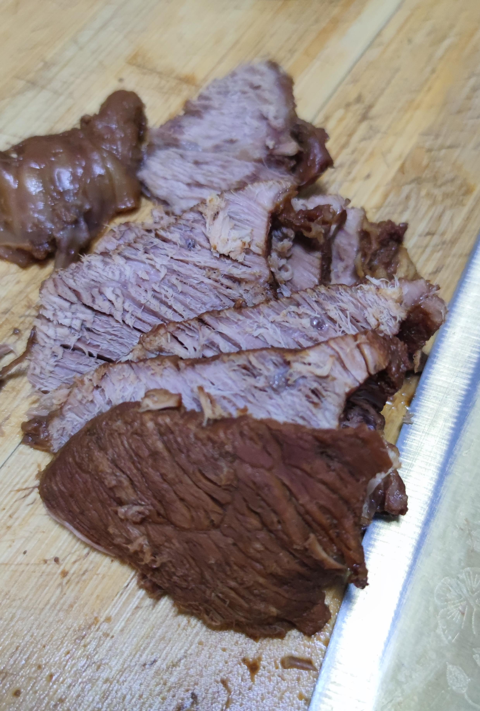

# 家常酱牛肉的做法

酱牛肉营养丰富，味道香，不论是当作主食还是佐餐都很棒。一般初学者只需要 3 小时即可完成。

## 必备原料和工具

- 牛肉
- 香叶
- 姜
- 葱
- 老抽
- 桂皮
- 冰糖
- 花椒
- 料酒
- 生抽
- 盐
- 八角
- 黄豆酱

## 计算

每份：

- 牛肉2000克
- 香叶1片
- 姜3片
- 葱半根
- 老抽3勺
- 桂皮1快
- 冰糖7-8粒
- 花椒15粒
- 料酒6勺
- 生抽3勺
- 盐8克
- 八角4个
- 黄豆酱3勺

## 操作

- 牛肉浸泡4-6小时，加料酒、姜片，去除血水
- 牛肉切成8cm，不超过10cm的肉块
- 牛肉放入锅中，加入冷水至水面没过牛肉，开锅至水沸腾开始及时，3分钟后停火，捞出牛肉，用温水洗净
- 将洗净后的牛肉放入砂锅或炖锅，加水没过牛肉，开大火，放入除盐之外的其他配料。
- 水开之后，大火转为小火，持续加热90分钟，加盐
- 加盐后，继续小火90分钟（注：每30分钟确认水位线，要求至少达到牛肉面高度的80%）
- 加热180分钟后，捞出牛肉，自然冷却，切片
- 上桌食用，其他牛肉建议不切片冷藏。

## 附加内容

- 操作时，需要注意观察沸腾的水位线，如发现低于 2/3 的食材应加热水至没过食材（约每30分）。

### 参考资料

- [下厨房app中我的食谱](http://www.xiachufang.com/recipe/106670199/)

<!-- 必须保留下面的文字。 -->
如果您遵循本指南的制作流程而发现有问题或可以改进的流程，请提出 Issue 或 Pull request 。

<!-- 在提交PR前，请删除模板中的注释。 -->
