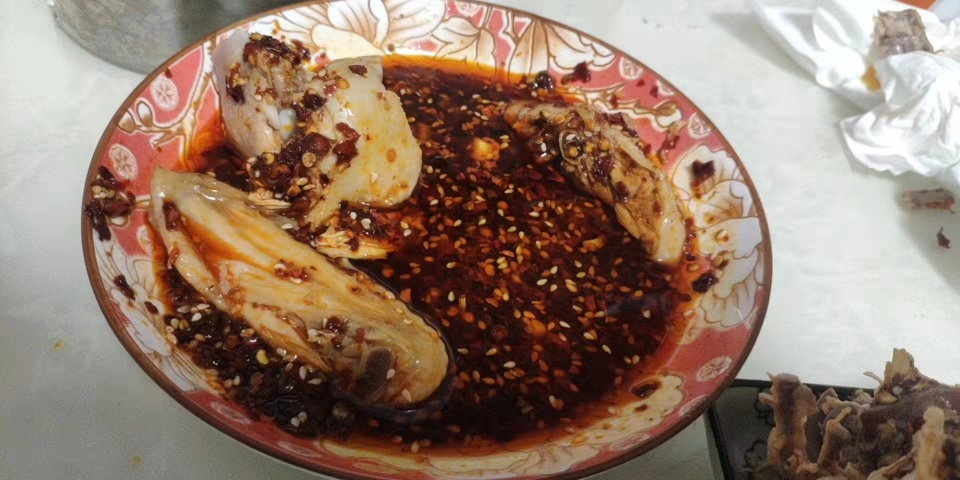

# 油泼辣子的做法

制作耗时 10 分钟

预估烹饪难度：★★★

## 必备原料和工具

- 蒜头
- 干辣椒面
- 盐
- 熟白芝麻
- 小米椒
- 花生油（可用菜籽油替换）
- 家庭小陶瓷碗
- 家庭铁勺子
- 五香粉 （可选）
- 草寇（可选）
- 小葱 （可选）
- 八角
- 花椒
- 香叶
- 白芷
- 姜片（可选）
- 糖
- 白醋

## 计算

- 蒜头 1 个
- 干辣椒面 100 克
- 盐 5 克
- 熟白芝麻 15 克
- 小米椒 1 个
- 花生油 150 毫升 （可用菜籽油替换）
- 五香粉 10 克（可选）
- 草寇 1 个（可选）
- 小葱 3-5 根（可选）
- 其他配料：八角(1)、花椒（20-50 粒都可，看个人口味）、香叶（2-3 片）、白芷（2-3 片）、姜片（大拇指粗细的姜切片）（可选）
- 糖 30 克
- 白醋 5 ml（大概就是小铁勺子的量）

## 操作

- 拿出蒜头掰 2 个`小蒜头`去皮
- 拿出砧板剁碎`小蒜头`、`小米椒`
- 拿出碗倒入`花生油`
- 油热放入`其他配料`和`小葱`,等到香料变焦，捞出扔掉
- 拿出铁锅将碗内的油放入加热 2 分钟（菜籽油烧至冒烟）
- 此时是空碗
- 往空碗加入`干辣椒面`、`白芝麻`、`蒜末`、`小米椒`、`盐`、`五香粉`、`草寇`作为"调料"
- 关火将油温冷却至 `210` 摄氏度
- 将锅内热油倒入碗内并用勺子搅拌即可（可以在 `165` 摄氏度时加入同样"调料"的碗最后进行混合进行增辣）
- 倒入热油稍微搅拌后放入白醋，此时会重新沸腾。继续进行搅拌，白醋增香。
- 油泼辣子冷却到温热放白糖和味精，白糖可以是辣味柔和，不会那么的呛口

## 附加内容

- 五香粉、草寇作为"调料"加入，可以增加香味，使油泼辣子更香

如果您遵循本指南的制作流程而发现有问题或可以改进的流程，请提出 Issue 或 Pull request 。
