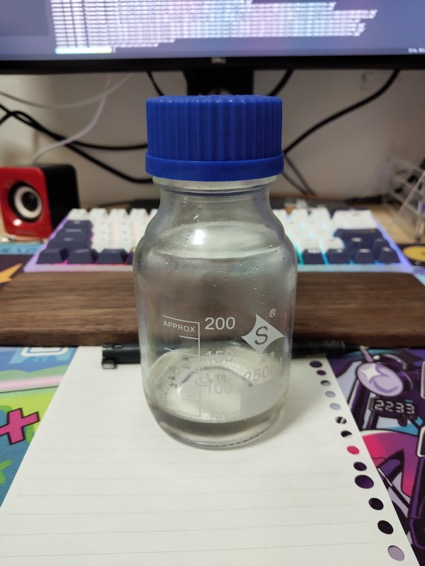

# 蔗糖糖浆的做法

将糖事先溶解好便于在配制饮料（特别是冷饮）时给饮料增甜

## 必备原料和工具

原料
- 白砂糖
- 水

工具
- 可密封容器（建议使用高硼硅试剂瓶，便宜）

## 计算

建议比例=>糖 : 水 = 1 : 1，这样方便进行糖量控制，比如想要 15 克糖，就量取 30 克的糖浆
- 水 100 克
- 白砂糖 100 克

## 操作

1. 将称好的白砂糖的饮用水于容器混匀
2. 容器封盖放冰箱冷藏

## 附加内容

水无论冷热都可，如果比较急用，可用热水溶解后再冷却糖浆。

配制好的糖浆不会轻易变质，在冷藏状态下保存一周通常是没问题的。

如果您遵循本指南的制作流程而发现有问题或可以改进的流程，请提出 Issue 或 Pull request 。
