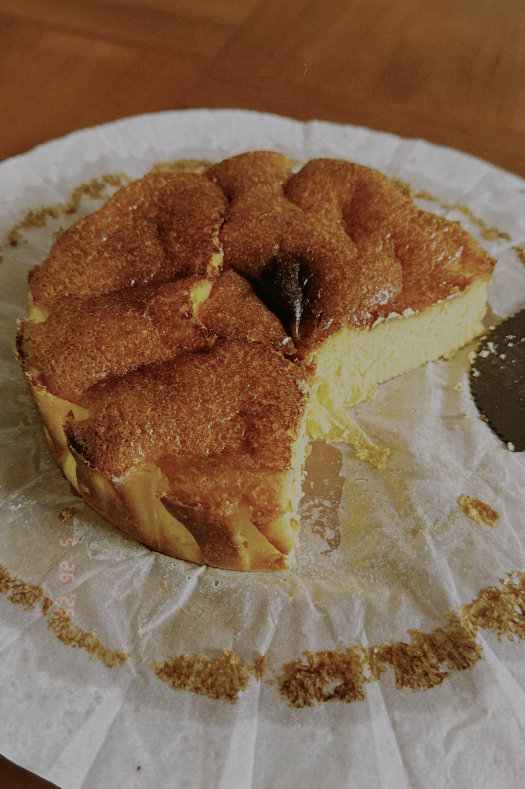

## 原味巴斯克芝士蛋糕的做法

巴斯克芝士蛋糕是下午茶以及甜品店中很常见的一道甜品，原味是做法最简单的一种巴斯克蛋糕。出品时间约半个小时（不算冷冻定型），预计成品尺寸为6寸。

预估烹饪难度：★★★

## 必备原料和工具

- 奶油奶酪（电商平台购入或者当地超市）
- 白砂糖
- 鸡蛋
- 淡奶油
- 鸡蛋
- 玉米淀粉
- 打蛋器（可用筷子或者勺子代替）
- 空气炸锅（品牌看喜好挑选即可，建议买5L左右的）
- 6寸蛋糕模具
- 巴斯克蛋糕油纸

## 计算

- 奶油奶酪 225g（超市一整块大小）
- 鸡蛋 2个全蛋1个蛋黄
- 白砂糖 60g
- 淡奶油 125ml
- 玉米淀粉 12g

## 操作

- 室温下融化奶油奶酪或者隔热水搅拌至融化
- 下入白砂糖并搅拌均匀至顺滑
- 下入一颗蛋黄并搅拌均匀，然后依次加入剩余两个鸡蛋，搅拌均匀至无明显蛋白（这一步需要有耐心，可以减少后续过筛次数）
- 倒入准备好的淡奶油，搅拌均匀
- 过筛加入玉米淀粉并搅拌
- 将油纸加入模具
- 蛋糕液过筛（这一步可以多过几次筛，确保蛋糕液丝滑）
- 空气炸锅180° 20分钟，结束调整温度至200°再转5分钟上色
- 待蛋糕冷却到室温后，连同模具一起拿到冰箱冷藏至少三小时（一晚上最好），冻的越久口感越好

## 附加内容

- 一定要有耐心，冷却到室温之后再放入冰箱当中冷藏，否则有可能出现出水的情况，会影响口感
- 白砂糖可以用代糖替代，60g的甜度我个人觉得刚刚好，可以随自己口味增减
- 奶油奶酪推荐Kiri，奶味比较浓郁

如果您遵循本指南的制作流程而发现有问题或可以改进的流程，请提出 Issue 或 Pull request 。
