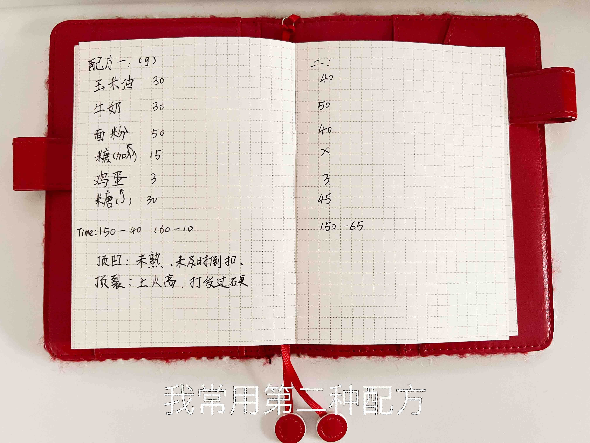
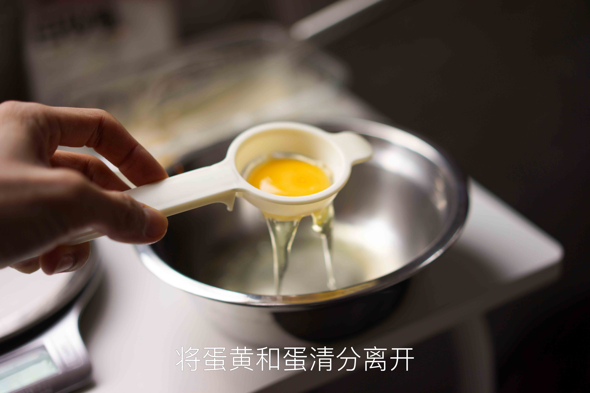
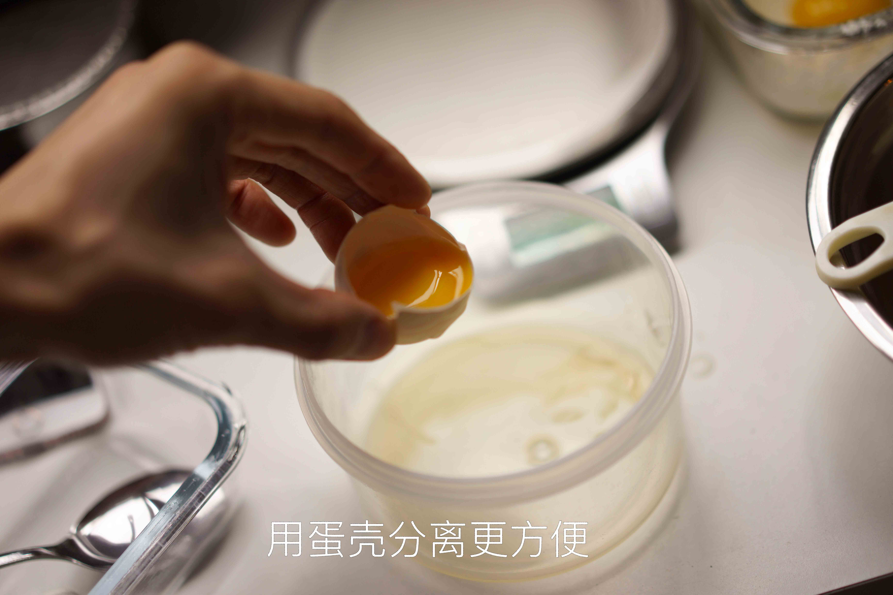
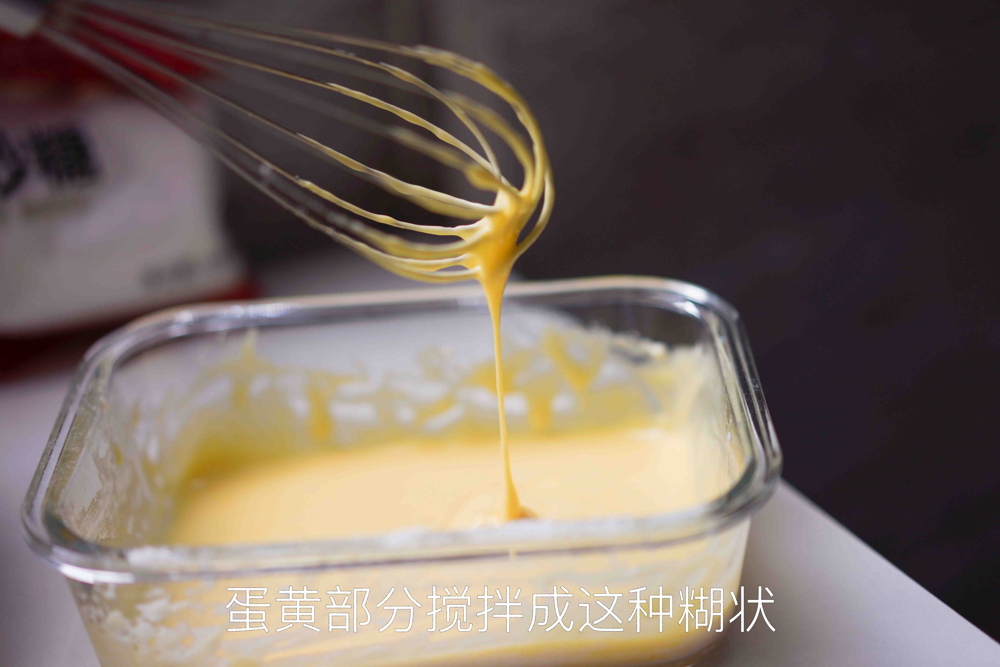
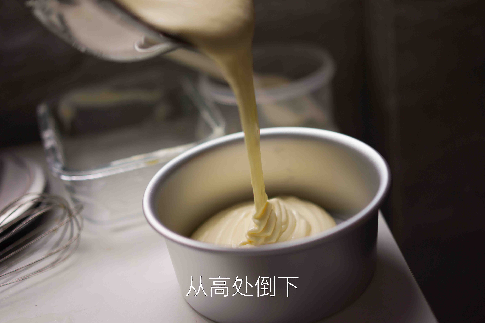
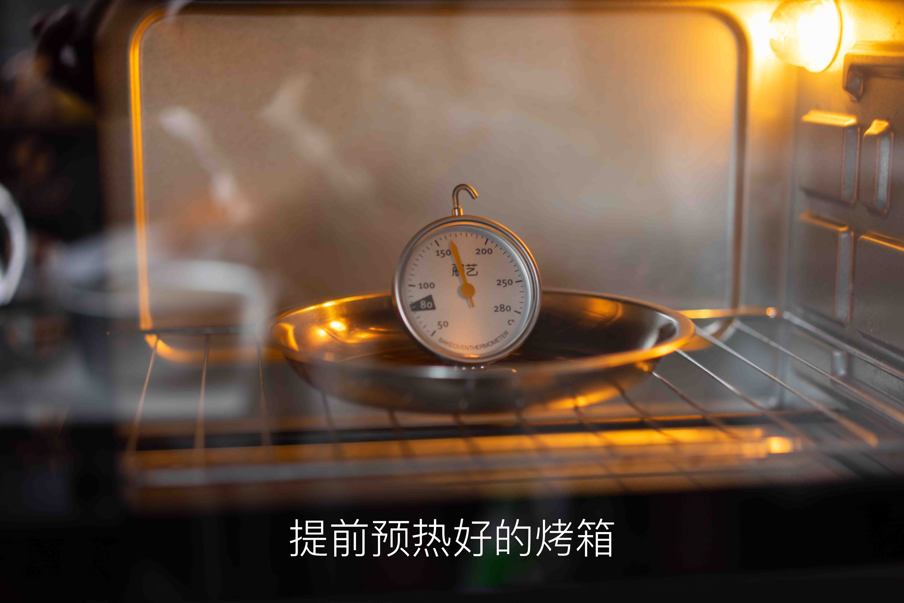
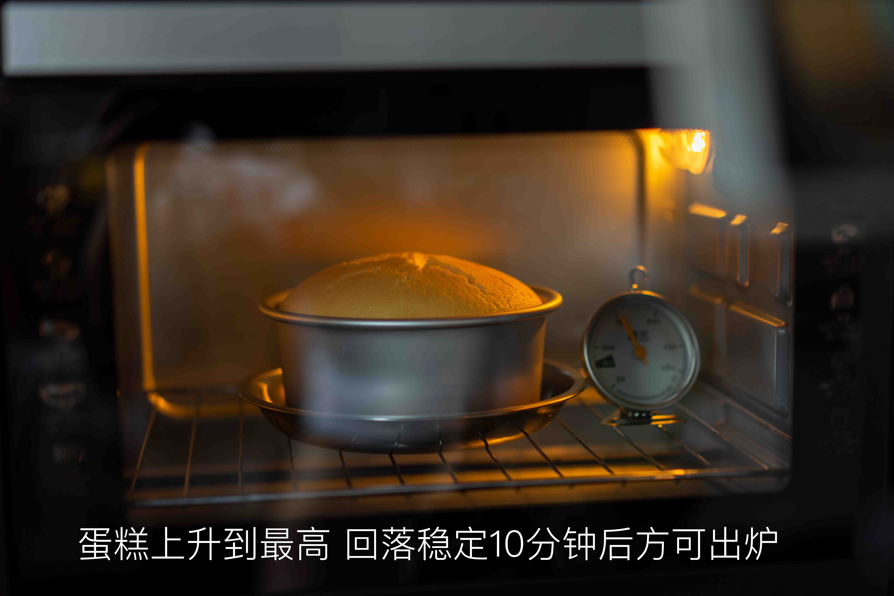

# 戚风蛋糕的做法

戚风蛋糕是一道烘焙入门菜品，有一定操作难度。但成功制作后，其口感细腻绵软，令人回味。加上烘烤时间，一般初学者需要 **1.5 - 2 小时**即可完成。

## 必备原料和工具

### 工具

* 烤箱（电饭锅可替代，但大多情况下由于锅胆材质问题易失败）
* 打蛋器（电动最好，手动费力且有一定失败概率）或筷子（非常不推荐）
* 铝合金阳极模具（千万不能选不沾模具，常用尺寸为 6 寸或 8 寸）
* 刮刀（用于翻拌蛋糕糊）

### 原料

- 鸡蛋
- 白糖
- 牛奶（或水）
- 食用油（或黄油，但需加热软化）
- 低筋面粉（推荐惠宜）
- [可选] 柠檬汁或白醋

## 计算

每份（12 个面积单位）：

- 1 个鸡蛋（正常中等大小，约 50g）
- 白糖 16g
- 食用油 8g
- 牛奶 10g
- 低筋面粉 17g

具体来说，对于常见 6 寸及 8 寸蛋糕：

* 6 寸：大小为 3 份（即三个鸡蛋）。面积 36 个单位。
  * 鸡蛋 3 个，白糖 50g，食用油 25g，牛奶 30g，低筋面粉 50g
* 8 寸：大小为 5 份（即五个鸡蛋）。面积 64 个单位。
  * 鸡蛋 5 个，白糖 80g，食用油 40g，牛奶 50g，低筋面粉 90g

## 操作

### 前期分离操作

* 从冰箱中取出新鲜的鸡蛋
* 准备两个容器并擦干，分别盛放蛋清与蛋黄
* 对盛放蛋清的容器，可稍有水珠，但**不能有任何油**；盛放蛋黄的容器不能有水珠
* 打蛋，手工或利用分蛋器，将蛋清与蛋黄分离到两个容器中。
* 分离过程中蛋黄不能破碎，**蛋清中不能混有任何蛋黄**，否则会严重影响打发。（白色系带可进入蛋清，不影响）
* （注意，不使用厨房机的情况下，盛放蛋清的容器也是打蛋的容器，为避免溢出，加入全部蛋清后不要超过容器的 **1/8**）

本步骤之前的描述存在一定问题并已修改，感谢 Issues(#593)中 @ABAEX 指出：

> 蛋清容器而言，可有水珠，蛋黄容器不能有。
>
> 原因：油会影响蛋白的打发，蛋清85%是水，稍有水珠并不影响打发。
> 特别新鲜的鸡蛋蛋清会比较硬，应对硬蛋清 5个鸡蛋配方的话加一勺水(15g)会帮助蛋清打发（1个鸡蛋配方则是3g水）
> 而蛋清打发途中加的糖，实际也是先融于蛋清中的水里，成为糖浆溶液包裹在气泡外，对打发的气泡起保护作用。
> 温度对糖融于水的速率以及溶解度影响较大，刚从冰箱拿出的蛋清不易打发。但温度较低的鸡蛋容易分离蛋清蛋黄，建议分离后恢复室温再进行打发。
### 搅拌蛋黄液

* 向蛋黄中加入食用油、牛奶以及 **1/4** 的白糖，用刮刀搅拌均匀
* 准备好低筋面粉，一边慢慢撒入容器一边用刮刀“Z 字形搅拌”（之字形搅拌），即刮刀只能沿着刀刃的方向左右或前后移动。**不可无序地逆时针或顺时针搅拌**
* 继续，加入全部面粉，仍使用上述搅拌方式，直到混合均匀、无干粉状态。（少许团块是正常现象，可继续搅拌使其分散）
* 静置，备用

感谢 Issues(#593)中 @ABAEX 指出，本步骤有另一种不同的顺序：

> 可先加入油，然后放入低筋面粉搅拌，油会直接阻断面筋的形成，较为省事。
> 之后加入蛋黄和牛奶继续搅拌，此时再加入含水的牛奶也不会让面粉形成面筋了。

### 打发蛋白

* 准备好剩余 **3/4** 的白糖。分为三份，每份为总量的 **1/4**
* [可选] 蛋清中加入柠檬汁或白醋
* 打蛋器中速，打发蛋白至有*粗大气泡的状态*，加入**第一份白糖**
* 打蛋器高速，打发蛋白至*气泡较细腻的状态*，加入**第二份白糖**
* 打蛋器高速，打发蛋白至*“湿性发泡”*的状态（此时提起打蛋器头，有长长的弯曲尖角），加入**第三份白糖**
* 打蛋器中低速，打发蛋白至“干性发泡”的状态（提起打蛋器头，有短小直立的尖角；倒扣容器，蛋白可粘住容器不掉下来）
* 此时蛋白打发程度已符合要求
* （ps：关于蛋白状态的判断可参考附件链接中的图片。）
* （ps2：打蛋器应尽量贴近容器底部，防止出现上面浮着的表层打发，底部仍然是液体的情况）

### 混合搅拌

* 简单搅拌几下蛋黄液
* 用刮刀取 **1/3** 的蛋白霜，加入到蛋黄糊中
* 采用“翻拌”的手法，此手法是为了避免消泡。从附录中摘录一段：

  > 具体的翻拌手法是先用右手拿刮刀从搅拌盆中心插入面糊底部，然后向8点钟方向刮去直到碰到盆壁，顺势舀起面糊提到空中，然后再移回盆中心将面糊放入盆内，左手握住搅拌盆从9点钟方向转到7点钟方向，刚好旋转了60度，就完成了一次循环，速度大约是1秒钟两下。此方法出自《小岛老师的蛋糕教室》，我个人觉得非常好用。用接地气的话说就是，像炒菜一样翻炒。

* 将 **1/3** 的蛋白霜与蛋黄液的混合液倒入剩余 **2/3** 的蛋白霜中，继续翻拌均匀
* 将蛋糕糊倒入模具，震荡几下避免大气泡

### 烘烤

* 烘烤总时间：6 寸蛋糕 **30-35** 分钟，8 寸蛋糕 **50** 分钟。根据自己烤箱特性灵活调整，一般不超过 $\pm 5$ 分钟。（最后几分钟时可在烤箱前观察）
* 选择**变温烘烤**，分为两个阶段。
  * 第一阶段烤箱设定温度为：上管 **150** 摄氏度，下管 **160** 摄氏度；
  * 第二阶段温度为：上管 **160** 摄氏度，下管 **170** 摄氏度；
* 以**与第一阶段烘烤温度相同的温度预热**，约 10 分钟可到达预定温度。（建议有经验后，在混合搅拌开始时即可预热）
* 预热完成后，将模具放入烤箱下层
* 烘烤总时长的前 **3/5** 为第一阶段烘烤，后 **2/5** 时长为第二阶段烘烤。切换时，直接调整烤箱温度即可。
* 烤好后，出炉

### 冷却与脱模

- [可选] 将模具从高处落下，震出其中的热气
- 模具倒扣使蛋糕冷却
- 脱模，食用

## 附加内容

- 参考了以下教程，文中说明非常详细且有每一步骤的配图。同时，对于为什么做某一个操作、背后的原理也有阐释，以及出现某些问题的分析：
- [为了做好这个戚风蛋糕，我用了一整箱鸡蛋，从此告别凹底和塌陷](https://zhuanlan.zhihu.com/p/86865919)
- 对戚风蛋糕而言，蛋清打发是次要问题，关键是**烤制时的温度和时间**。

- 一些参考图片

  

  

  

  

  

  

  

  

  

如果您遵循本指南的制作流程而发现有问题或可以改进的流程，请提出 Issue 或 Pull request 。
