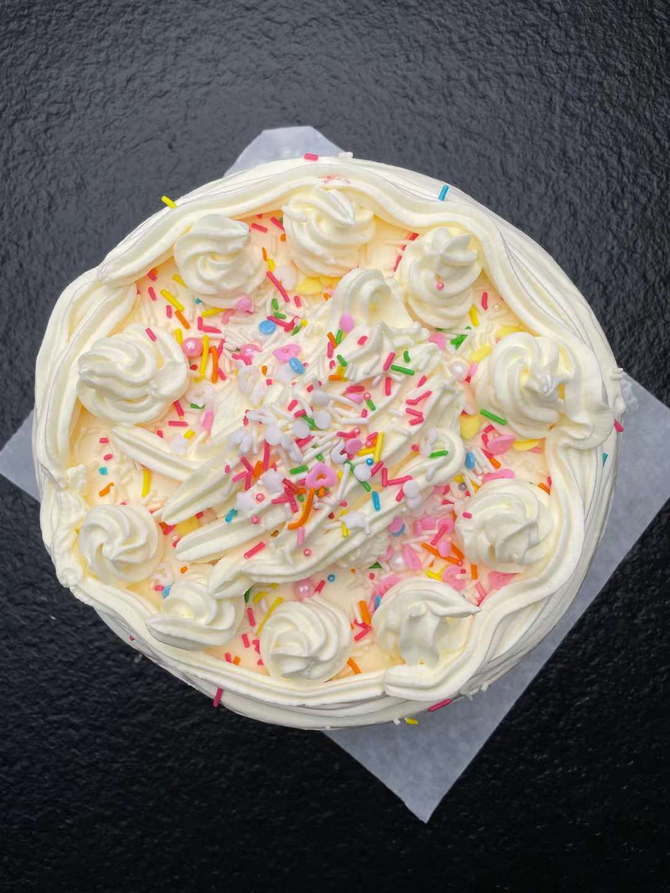
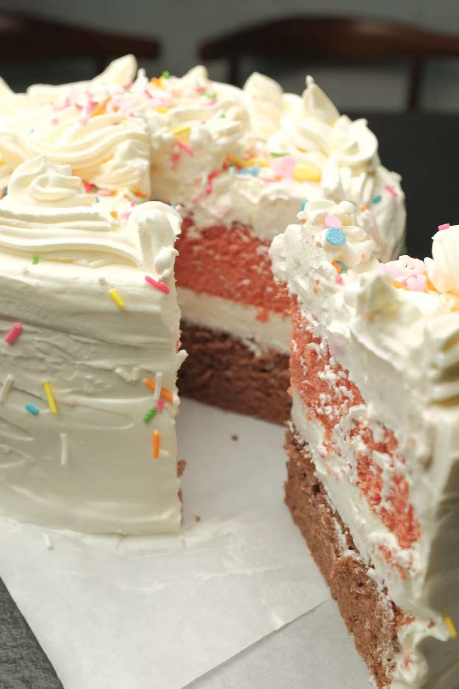
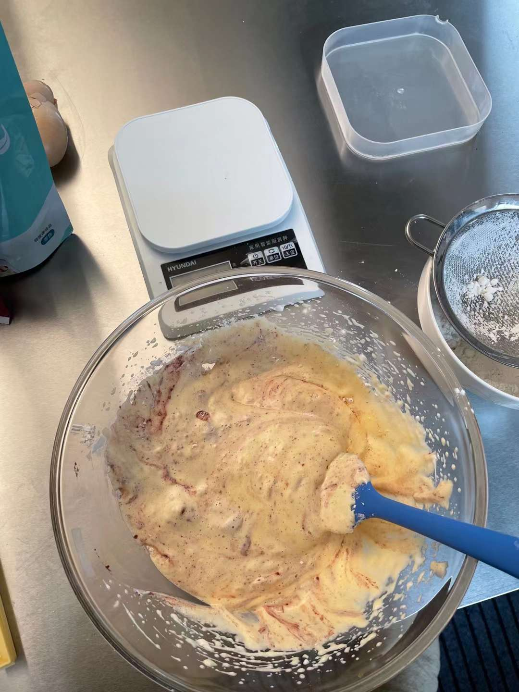
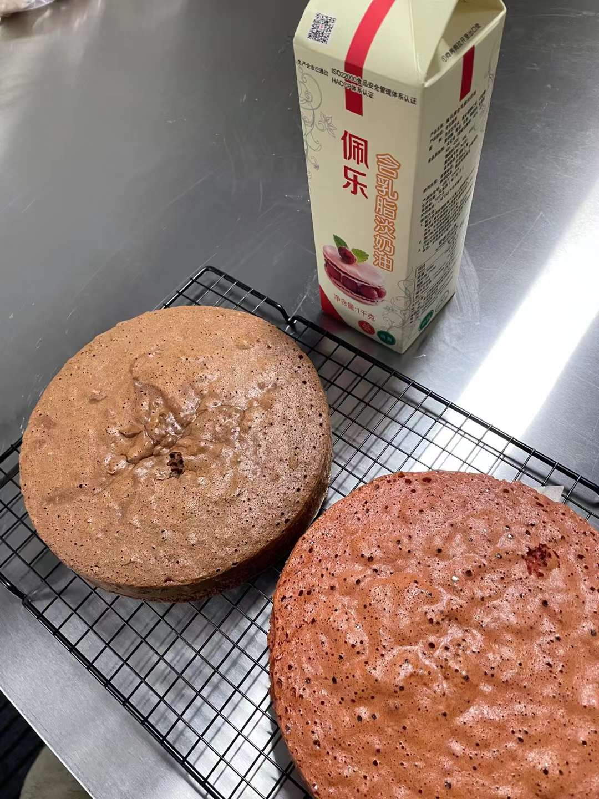
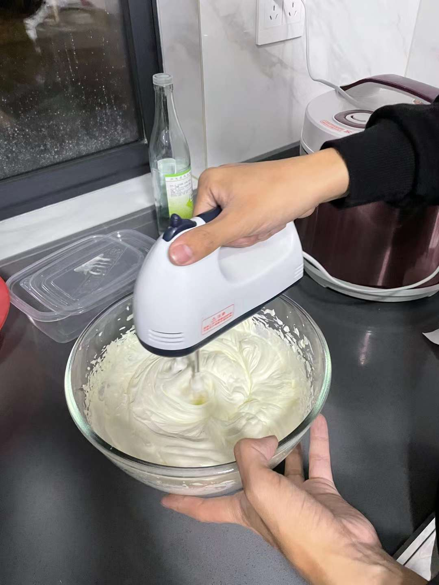
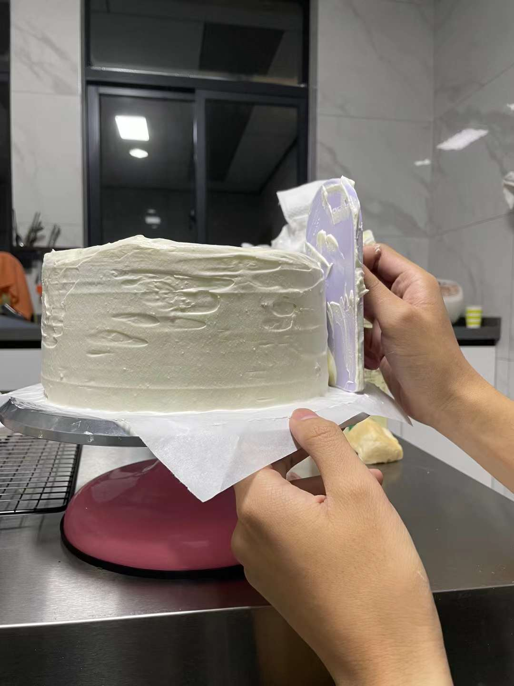
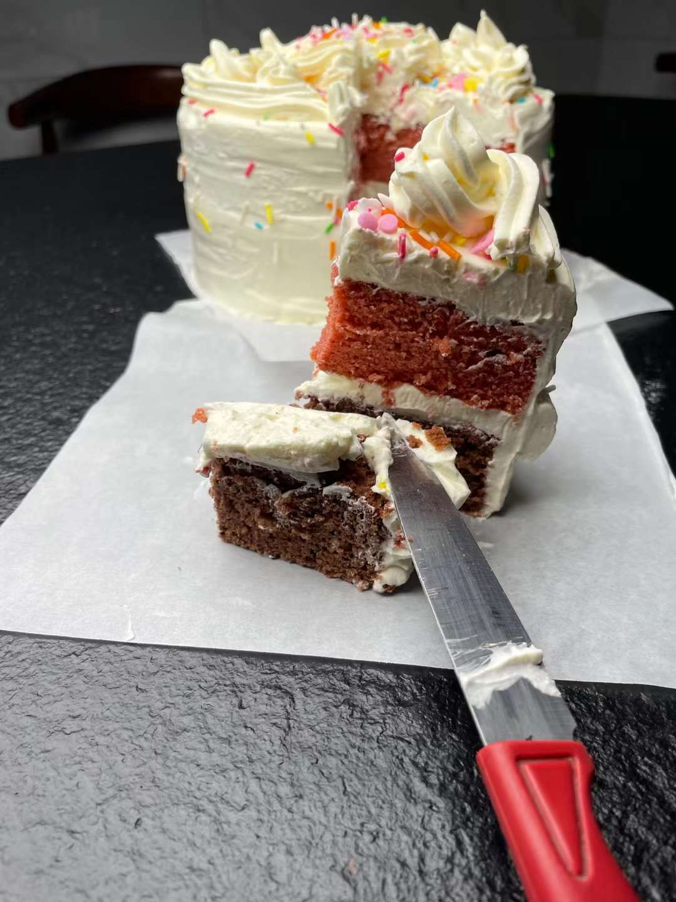

<!-- 这是 HowToCook 菜谱仓库中的示例菜谱模板文件。 -->
<!-- 注意：在编写时，中文与英文或数字之间必须有且仅有一个空格。 -->
<!-- 注意：在编写时，标题与正文之间必须有且仅有一个空行。 -->

# 海绵蛋糕的做法

<!-- 标题必须是 `你的菜名` + `的做法`。和文件名一致。 -->

<!-- 如果有图片更好。 -->

<!-- 在这里简单介绍你的菜的特点、营养价值、难度、预计制作时长。 -->
海绵蛋糕是生日蛋糕常见的一种，具有长肉、哄妹纸开心的特点。因其量大味美，也有一定的社交价值，真是周末打发时光，与朋友增进感情的必备良品🐶

## 必备原料和工具

<!-- 在这里列出你的必需原料。以方便大家快速判断自己手边的材料是否足够。-->

<!-- 注意：某些原料已经在厨房采购部分提及。这里不要重复提及：燃气灶, 饮用水, 锅, 食用油, 碗与盘子, 筷子, 炒勺, 洗涤剂, 抹布, 钢丝球, 菜刀  -->

<!-- 你可以推荐购买哪个品牌的来方便决策。 -->
- 原料:
  - 鸡蛋
  - 白醋 有助于蛋白打发
  - 白砂糖 推荐用绵白糖，溶解更快
  - 黄油 动物黄油跟植物黄油都可
  - 低筋面粉 一定要低筋的，不然就做成了馒头了！
  - 淡奶油 如果不想自己调整奶油甜度，可以用甜奶油，后面的操作也不用加糖了
  - 装饰糖
- 工具:
  - 打蛋盆1只
  - 打蛋器1只
  - 刮刀1把
  - 勺子1把
  - 化油碗1只
  - 小碗1只
  - 烤箱纸
  - 烤箱
  - 8寸蛋糕磨具
  - 筛分器1个
  - 裱花台1个
  - 裱花袋1只

## 计算

<!-- 这一章节里介绍一些计算公式，求得原料的量、重要的时间参数、混合比例，以便在后续操作中引用。 -->
<!-- 这一章节可选。可以和上一章节合并。 -->

<!-- 这里有两种情况： -->
<!-- 1. 可能会大批量做菜。例如：食堂给全校学生做西红柿鸡蛋、米饭、米粥。这种情况需要给出计算公式。 -->
<!-- 2. 固定菜量的产品菜。每份的容量一致而永远不会发生变化。这种情况需要给出一份的量。 -->

每份：

  - 鸡蛋 3枚，带壳约200g左右，重量不够的话，酌情增减鸡蛋数量
  - 白醋 3g
  - 糖 90g + 60g 可以根据自己对糖的接受程度增减，但打发蛋白的糖不建议太少，因为糖是蛋白打发的关键之一
  - 黄油 30g
  - 低筋面粉 80g 
  - 淡奶油 250ml
  - 装饰糖 10g

## 操作

<!-- 在这里详细描述做菜的全部流程。 -->
<!-- 不允许使用不精准描述的词汇，例如：`适量`、`少量`、`中量`、`适当`。 -->
<!-- 在这里，如果操作的食材不是“全部食材”而是“部分食材”，也必须指明。否则默认指定的是全部原料。例如这里‘土豆’表示‘全部准备好的土豆’。 -->
- 蛋清蛋黄分离
- 保证蛋清里面无油无水，不要有蛋黄、加入白醋或者柠檬汁、再加入30g的白糖，高速打发
- 打发到有白色泡泡时候，倒入30g白糖，打到蛋白弯钩状
- 加入剩余30g白糖，低速打发到蛋白能立起来
- 分两次筛入低筋面粉，用刮刀拌匀，轻柔，由下至上翻拌
  - 同时预热烤箱到140摄氏度
- 融化黄油到50摄氏度，大概黄油完全融化
- 取一刮刀蛋糕糊拌入黄油里，拌匀，再拌入剩下的蛋糕糊里 
- 在蛋糕磨具里垫上烘焙纸，震一下去除大气泡
- 放入烤箱上下火，140摄氏度40分钟，150摄氏度10分钟上色
- 取出，撕去烘焙纸，晾凉，时间在两个小时左右。一定要晾凉，不然奶油抹上去就化了 
- 取淡奶油，加糖60g打发，加入裱花袋里 
- 将蛋糕胚放裱花台上，用刮刀抹上奶油 
- 撒上装饰
- 吃蛋糕 

## 附加内容

<!-- 在这里额外补充一些注意事项、参考资料、安全须知等。 -->
- 不建议在夏天制作，晾凉时间太长，不易保存。

<!-- 必须保留下面的文字。 -->
如果您遵循本指南的制作流程而发现有问题或可以改进的流程，请提出 Issue 或 Pull request 。

<!-- 在提交 Pull Request 前，请删除模板中的所有注释。 -->
