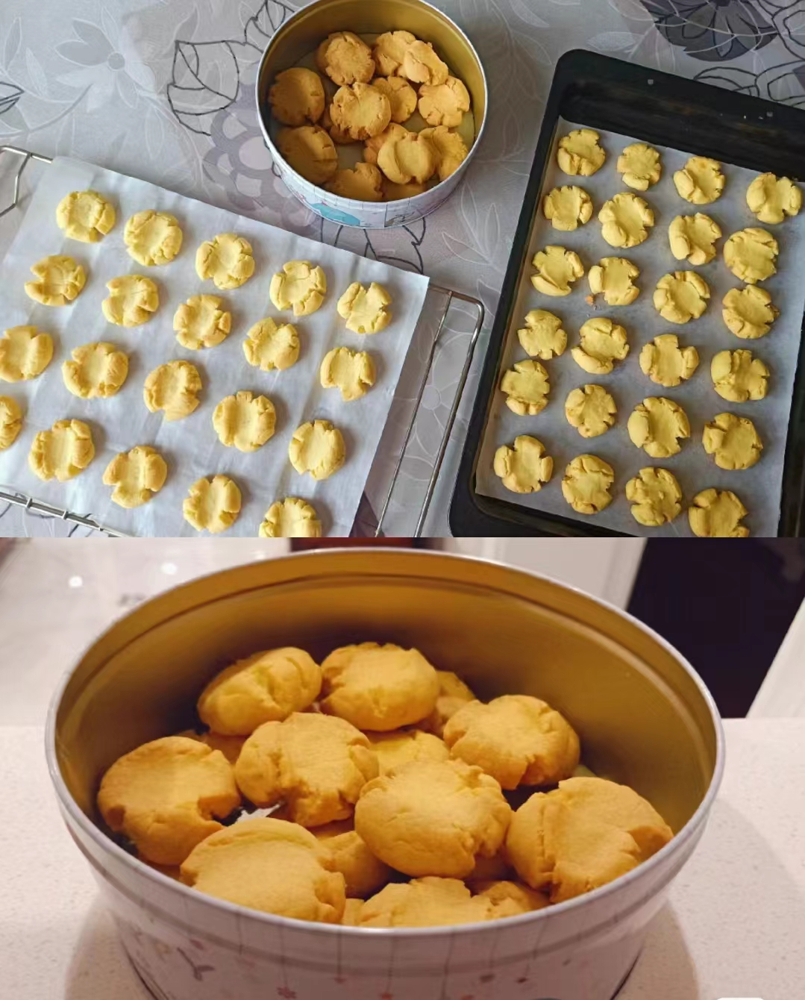

# 玛格丽特饼干的做法

玛格丽特饼干通常作为下午茶点心或伴随热饮享用，是一种经典而受欢迎的点心。它们的酥脆质地和丰富的黄油味道使它们成为许多人喜爱的饼干之一。

预估烹饪难度：★★★

## 必备原料和工具

- 熟蛋黄
- 黄油
- 白砂糖
- 盐
- 低筋面粉
- 玉米淀粉
- 烤箱

## 计算

鉴于这种小甜点的高热量，每次制作前需要确定计划做几份。一份正好够一个人食用。

每份：

- 熟蛋黄 1 个
- 黄油  50 克
- 白砂糖  20 克
- 盐 1 克
- 低筋面粉 50 克
- 玉米淀粉 50 克

## 操作

- 黄油隔热水融化、将蛋黄磨碎备用。
- 在融化的黄油中添加糖、盐、以及碾碎的鸡蛋黄，搅拌均匀
- 加入低筋面粉与玉米淀粉，揉成面团
- 将面团均匀分割成大约 8 克重的小面团，然后将它们搓成球状。
- 使用大拇指轻压在每个小面团上，以形成裂纹。
- 预热烤箱至 150℃，将小面团放入烤箱中，烘烤 20 分钟。
- 微微放凉即可食用

## 附加内容

- 可根据个人口味微调盐与糖的比例，如果喜欢其他风味可以把每份的 3 克玉米淀粉换成可可粉或抹茶粉。
- 如果条件允许可以把蛋黄、低筋面粉等食材过筛，口感会更好。
- 介于材料获取难度选择了白砂糖，如果条件允许可以换成糖粉 30 克。
- 如果没有烤箱可使用微波炉、空气炸锅等，微波炉为高火 2-3 分钟，空气炸锅为 150℃20 分钟
- 参考资料：[第一百种可邮寄的小饼干 酥酥糯糯入口即化~-哔哩哔哩](https://b23.tv/NZCsV0x)

如果您遵循本指南的制作流程而发现有问题或可以改进的流程，请提出 Issue 或 Pull request 。
