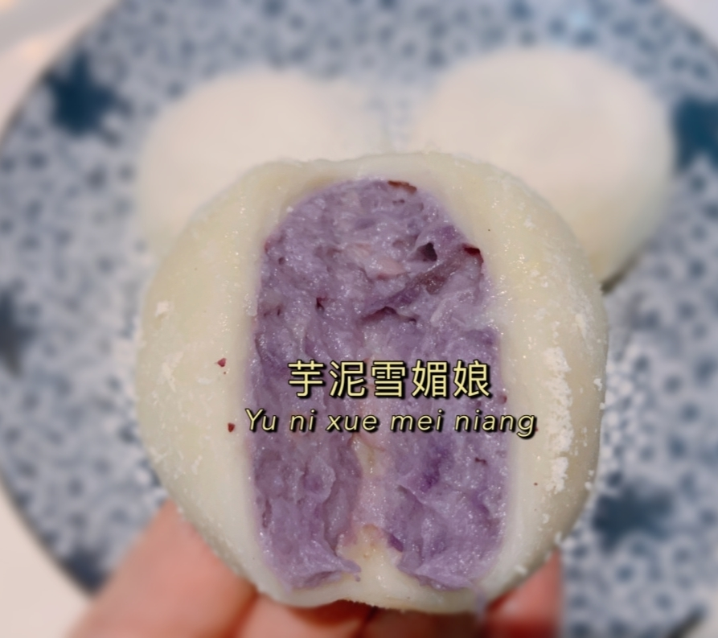

# 芋泥雪媚娘的做法

芋泥雪媚娘是一道甜品，很适合做给孩子吃，无需烤箱，手残党也可以做成功～预计制作时间2小时。

## 必备原料和工具

- 荔浦芋头（电商平台购买即可，实惠新鲜） 200g
- 紫薯粉 3g
- 牛奶 165g
- 糯米粉a 50g
- 糯米粉b 75g
- 玉米淀粉 22g
- 黄油 30g
- 淡奶油（推荐安佳） 145g
- 白砂糖 26g
- 料理搅拌机（电动打蛋器也可以）
- 筛网 网孔约为 1 毫米
- 保鲜膜

## 操作

- 芋头切块，大火煮熟至软（40分钟即可），全部放入料理机
- 向内加入30g牛奶，25g淡奶油，将其打成泥状
- 再向内加入3g紫薯粉，18g白砂糖，继续搅拌打成细腻芋泥
- 取出另一个碗，加入全部糯米粉b，22g玉米淀粉，135g牛奶，50g白砂糖，混匀并过筛一遍，保鲜膜盖上并扎小洞，中火蒸半个小时
- 在蒸的过程中，将糯米粉a放入平底锅小火翻炒至微微发黄（即炒熟），作为手粉备用
- 将中火蒸完半小时的糯米牛奶混合物（果冻状）趁热加入黄油30g，将黄油揉至面团完全吸收，然后放冰箱冷藏一小时
- 取出另一只碗，加入120g淡奶油，8g白砂糖，打发至有纹路，装进裱花袋备用
- 取出冷藏后的面团，搓揉5分钟，分成30g一个，均匀撒上2g手粉防粘，擀成圆形，先挤上5g裱花奶油，然后放上30g芋泥，最后将面饼像包包子一样包起来（可以减去多余的皮）
- 包好后再均匀撒2g手粉防粘
- 重复以上两步直至原材料用光

## 附加内容

- 制作时最好佩戴不粘手套
- 制作完即可食用，不用再加热

如果您遵循本指南的制作流程而发现有问题或可以改进的流程，请提出 Issue 或 Pull request 。

