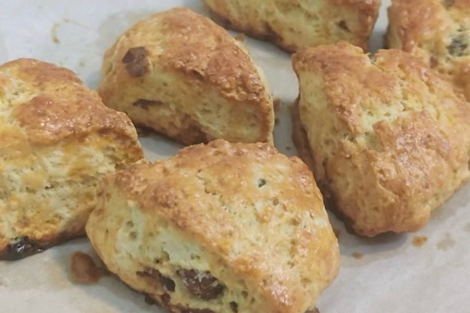

# 英式司康的做法

英式司康是非常简单快手的下午茶甜品，可以搭配果酱、茶与咖啡。成品以蛋奶香气为主轴风味，糖量适中不会过于甜腻。

预估烹饪难度：★★★

## 必备原料和工具

- 无盐黄油（推荐品牌总统）
- 低筋面粉
- 糖
- 盐
- 泡打粉
- 鸡蛋
- 淡奶油
- 奶油奶酪（可选）

## 计算

每次制作前需要确定计划做几份。一份正好够 4-6 个人吃。

每份：

- 无盐黄油 40g
- 低筋面粉 180g
- 糖 30g
- 盐 1g
- 泡打粉 5g
- 鸡蛋 1 个（约 50g）
- 淡奶油 45g
- 奶油奶酪 50g

## 操作

- 鸡蛋打散，称量出 30g 蛋液放入干净容器中，放入全量淡奶油和奶油奶酪混合均匀。如果奶酪太硬可以水浴加热至大约 40 度再混合。
- 将低筋面粉，盐，糖，泡打粉放入干净容器中混合均匀
- 黄油切成小块，放入上一步的混合物中，用手将黄油捏入混合物中，呈粗玉米粉质地
- 将第一步的蛋奶混合液倒入上一步得到的粉油混合物种，搅拌均接近。叠压成均匀面团
- 面团放到案板上，擀成 1.5cm 厚的面片，用刀或者模具分切成合适的形状
- 用刷子蘸取剩余的 20g 鸡蛋液，刷在司康表面
- 烤箱预热 180 度，烤制 27 分钟

## 附加内容

- 最简单的分切方案是擀成圆形面皮，用刀切成 6 个扇形

如果您遵循本指南的制作流程而发现有问题或可以改进的流程，请提出 Issue 或 Pull request 。
