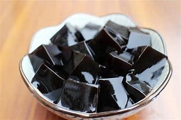

# 龟苓膏的做法

预估烹饪难度：★★

---

## 必备原料和工具

- 龟苓膏粉 25 克  
- 冷水 120 毫升  
- 开水 500 毫升  
- 白砂糖 100 克  
- 小锅  
- 搅拌工具  
- 模具或碗

---

## 计算

每次制作约可获得 3~4 小碗成品，适合 2~4 人食用。

---

## 操作

1. 在锅中倒入龟苓膏粉 25 克与冷水 120 毫升，充分搅拌至无颗粒感。
2. 在另一个容器中加入白砂糖 100 克，倒入沸水 500 毫升，搅拌至糖完全溶解。
3. 将糖水缓慢倒入龟苓膏粉液中，立即搅拌均匀，避免结块。
4. 将混合液体放入锅中，加热时保持中小火，并持续搅拌以防粘锅。
5. 加热至液体变粘稠并开始冒小泡，即可关火。
6. 快速将液体倒入模具中，自然冷却凝固。建议冷藏 1~2 小时后食用，口感更佳。

---

## 附加内容

- 龟苓膏冷却过程中不可随意移动容器，否则可能影响成型。  
- 加热时应避免使用大火，防止结块或糊底。  
- 可根据个人口味添加蜂蜜、炼乳或水果食用。  
- 不同品牌龟苓膏粉浓度略有差异，建议参照包装说明调整配比。

---

如果您遵循本指南的制作流程而发现有问题或可以改进的流程，请提出 Issue 或 Pull request 。
