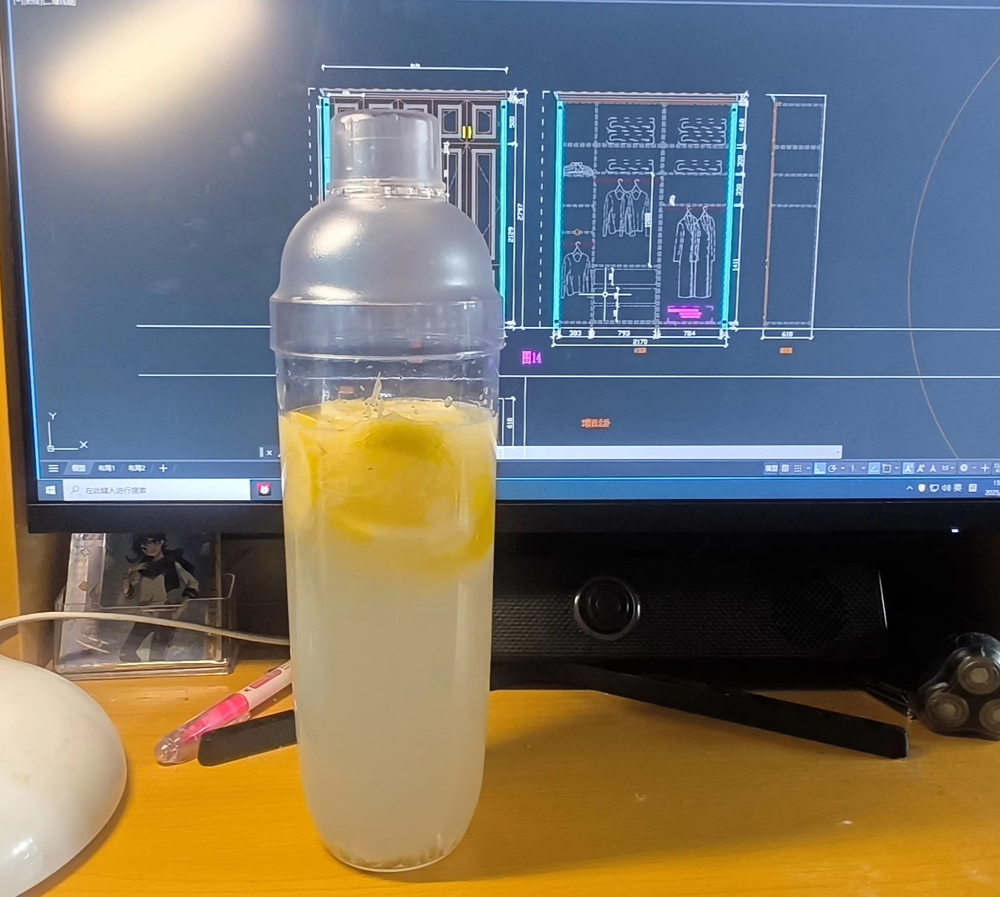

# 柠檬水的做法

这道饮品以新鲜柠檬为主角，搭配果蜜调和，酸甜平衡，冰镇后更感清凉解暑。柠檬富含维生素 C，经常饮用有助于补充营养、提神美白。制作步骤极简，只需捶打、加料、摇晃，新手也能在三五分钟内完成。

预估烹饪难度：★

预估卡路里：141 大卡

## 必备原料和工具

- 原料
  - 柠檬
  - 果蜜
  - 冰（可选）
- 工具
  - 雪克杯

## 计算

一杯分量，约 500 毫升

- 柠檬 40~45 克
- 果蜜 40~45 克
- 冰几块（可选）

## 操作

1. 称 40~45 克柠檬，放入雪克杯中
2. 雪克杯盖盖子锤大约 10 次
3. 加入果蜜 40~45 克
4. 补水
5. 摇晃均匀
6. 最后根据喜好加冰

## 附加内容

- 参考资料：[柠檬水教程](https://v.douyin.com/TVNTcXDi46I)

如果您遵循本指南的制作流程而发现有问题或可以改进的流程，请提出 Issue 或 Pull request 。
