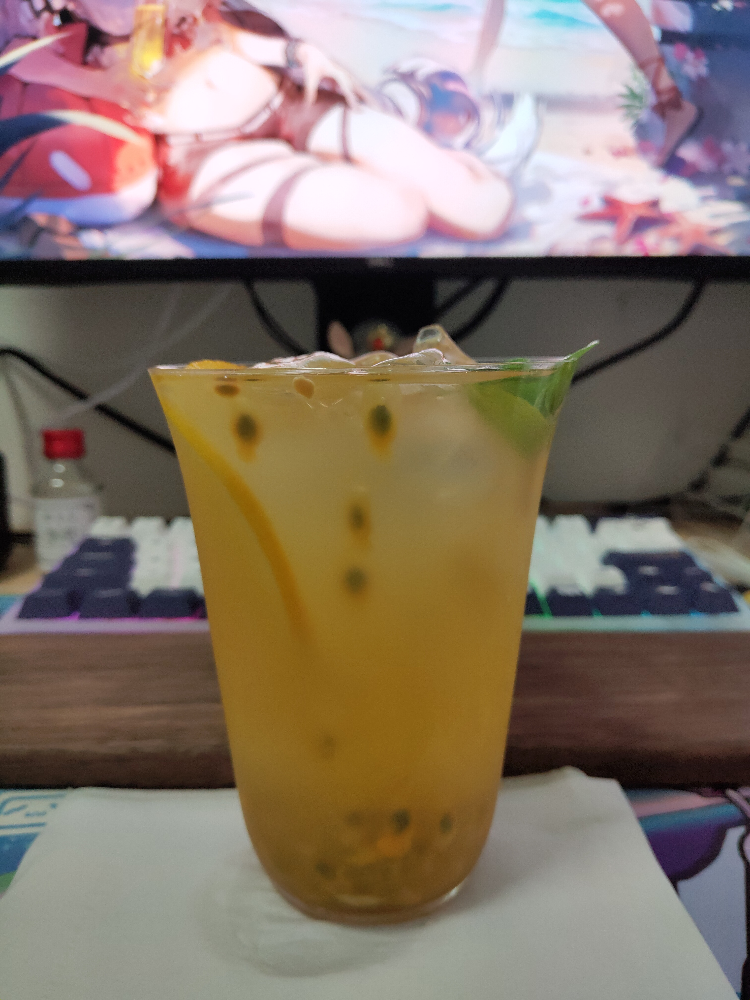

# 百香果橙子特调的做法

## 必备原料和工具

- 原料:
    - 百香果
    - 橙子
    - 茉莉绿茶茶叶/苏打气泡水二选一
    - 白砂糖
    - 冰块
    - 蜂蜜（可选）
    - 薄荷叶或其他绿叶（可选，装饰使用）
- 工具
    - 手动压汁器

## 计算

- 基于茉莉绿茶版本准备，一杯分量，约 380 毫升
    - 橙子 1 个（约 200 克，拳头大小）
    - 茉莉绿茶茶叶 3~6 克
    - 开水 150 毫升
    - 冰块 160 克以上
- 腌制百香果部分（因为量小不好配置，这里是两次的分量）
    - 百香果 3 个
    - 白砂糖 30 克
    - 蜂蜜 10 克（如果没有可以用 5 克白砂糖代替）

## 操作

- 百香果腌制（因为量小不好配置，这里是两次的分量）
    - 将三个百香果的果肉取出来（里面的汁也不能放过），置于容器中
    - 称量 30 克白砂糖放入
    - 称量 10 克蜂蜜放入（如果没有可以用 5 克白砂糖代替）
    - 搅拌均匀
    - 容器保鲜膜封口，放入冰箱中进行 12~24 小时的腌制
- 茉莉绿茶调配（推荐比例=>茶 : 水 : 冰 = 1~2 : 50 : 30）
    - 称量 3~6 克茶叶置于容器，加入 150 毫升开水，泡 6 分钟
    - 往泡好的绿茶中放入 90 克冰块冷却，可搅拌加速冷却
    - 待冰块消失后，将茶叶过滤得到茉莉绿茶茶水约 240 毫升
- 橙子的处理（可在泡茶期间处理）
    - 将橙子对半切（**刀方向垂直于橙子的头尾连线**），并从其中的一半中切取一片橙子备用
    - 再次将橙子对半切，将得到的 4 角橙子用压汁器压出橙汁置于容器中备用
- 正式调配
    - 选择一个你最喜欢的杯子，建议使用容量在 350~400 毫升的透明玻璃杯
    - 将 70 克冰块放置在杯底，并将所有橙汁倒入
    - 将之前准备的一片橙子贴杯内壁放置
    - 将一次分量的腌制百香果浇在冰上
    - 缓慢注入茉莉绿茶直至满杯，便于分层
    - 在液面放置好装饰用的绿叶（可选）

搅拌均匀后享用

## 附加内容

如果缺少或不喜欢茉莉绿茶，可以使用苏打气泡水代替，免去茉莉绿茶的调配流程

### 成品

| 版本           | 成品图                                                  |
| -------------- | ------------------------------------------------------- |
| 茉莉绿茶版本   |   |
| 苏打气泡水版本 |  |

如果您遵循本指南的制作流程而发现有问题或可以改进的流程，请提出 Issue 或 Pull request 。
