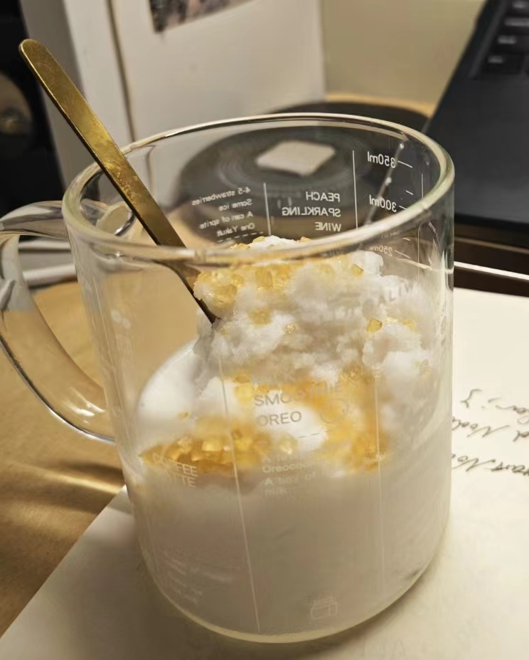

# 砂糖椰子冰沙的做法

砂糖椰子冰沙是一道极具热带风情的快手冷饮，清甜的椰香融合粗粒黄糖的焦香，口感绵密冰爽。椰子水富含天然电解质与矿物质，能快速补充水分，咖啡调糖增添碳水能量。制作门槛极低，只要提前将椰汁冻硬，敲打成沙即可，对新手毫无压力。从冷冻到出品需提前准备 10 小时以上，但动手操作仅需几分钟，很适合作为悠闲的午后冰品。

预估烹饪难度：★

预估卡路里：231 大卡

## 必备原料和工具

- 瓶装椰汁（瓶口较大为佳）
- 咖啡调糖（黄色粗粒）

## 计算

冰沙最佳份量通常与融化速度有关，300g 在零下 18 度制成的冰沙在室温下通常可维持 30 分钟。

每份：

- 瓶装椰子汁 500ml
- 咖啡调糖 10g（两包太古咖啡调糖）
- 坚果碎（可选）

## 操作

1. 500ml 瓶装椰汁倒掉 200ml，立刻拧紧瓶盖。
2. 将这瓶椰汁放入冰箱冷冻区并冷冻 10 小时以上。
3. 将这瓶椰汁取出，若确认瓶中椰汁已彻底冻结，则在墙角、椅背、桌角等坚硬表面上用力抽打。（请务必确认表面不会因此受到损伤）
4. 当抽打到冻结椰汁变成冰沙状态，打开瓶盖倒出冰沙。
5. 在冰沙表面均匀撒上咖啡调糖或坚果碎。
6. 完成

## 附加内容

- 在以上步骤中，瓶装椰汁可以提前冰冻，但是不宜超过 7 天，否则有变质风险。

如果您遵循本指南的制作流程而发现有问题或可以改进的流程，请提出 Issue 或 Pull request 。
