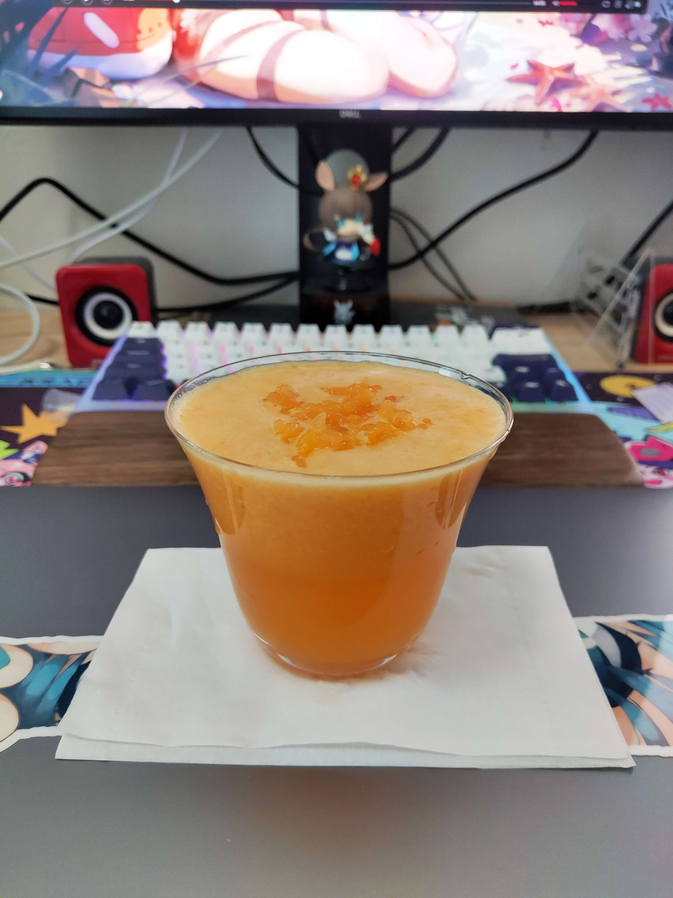

# 耙耙柑茶的做法

预估烹饪难度：★★

## 必备原料和工具

- 原料:
  - 耙耙柑（替换物请看附加内容）
  - 茉莉绿茶
  - 冰块
  - [蔗糖糖浆](../../condiment/蔗糖糖浆/蔗糖糖浆.md)（可选）
- 工具
  - 搅拌机

## 计算

一杯分量，约 300 毫升

- 耙耙柑 1~2 个（200 克以上）
- 茉莉绿茶 2~4 克
- 冰块 60 克
- 1 : 1 蔗糖糖浆 10 克（可选）

## 操作

- 茉莉绿茶调配（推荐比例=>茶 : 水 : 冰 = 1~2 : 50 : 30）
  - 称量 2~4 克茶叶置于容器，加入 100 毫升开水，泡 6 分钟
  - 往泡好的绿茶中放入 60 克冰块冷却，可搅拌加速冷却
  - 待冰块消失后，将茶叶过滤得到茉莉绿茶茶水约 160 毫升
- 正式调配
  - 选择一个杯子，建议使用容量在大约 300 毫升的透明玻璃杯
  - 取出耙耙柑的肉瓣，并将外皮剥去，取得果肉
  - 取 130 克果肉和 130 毫升茉莉绿茶放入搅拌机中
  - 倒入 10 克蔗糖糖浆（可选，如果喜甜可放）
  - 封盖启动搅拌机，搅拌 20 秒后将搅拌产物倒入杯中
  - 取一点果肉撕碎撒在液面上

开始享受

## 附加内容

- 耙耙柑可以用其他容易分离果肉的柑橘替代，比如丑橘
- 果肉和茶水比例为 1 : 1，如果需要配置更大的分量，可按比例提升用量

如果您遵循本指南的制作流程而发现有问题或可以改进的流程，请提出 Issue 或 Pull request 。
