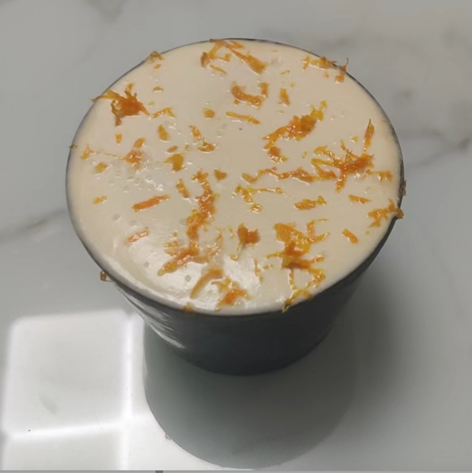

# 菠萝咖啡特调的做法

菠萝咖啡特调是非常适合家庭出品的饮料，酸甜可口。

预估烹饪难度：★★★

## 必备原料和工具

- 咖啡液（推荐浓缩或者冷萃）
- 菠萝汁（鲜榨或者 nfc）
- 冰块
- 苏打水
- 奶油
- 牛奶
- 糖
- 海盐（可选）
- 朗姆酒 （可选）

## 计算

每次制作前需要确定计划做几份。一份正好够 1 个人吃。

每份：

- 咖啡液 30ml
- 菠萝汁 60ml
- 冰块 50g
- 苏打水 30ml
- 奶油 30ml
- 牛奶 10ml
- 糖 8g
- 海盐 0.5g
- 朗姆酒 5ml

## 操作

- 杯子里依次加入冰块，咖啡液，菠萝汁和苏打水
- 奶油加糖打发至湿性发泡，加入朗姆酒和牛奶均匀只有流动性
- 在第一部混合液上方倒入奶油
- 奶油顶面撒上海盐

## 附加内容

- 咖啡液建议选用花果风味，浓缩可以用中烘豆，冷萃可以用普通水洗或者日晒
- 倒入奶油时，高度尽量放低，让奶油能均匀漂浮在饮料表面形成奶盖
- 用新鲜的咖啡液和菠萝汁能大大提升整体风味口感

如果您遵循本指南的制作流程而发现有问题或可以改进的流程，请提出 Issue 或 Pull request 。
