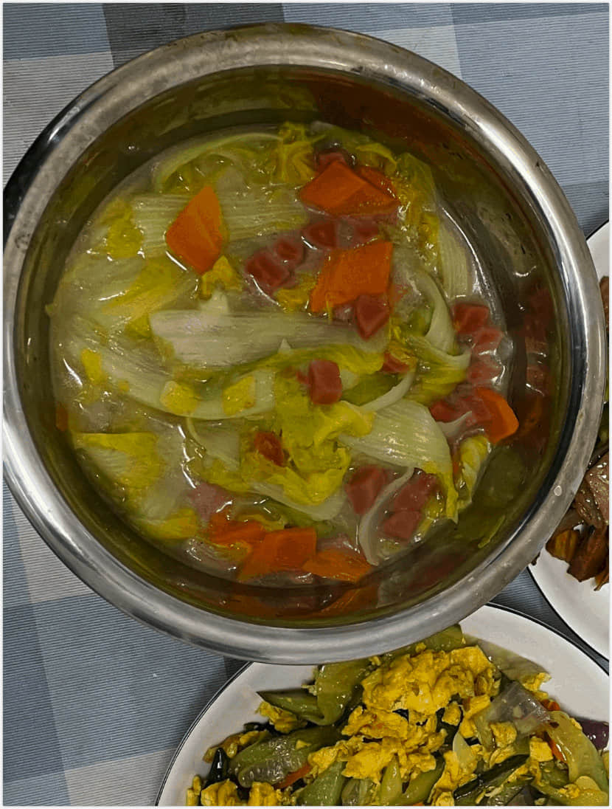

# 上汤娃娃菜的做法 (素菜|减肥餐)

## 必备原料和工具

- 娃娃菜
- 皮蛋
- 午餐肉(火腿肠)
- 葱
- 姜
- 蒜
- 盐
- 糖
- 淀粉

## 计算

注意，这道菜仅有足够 2-4 人食用的版本。

- 娃娃菜 700g
- 金针菇 10g(看个人喜好, 不喜欢 see you tomorrow 的就不放 😂)
- 皮蛋 一个(没有也可以不放, 我吃着也好吃)
- 午餐肉(火腿肠都可以替代)

## 操作

- 娃娃菜洗净, 竖着切开切成段。
- 葱 3g 切 小段。蒜 10g 切片。姜 10g 切小片。
- 皮蛋切成丁, 火腿肠或者午餐肉切成丁(1cm 大小的丁)
- 金针菇洗净撕开
- 烧热水娃娃菜放进去十秒钟出一下水捞出。
- 热锅凉油, 加热锅倒入油过一遍就倒出来, 重新倒入一点油。
- 调至小火加入葱姜蒜，煎炒出香味即可。
- 加入适 300g 清水(水量没过娃娃菜即可), 放入娃娃菜, 金针菇, 午餐肉
- 加入调味料蚝油、糖、盐、味精烧开。
- 煮 3 分钟左右, 煮开后开始装盘, 盛出娃娃菜后皮蛋放在上面把汤汁浇上去就可以了
- 

    拍照技术有限, 味道还是很不错的

## 附加内容

如果您遵循本指南的制作流程而发现有问题或可以改进的流程，请提出 Issue 或 Pull request 。
