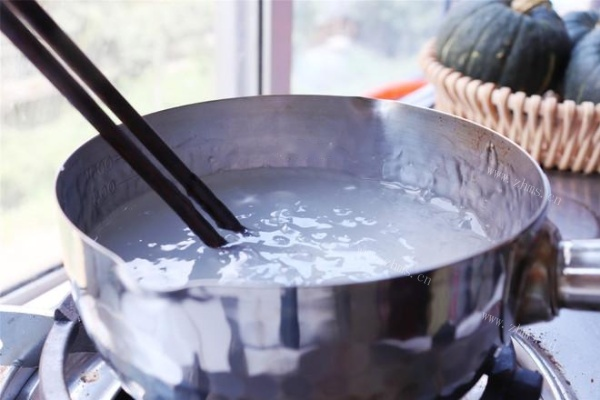
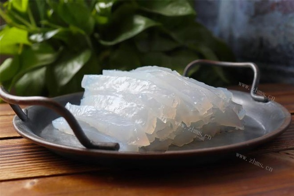
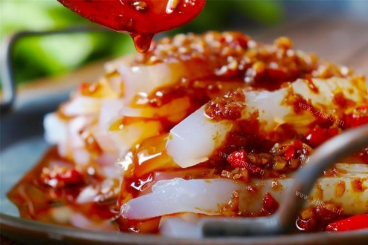

# 凉粉的做法

伤心凉粉吃了不会让你伤心的哦！

## 必备原料和工具

- 豌豆淀粉
- 大蒜
- 小米辣
- 辣椒粉
- 酱油
- 醋
- 白糖
- 鸡精
- 盐
- 花生碎
- 香菜

## 计算

下述材料为一人份，多人可根据人数按比例增加配料的量。

- 豌豆淀粉  100g
- 大蒜   3瓣
- 小米辣  3颗
- 辣椒粉  10g
- 酱油   10ml
- 醋   10ml
- 白糖  3ml
- 鸡精  3g
- 盐  3g
- 花生碎  5g
- 香菜  5g

## 操作

- 准备食材。

    

- 把豌豆淀粉和水各100克混合搅拌。

    

- 往锅中倒入600g水，大火煮开后转为小火。

    

- 倒入淀粉水，边倒边不断的搅拌，搅拌到浓稠且色泽均匀。

    

- 找一个容器，在容器中刷一层薄薄的食用油。

    

- 将煮好的淀粉倒入容器中冷藏2-4小时。

    
	
- 冷藏后取出，脱模，切条。

    
	
- 大蒜和小米辣剁成沫，放上10g辣椒粉，5g花生碎，热油搅拌均匀。

    	
	
- 再加入10ml酱油，10ml醋，5g白糖，3g鸡精，3g盐搅拌均匀。

    
	
- 将调味料倒在凉粉上，然后撒上香菜即可。

    

## 附加内容

- 参考: [制作凉粉的详细步骤](https://www.zhms.cn/recipe/mzvyy.html?source=2)

如果您遵循本指南的制作流程而发现有问题或可以改进的流程，请提出 Issue 或 Pull request 。
