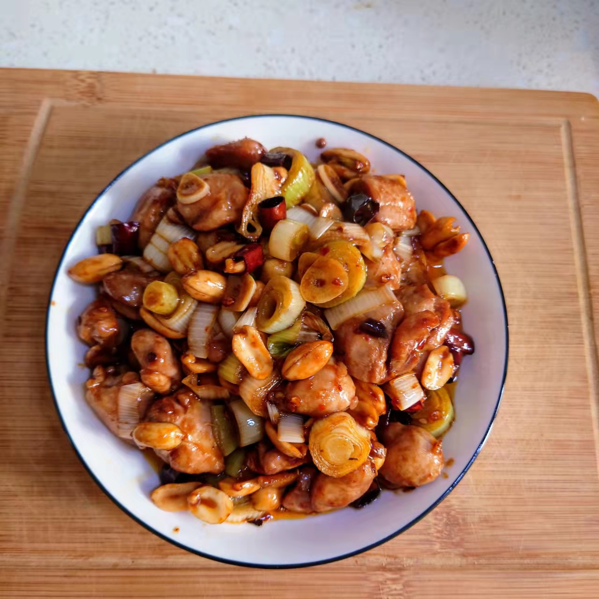

# 宫保鸡丁的做法

老派川菜的简单做法分享

## 必备原料和工具

- 手枪腿
- 大葱
- 干辣椒
- 熟花生
- 生抽酱油
- 香醋
- 白糖
- 料酒
- 盐
- 鸡精
- 淀粉
- 植物油
- 芝麻油

## 计算

注意，这道菜默认一人版本，两人也够吃，理论上多人只需简单加倍即可。

- 必须配料
    - 手枪腿 = 1 支（约 350g）
    - 大葱 = 1 根（约 180g）
    - 熟花生 = 150g
    - 姜片 = 10g
    - 干辣椒 = 10g
    - 生抽酱油 = 10g
    - 白糖 = 2g
    - 盐 = 2g
    - 植物油 = 20g
    - 淀粉 = 15g
    - 料酒 = 15g
- 进阶配料
    - 老抽酱油 = 5g
    - 花椒 = 5g
    - 香醋 = 5g
    - 鸡精 = 2g
    - 芝麻油 = 10g
    - 淀粉（用以勾芡） = 10g

使用上述条件，计算出计划使用的原材料比例，依口味调整。

## 操作

- 手枪腿用剪刀去骨，鸡肉面用刀背拍打一遍，切条后切至 1.5cm 见方肉丁；泡于清水 10min，捞出控干备用
- 取大葱葱绿与姜片 5g 于碗中，导入 50g 开水备用；葱白切 1.5cm 圆粒备用；取花生放入微波炉高火 5 分钟焙干备用
- 鸡丁中加入盐 2g，老抽酱油 5g，料酒 15g，淀粉 15g 搅拌均匀，至微微发干；缓慢加入部分葱姜水，搅拌鸡丁至粘手；保鲜膜密封，放入冰箱腌制 1 小时
- 干辣椒切段；起锅，大火烧热转小火；放入干辣椒焙干至微微发糊，捞起备用；花椒焙干至有香味，捞起备用
- 转大火，倒入 20g 植物油，7 成热（竹筷子起泡）下入鸡丁，煎至上面开始发白，用锅铲翻面，煎 30s 后翻炒均匀
- 下入葱粒翻炒，加入余下葱姜水不够 100g 再加一点清水；盖上锅盖，转中小火焖 2min；
- 转大火，下入熟花生，干辣椒和花椒；加入鸡精 2g，香醋 5g，白糖 2g，翻炒均匀；
- 淀粉 10g 加 50g 清水调成水淀粉，加入锅中，翻炒均匀，收汁到自己想要的浓度
- 关火，淋入芝麻油 10g，即可出锅

## 附加内容

辣椒依据个人口味酌量添加，怕辣可去籽；

如果您遵循本指南的制作流程而发现有问题或可以改进的流程，请提出 Issue 或 Pull request 。
