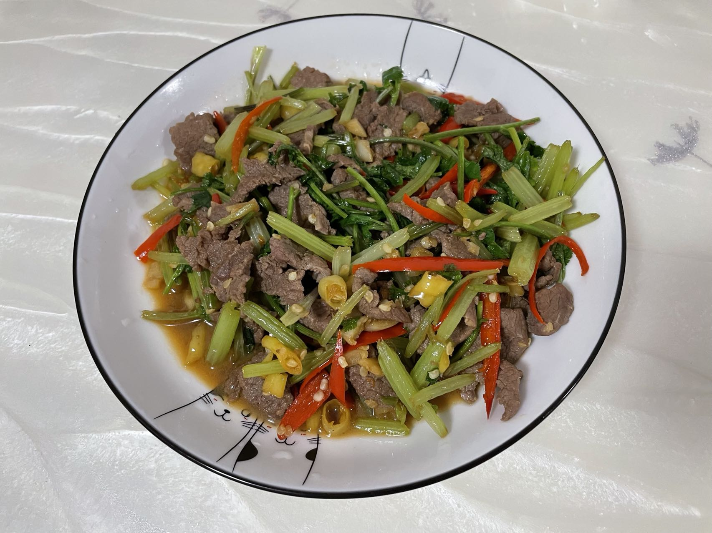

# 小炒黄牛肉的做法

小炒黄牛肉是一道简单易做的湘菜。口味十分劲爆爽口。一般初学者只需要 1 小时即可完成

## 必备原料和工具

- 牛里脊
- 芹菜
- 小米椒
- 野山椒
- 香菜

## 计算

每份：

- 牛里脊 400g
- 芹菜 200g
- 小米椒 30g
- 野山椒 30g
- 香菜 30g
- 食用油 15ml
- 酱油 6ml

## 操作

- 牛里脊切成不超过 3cm 的薄片，倒入 6ml 酱油，用手抓匀备用
- 芹菜切成不超过 5cm 的小段，备用
- 小米椒切成丝状，备用
- 野山椒切成颗粒，备用
- 香菜切成成不超过 3cm 的小段，备用
- 热锅，锅内放入 15ml 食用油，大火等待 30 秒让油温升高
- 放入小米椒和野山椒爆香
- 放入牛里脊，然后**翻炒 5 分钟**
- 关火，撒上香菜，盛盘

## 附加内容

- 操作时，全程需要开大火

如果您遵循本指南的制作流程而发现有问题或可以改进的流程，请提出 Issue 或 Pull request 。
