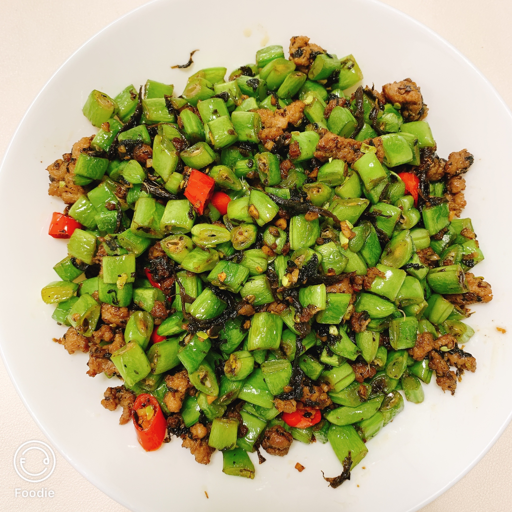

# 榄菜肉末四季豆的做法

## 必备原料和工具

* 四季豆
* 五花肉
* 橄榄菜
* 大蒜
* 小米辣（不吃辣可以不放）

## 计算

* 四季豆 220g
* 五花肉 100g
* 橄榄菜 20g
* 大蒜 10g
* 小米辣 10g

## 操作

* 将四季豆洗净，并把筋撕干净，然后切成大小均匀的颗粒备用。
* 将大蒜拍碎剁成蒜末备用。
* 将小米辣切成大小均匀的颗粒备用。
* 将五花肉去皮，然后剁成肉末备用。
* 将锅烧热，然后加入 20ml 油滑锅，锅滑好之后将热油倒出，然后加入 10ml 冷油，这就是传说中热锅冷油，这么做主要是防止肉末粘锅。
* 如果家里没有晾油瓶的话，也可以不用滑锅，放入油之后，直接加入肉末开始煸炒，小火煸炒两分钟，炒出猪油。
* 肉末炒香之后加入蒜末，橄榄菜和小米辣，炒出香味。
* 加入四季豆开中火煸炒，四季豆至少要炒 5 分钟，一定要保证四季豆**熟透**，否则可能会食物中毒。
* 四季豆炒熟后加入 2ml 酱油从锅边淋入，然后加入 2g 盐、1g 鸡精、1g 胡椒粉和 0.5g 糖。
* 将调料翻炒均匀。
* 出锅，装盘。

## 附加内容

如果您遵循本指南的制作流程而发现有问题或可以改进的流程，请提出 Issue 或 Pull request 。
