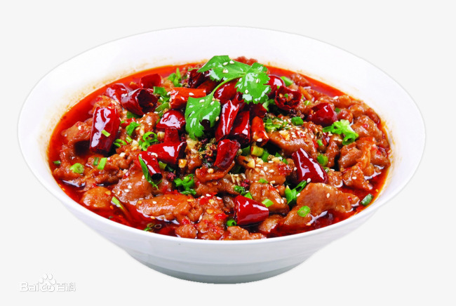

# 水煮肉片的做法

因肉片未经划油，以水煮熟故名水煮肉片。水煮肉片肉味香辣，软嫩，易嚼。吃时肉嫩菜鲜 ，汤红油亮，麻辣味浓，最宜下饭，为家常美食之一；特色是“麻、辣、鲜、香”。

## 必备原料和工具

- 里脊肉 1块
- 豆芽菜 适量
- 青菜 适量

## 操作

<!-- 在这里详细描述做菜的全部流程。 -->
<!-- 不允许使用不精准描述的词汇，例如：`适量`、`少量`、`中量`、`适当`。 -->
<!-- 在这里，如果操作的食材不是“全部食材”而是“部分食材”，也必须指明。否则默认指定的是全部原料。例如这里‘土豆’表示‘全部准备好的土豆’。 -->
- 土豆去皮、切成不超过 4cm 的大块，备用
- 咖喱块切碎，增加接触面积加速溶解，备用
- 热锅，锅内放入 10ml - 15ml 食用油。等待 10 秒让油温升高
- 放入土豆，保持翻炒至土豆*变软*（可以用筷子确认）
<!-- 对于可以自行斟酌加量的食材，必须给出建议的范围 -->
- 加水没过所有食材，沸腾后，将火调小然后**等待 15 - 20 分钟**
<!-- 在描述过程时不得加入上文或原材料中未提及的食材。凡是需要等待的步骤必须给出`等待时间计算公式`或`结束一个步骤的判断标准` -->
- 关火，加咖喱并搅拌，等待直至咖喱融化
- 再开火，缓慢**搅拌 10 分钟**，防止糊锅
- 在外观*呈粘稠状态*后关火，盛盘

## 附加内容

<!-- 在这里额外补充一些注意事项、参考资料、安全须知等。 -->
- 操作时，需要注意观察沸腾的水位线，如发现低于 2/3 的食材应加热水至没过食材。

- [世界美食教程的微博视频](http://t.cn/EJ77yFy)

<!-- 必须保留下面的文字。 -->
如果您遵循本指南的制作流程而发现有问题或可以改进的流程，请提出 Issue 或 Pull request 。

<!-- 在提交 Pull Request 前，请删除模板中的所有注释。 -->
