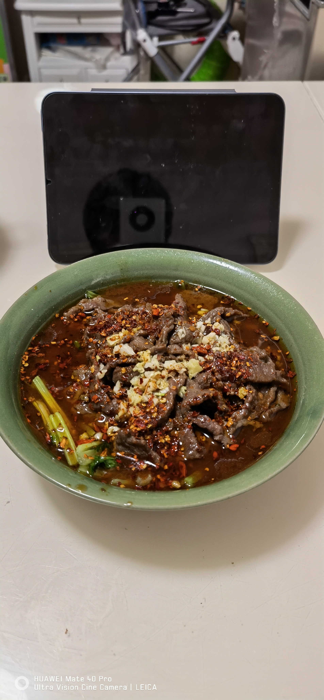

# 水煮肉片的做法

这道菜对于普通厨子来说还是很有挑战的，过程复杂，做法多样，主料，配料，辅料间的搭配非常多，搭配也可以很随意（仅对于比较娴熟的人来说），没有标准范式。

就跟软件开发一样，看起来流程是“从需求、评审、设计、coding、联调、提测、上线、运维”，周而复始。做菜看起来是煎、炸、焖、炒、煨、煮等手法加上常见的调味料，实际上过程中千变万化。

不确定性的因子很多且要求精准。比如多煮10秒和少煮10秒差别很大，用大火中火，调味料先放什么后放什么，煮2个人菜量和20个人的菜量，在手法上和总体的挑战上方差很大，犹如一个项目是10个人用还是100万人用即便功能完全一样，但挑战差异巨大。

## 原料和工具

### 工具

- 漏勺（比较密的那种漏勺），如 [这里](https://cbu01.alicdn.com/img/ibank/O1CN01NioTtl1gd9uFViRPw_!!2206602884164-0-cib.jpg) 所示。

### 主料

- 牛肉
- 猪肉
- 鸡肉
- 鱼肉

常见的肉类都可以，根据自己的喜好即可。牛肉最好是牛腿肉或者牛里脊肉，猪肉最好是里脊肉或者猪前腿肉比较嫩，鸡肉一般采用鸡胸肉，鱼肉的话能片成鱼片的都可以。切片注意要横着肉的纹路且，横且牛羊竖切猪。

### 辅料

任何自己喜欢吃的蔬菜，不宜太多，比如

- 上海青
- 莴笋
- 黄/绿豆芽
- 莲藕
- 芹菜

以上蔬菜切段或者切片均可。

### 配料

- 盐（必备）
- 大蒜（必备）
- 干红辣椒（必备）
- 青/红花椒粒（必备一种）
- 料酒（必备，可以用啤酒或白酒代替）
- 淀粉（尽量备，有的地方也叫生粉，基本都是红薯粉或土豆粉）
- 火锅底料（尽量备）
- 花椒面（尽量备）
- 豆瓣酱（尽量备）
- 生抽（尽量备）
- 酱油（尽量备）
- 味精/鸡精（尽量备）
- 小葱（可选）
- 大葱（可选）
- 生姜（可选）
- 蒜苗（可选）
- 蠔油（可选）

以上配料不求全，少一些也都是可以的。

### 计算

- 五花肉的用量为 0.5 斤/男人 0.3 斤/女人
- 蔬菜适量（如小芹菜4 ~ 8颗、上海青 5 ~ 10 颗，随意搭配即可）
- 盐 1勺
- 大蒜粒 5 ~ 10 颗
- 干红辣椒 8 ~ 10 颗
- 青/红花椒 20 ~ 30 粒
- 料酒 2～3 勺
- 淀粉 3～4 勺
- 火锅底料 1/4 包
- 花椒面 2 ～ 3 勺
- 豆瓣酱 2 勺
- 生抽 2 勺
- 酱油 2 勺
- 味精 1/3～1/2 勺
- 大葱 1/2 棵（共约200克）
- 小葱 2 ～ 4 棵（共约 100克）
- 生姜 5 ～10 片
- 蒜苗 3 ～ 4 棵（共约100 ～ 200克）
- 蠔油 1 ～ 2 勺

文中提到的勺子默认为家里用的普通的勺子（容积约为5ml），如图所示

## 操作

### 主料处理

1. 热心的摊主切片或自己切片（每片约2毫米，1块钱的硬币的厚度），如果自己切片需准备一把快刀。
2. 切好片后使用料酒 + 大葱 + 生姜 + 盐 + 生抽/酱油 + 水淀粉等腌制10-15分钟（这个过程注意把肉和料用双手充分搅拌）。
3. 下锅前把除肉之外的其他配料捡去不用。
3. 另拿干净饭碗，调制水淀粉，大概3～4勺淀粉（准备的全部淀粉），接近1/2的饭碗的水，充分搅拌。

### 辅料处理

1. 刀口辣椒的处理
    1. 将适量的干红辣椒（一般10～20颗）和少量的青红花椒放到锅里用大概6～7成的油温（油的量2～3小勺）简单炒制30s左右，将糊未糊的状态，说人话就是变色。
    2. 用刀将炒制好的辣椒和花椒，放在案板上简单的研磨或者切碎（注意切勿用力过猛，因为刚炒制出来比较脆，用力过猛就会到处蹦），处理好后备用。
2. 青菜的处理
    1. 喜欢吃的蔬菜，用少量的油简单炒一下，炒的过程中放一点点盐，切记确保蔬菜断生即可。
    2. 或者这步也可以使用焯水的方式处理，焯水的时候放不到1/2勺盐以及1勺油，这样能保持蔬菜的绿。
    3. 盛出来，放到最后要装菜的盘子里，后续肉出锅的时候直接盛到这个碗里即可。

### 开始炒料

1. 锅烧热，放入少许（2～3勺）底油滑锅。
2. 依次放入豆瓣酱1～2勺都可，火锅底料（如有），干红辣椒、花椒、大葱（如有）用中火把料都炒化，一般这个过程2分钟左右。
3. 加入适量的水（一般来说如果是半斤肉的话大概600-800毫升水）
4. 水烧烤后熬制3分钟左右。
5. 把锅里的料渣用漏勺捞出来去掉。
6. 控制火候，中小火即可。
7. 逐步放入备好的肉，过程中尽量把肉铺开，避免一大坨。
8. 煮大概1到2分钟左右，过程中用勺子轻轻的推动，防止粘锅。
3. 临出锅前洒水淀粉，再煮个10到20秒即可，加水淀粉的目的主要是让汤汁浓稠可以包裹各种味道。

### 点睛之比

正宗的水煮最后这一步至关重要。

1. 肉盛到放蔬菜的盘子后。
2. 把之前做好的刀口辣椒和蒜末以及花椒面（如有）均匀的洒在肉上。
3. 烧相对较多的油（4～6勺），油温控制在6～8成即可（烧的时候开始冒烟），淋在刀口辣椒和蒜末上。
4. 最后也可以使用撒上一把白熟芝麻（没有就算了）

刀口辣椒弄起来比较麻烦，也可以使用普通的辣椒面也可以，当然不用这个步骤也不是不行，个人觉得这个地方是点睛之比，热油和辣椒以及花椒面能最终激活肉的香味让这道菜得到升华。

### 成品示例

## 附加内容

* 肉切勿过厚或者过薄，切肉前可以放冰箱冻一会，便于切肉，基本上2～3毫米左右。
* 刀口辣椒是这道菜的灵魂，不过确实也比较麻烦，特别是切的时候容易蹦，也可以用捣蒜的那个工具（一般是石头或者陶瓷的），具体叫啥我忘了，避免广告不贴链接了。
* 水淀粉在腌制肉和起锅的时候都会用到，可以稍微多弄点，一般差不多3～5勺淀粉，小半碗水，用的时候搅拌一下。
* 实在不能理解的同学，要不咱还是 [看个视频](https://www.youtube.com/watch?v=HBYLsLgi-3c) 多学几遍吧，更有画面感得学习下这道菜的烹煮过程。
* 如果您遵循本指南的制作流程而发现有问题或可以改进的流程，请提出 Issue 或 Pull request 。

