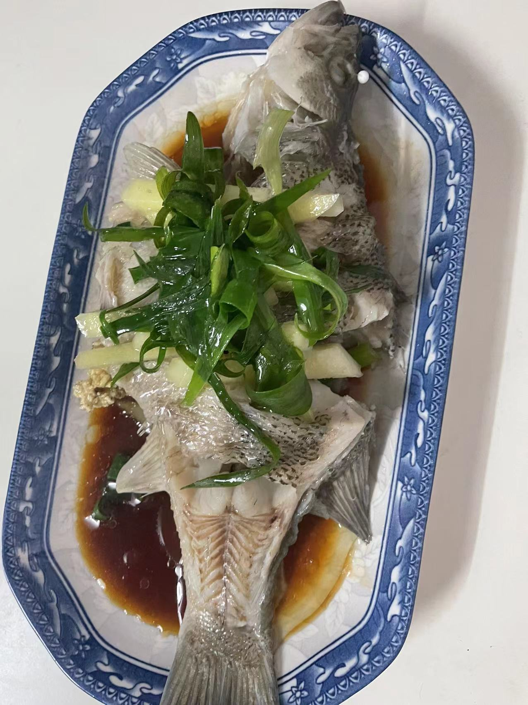

# 清蒸鲈鱼的做法

## 必备原料和工具

* 鲈鱼（害怕杀鱼的同学可以让店家帮忙杀）
* 香葱
* 姜
* 食用油
* 蒸鱼豉油
* 料酒
* 食用盐

## 计算

每份：
* 鲈鱼 一条
* 香葱 三根
* 姜  一块
* 食用油 10-15ml
* 蒸鱼豉油 10-15ml
* 料酒 10-15ml
* 食用盐 5-10g

## 操作

* 姜切丝、香葱的葱白切段，葱绿切丝，切丝后放入冷水浸泡
* 鲈鱼处理好后洗净，用厨房纸擦干，两面分别划几刀，用盐洗掉鱼身的粘液，并用少许盐抹遍鱼身的内外，腌制 10 分钟以上
* 鱼肚内塞上姜和葱白，鱼身也撒上姜和葱白，蒸鱼的碟子用筷子将鱼跟碟子隔开蒸，这样做的好处有两点：
  - 1、鱼在蒸的过程中会将水滴到盘子，如果鱼直接接触会导致鱼食用时会腥。
  - 2、能够将鱼均匀受热。
* 水热后放进入鱼。
* 大火清蒸10分钟。
* 蒸好的鱼，用干净的盘子装起来并去除身上姜蒜
* 浇上蒸鱼豉油
* 鱼身重新撒上姜和葱丝，浇上一勺烧热的食用油即可出菜

## 附加内容
* 技术总结
  - 这道菜属于有手就行，关键点在于火候，鱼的大小跟火候都会相关，太久会导致鱼肉太老极度影响口感，太短会导致部分鱼肉没熟。所以大火蒸鱼一般是10分钟内较佳。
  - 切记蒸鱼需要用筷子隔开装鱼的盘子，不然会导致鱼腥。
  - 这道菜难度系数简单，而且味道非常棒哦

如果您遵循本指南的制作流程而发现有问题或可以改进的流程，请提出 Issue 或 Pull request。

