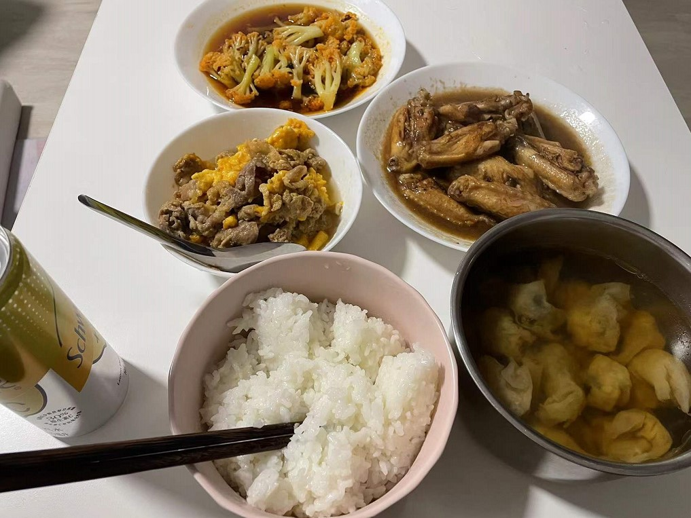

<!-- 这是 HowToCook 菜谱仓库中的示例菜谱模板文件。 -->
<!-- 注意：在编写时，中文与英文或数字之间必须有且仅有一个空格。 -->
<!-- 注意：在编写时，标题与正文之间必须有且仅有一个空行。 -->

# 滑蛋牛肉的做法

<!-- 标题必须是 `你的菜名` + `的做法`。和文件名一致。 -->

<!-- 如果有图片更好。 -->



<!-- 在这里简单介绍你的菜的特点、营养价值、难度、预计制作时长。 -->
这个滑蛋牛肉非常简单，需要的材料很少，预计15分钟就能做好。

## 必备原料和工具

<!-- 在这里列出你的必需原料。以方便大家快速判断自己手边的材料是否足够。-->

<!-- 注意：某些原料已经在厨房采购部分提及。这里不要重复提及：燃气灶, 饮用水, 锅, 食用油, 碗与盘子, 筷子, 炒勺, 洗涤剂, 抹布, 钢丝球, 菜刀  -->

<!-- 你可以推荐购买哪个品牌的来方便决策。 -->
- 过年煮火锅剩下的肥牛片
- 鸡蛋
- 白砂糖
- 料酒（可有可无）
- 油
- 耗油
- 酱油

## 计算

<!-- 这一章节里介绍一些计算公式，求得原料的量、重要的时间参数、混合比例，以便在后续操作中引用。 -->
<!-- 这一章节可选。可以和上一章节合并。 -->

<!-- 这里有两种情况： -->
<!-- 1. 可能会大批量做菜。例如：食堂给全校学生做西红柿鸡蛋、米饭、米粥。这种情况需要给出计算公式。 -->
<!-- 2. 固定菜量的产品菜。每份的容量一致而永远不会发生变化。这种情况需要给出一份的量。 -->

每份：

- 肥牛 15卷 
- 糖 3cm^3
- 料酒 3ml
- 油 20ml
- 耗油 3ml
- 酱油 3ml
- 鸡蛋 3个
<!-- 对于可以自行斟酌加量的食材，必须给出建议添加的范围 -->
<!-- 请不要使用 `勺`，`壶`，`匙` 作为单位！这些容器有大有小，会令人困惑，难以后续精准化。请使用毫升！ -->

## 操作

<!-- 在这里详细描述做菜的全部流程。 -->
<!-- 不允许使用不精准描述的词汇，例如：`适量`、`少量`、`中量`、`适当`。 -->
<!-- 在这里，如果操作的食材不是“全部食材”而是“部分食材”，也必须指明。否则默认指定的是全部原料。例如这里‘土豆’表示‘全部准备好的土豆’。 -->
- 肥牛去冰，放入碗A中
- 总共3个鸡蛋，拿两个碗B, C
    ```
        B = B.add(蛋清 * 2).add(蛋黄 * 1)
        C = C.add(蛋黄 * 2).add(蛋清 * 1)
    ``` 
- A = A + B
- A.add(3cm^3糖，3ml料酒，3ml耗油，3ml酱油)
- 搅拌A碗，腌制8分钟，搅拌C碗
- 郭乐倒油，倒C碗，翻炒直至牛肉看不见红色
- 倒入B碗中的蛋
- 稍微翻炒30s即可出锅

## 附加内容

<!-- 在这里额外补充一些注意事项、参考资料、安全须知等。 -->
- 不想牛肉太熟的话可以提早倒入C碗
- 不想鸡蛋太熟的话可以提早关火

<!-- 必须保留下面的文字。 -->
如果您遵循本指南的制作流程而发现有问题或可以改进的流程，请提出 Issue 或 Pull request 。

<!-- 在提交 Pull Request 前，请删除模板中的所有注释。 -->
