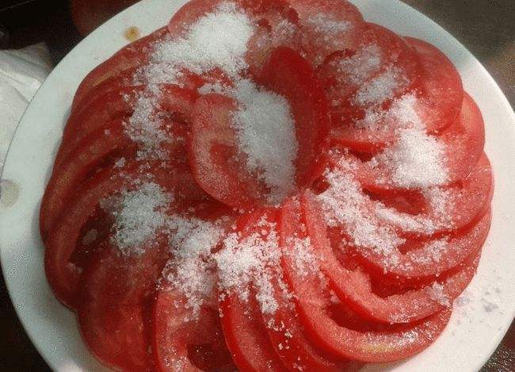

# 糖拌西红柿的做法

新鲜可口，制作简便，营养价值高，适合夏季食用，家庭餐桌上的一道美味凉菜。西红柿含有大量的维生素 C, 做法简单 几分钟就可完成。

## 必备原料和工具

- 西红柿
- 白砂糖
- 冰箱

## 计算

人数 2 至 3 人时最佳

- 西红柿的数量 = 人数 * 1 个
- 白砂糖 = 20g 左右

每份：

- 西红柿 2 个（每个西红柿约 100g，共 200g）
- 白砂糖 20g 左右

## 操作

- 西红柿大卸八块，去掉头部根蒂部，备用
- 拿出白砂糖，备用
- 全部切好后，将西红柿在盘子中均匀码一圈
- 撒上白糖，一盘凉拌西红柿就好了，营养美味，酸甜爽口，夏日解暑又解腻
- 放入冰箱冷藏 10 分钟口感最佳

## 附加内容

在制作过程中 请您小心使用刀具。

如果您遵循本指南的制作流程而发现有问题或可以改进的流程，请提出 Issue 或 Pull request 。