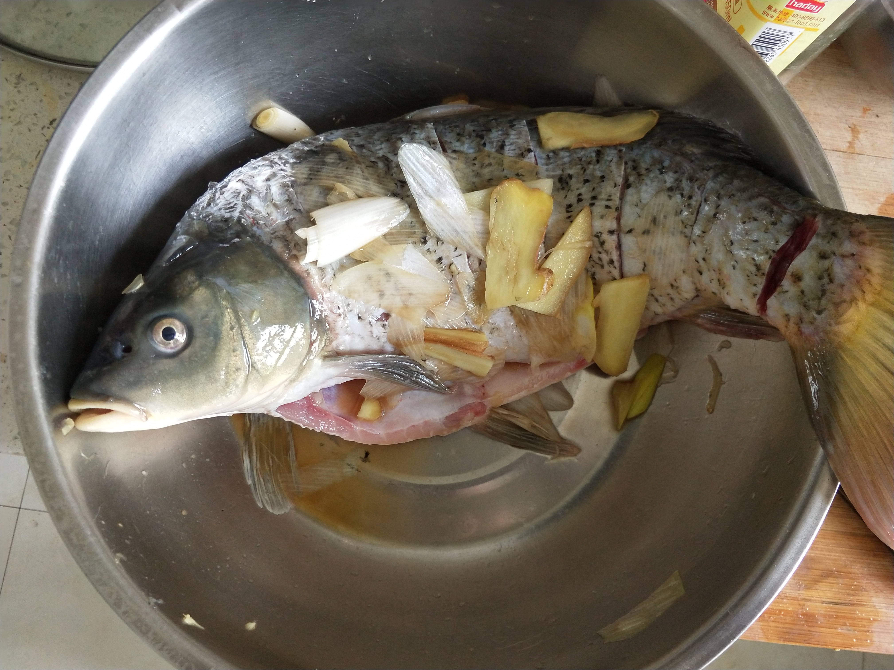
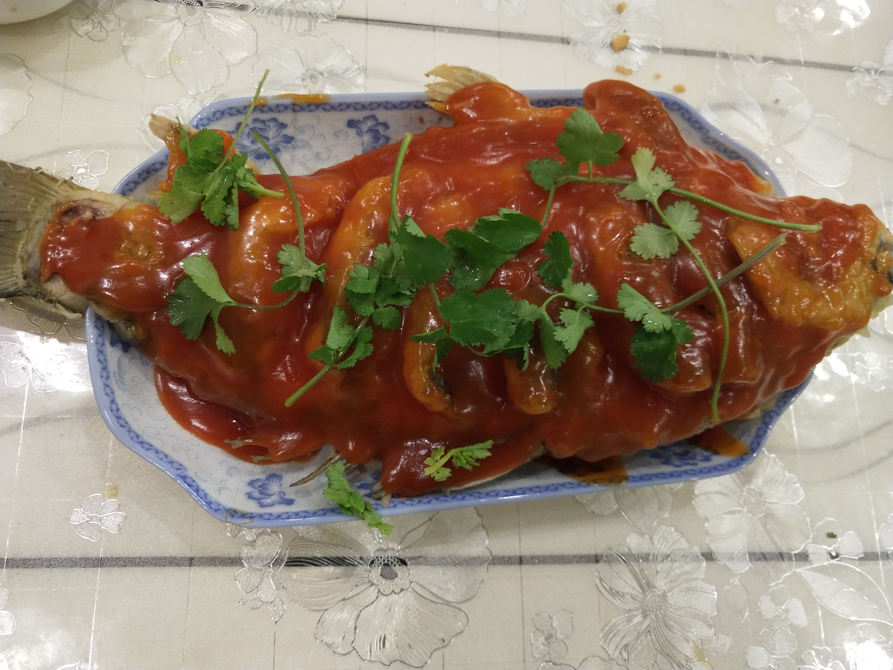

# 糖醋鲤鱼的做法

## 必备原料和工具

- 鲤鱼
- 番茄酱
- 白糖
- 白醋
- 淀粉
- 盐
- 葱
- 姜
- 料酒
- 香菜一颗
- 盆(两个)
- 菜刀一个
- 笊篱一个、锅铲一个

## 计算

注意，该菜只有 3 人以上版本(过大或太小的鱼都是不合适的)，所以不需要公式计算，特别适合家庭聚餐时食用，如年夜饭

- 鲤鱼 = 约 3 斤
- 清水 = 50g
- 番茄酱 = 40g
- 白糖 = 20g
- 白醋 = 10g
- 淀粉 = 10g
- 盐 = 30g
- 大葱 = 30g(约半颗)
- 姜 = 30g
- 料酒 = 25g

## 操作

- 将鱼清洗干净，确保无鱼鳞等异物
- 将鱼头朝左，鱼肚朝下，右手持刀。刀竖直切下 1cm，按紧鱼身往左片 3-4cm，再将鱼片中间轻轻划一刀
- 将鱼放进盆里，然后将大姜切片，大葱切段(随便切切就行了，主要是需要去腥味)
- 用吃奶的力气将大葱大姜里的汁水挤到盆中
- 加入 20g 盐，25g 料酒，然后给鲤鱼搓个澡，涂抹均匀
- 

    (腌鱼时间越长，鱼腥味就越小，推荐腌 30 分钟以上)

- 找个干净的盆，加入 100g 面粉、200g 淀粉、180g 水、5g 盐，用手将其搅拌均匀，面糊此时粘稠呈可拉丝状态，然后打入一个鸡蛋，再次搅匀
- 等待 30 分钟
- 将鱼放在案板上，用干毛巾将鱼身上的水擦干(这样可以更好的挂糊)
- 将盆冲洗干净，用干毛巾擦干
- 起锅烧油，加入约 1L 左右的油，将油温烧至 7 成热，约 200-240 度
- 捏起鱼的尾巴，将鱼头沉入锅底，用勺子往鱼的身上淋热油，待面糊成型后，将鱼慢慢放入锅中，拿锅铲轻轻铲起鱼的头部，然后垫上笊篱。防止底部炸糊。
- 准备一个盛鱼的盘子，放在锅的旁边。
- 用锅铲从鱼身处轻轻铲入，两个工具配合鱼翻个身。再炸两分钟，还是同样的方式(笊篱托着鱼头，锅铲托着鱼身，将鱼盛入盘中)
- 将锅中的油倒入擦干的盆中，放置一边，然后将锅刷干净
- 将 50g 清水、40g 番茄酱、20g 白糖、10g 白醋放入小碗中，搅拌均匀
- 再准备一个小碗加入 10g 淀粉、10g 水，搅拌成水淀粉
- 开大火将锅烧热，然后倒入我们准备的料汁，大火烧开，转小火
- 加入调好的水淀粉，边倒边搅拌，然后 20 秒后关火
- 将熬好的糖醋汁用勺子均匀地浇在鱼身上，可以加点香菜或葱花点缀，糖醋鲤鱼就做好了
- 

    我这里的糖醋汁熬的有点稠了......

## 附加内容

这道菜难度系数算中等吧，对新手还是不太友好的......

如果您遵循本指南的制作流程而发现有问题或可以改进的流程，请提出 Issue 或 Pull request 。
