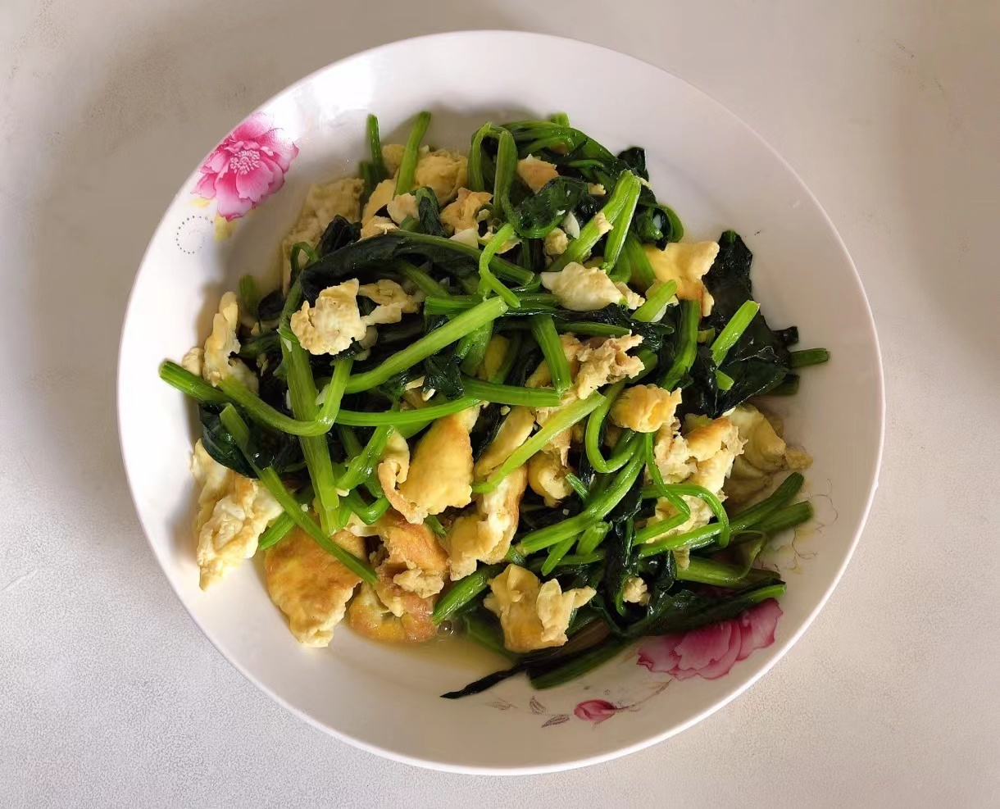

# 菠菜炒鸡蛋的做法

## 必备原料和工具

- 菠菜
- 鸡蛋
- 食用油
- 食用盐

## 计算

按照 1 人的份量：

- 菠菜 350g
- 鸡蛋 2 个
- 食用油 10-15ml
- 食用盐 5-10g

## 操作

- 菠菜去根，洗净，放在篮子里，沥水
- 将鸡蛋打入碗中，搅匀
- 热锅，加入 10ml 油
- 油热后，倒入鸡蛋液，中火翻炒 15 秒，先煎成蛋饼，然后再用锅铲切成小块
- 关火，将鸡蛋块 盛到盘子中，不要洗锅
- 重新开火，倒入 5ml 油，油热后，放入菠菜，大火 翻炒 15 秒后，倒入鸡蛋块，翻炒均匀
- 加入 5g 盐、100ml 饮用水，大火 翻炒 10 秒
- 关火，盛盘

## 附加内容

这道菜难度系数简单，营养丰富。

如果您遵循本指南的制作流程而发现有问题或可以改进的流程，请提出 Issue 或 Pull request。
