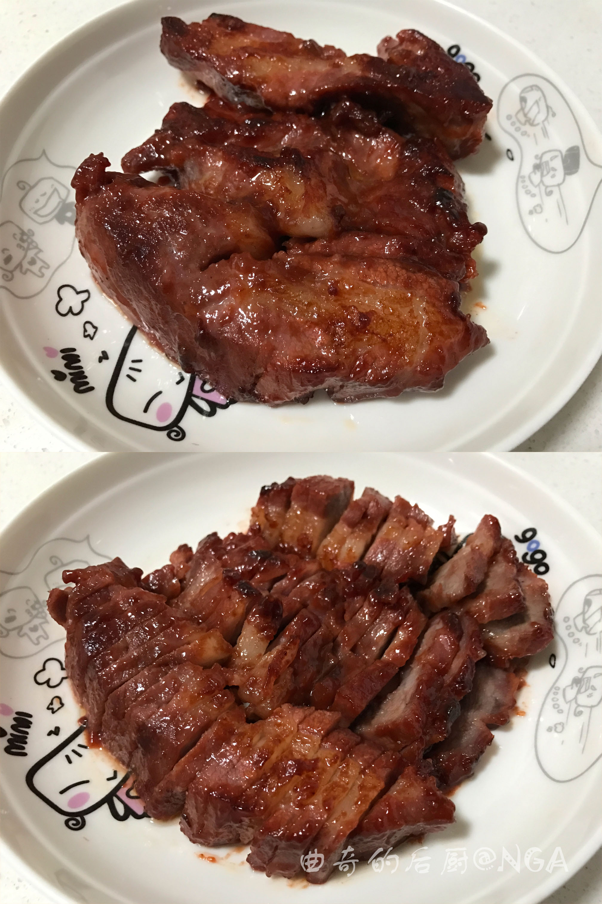

# 蜜汁叉烧的做法

本文来自[NGA 曲奇的后厨](https://nga.178.com/read.php?tid=14371201)的一篇文章，是利用平底锅简化的蜜汁叉烧的做法。原作者写道

> 闪金镇的烧腊店老板休假了。这意味着老牛和机械狂有半个月吃不上他们最爱的闪金镇叉烧，老大有半个月吃不上滑蛋叉烧盖饭，曲奇有半个月要被他们吵着要吃叉烧。想起去年为了做叉烧又是酱油又是蜂蜜又是烤架又是太阳，烤完叉烧以后曲奇都快被晒成咸鱼了……这次曲奇决定来个简化版的。

大意是家里人想吃叉烧，而店铺休息，作者想到以前的叉烧做法（烤箱+太阳晒）太麻烦，后来自己简化为使用平底锅就能做的版本。

正好本甘党（甜食党）发现到后，做了几次都能复现而且得到家里人一致好评，所以就收藏了下来，今天转到这里。

## 必备原料和工具

- 李锦记叉烧酱
- 李锦记排骨酱（可选，原菜谱里有，但我没加过，也挺好吃的）
- 猪肉（梅花肉最好，五花肉和其他肉理论上也可以，但我没有试过）
- 料酒
- 水

## 计算

每份（2-3 人）：

- 猪肉300g
- 叉烧酱40g
- 排骨酱20g（可选）
- 料酒3 100ml
- 水200ml

## 操作

- 猪肉洗干净，用厨房纸吸干水分，切成大约3指宽厚的条状
- 然后加入叉烧酱、排骨酱，抓匀以后盖上一个合适的碟子或者保鲜膜，放冰箱腌一晚上(8 个小时)。
- 梅花肉腌好以后开始来煎叉烧。用平底锅，热锅下油，全程保持小火，把腌好的梅花肉下锅慢慢煎至表面开始变色。
- 梅花肉从碗里取出来以后，留下的酱汁不用洗，加入清水，把留下的酱汁拌匀，等梅花肉煎至表面变色的时候倒入锅中。
- 再盖上锅盖，继续用小火焖煎，期间每2-3 分钟左右可以揭盖把肉翻一下面，直至叉烧熟透。判断叉烧熟了没有，可以用筷子在肉厚的部位戳进去，没有血水冒出来就差不多了。（个人经验翻4 次面就可以了）
- 叉烧煎熟以后不用再盖锅盖，然后开始收汁，继续保持小火慢慢把酱汁收干。到了后面会发现酱汁几乎全部被叉烧吸收，锅里只留下清澈的油，这个时候就可以出锅了。

## 附加内容

- 原文：[[曲奇的后厨] 平底锅简化版叉烧，以及超级下饭的滑蛋叉烧](https://nga.178.com/read.php?tid=14371201)

如果您遵循本指南的制作流程而发现有问题或可以改进的流程，请提出 Issue 或 Pull request 。

