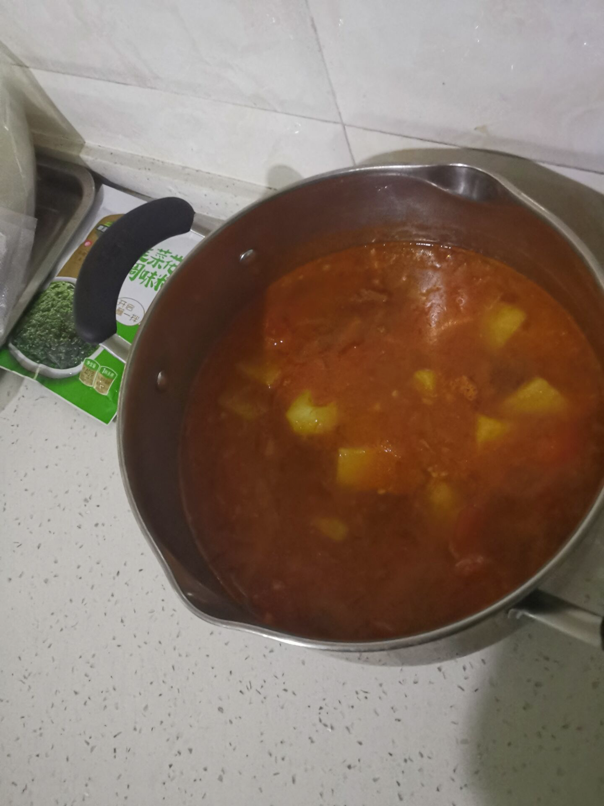

# 西红柿土豆炖牛肉(腩)的做法

特点就是还挺好吃，牛肉是优质蛋白，换成牛腩更好吃。  
难度基本没有，90 岁老奶奶拄拐杖都能做。  
预计制作总时常 1～1.5h。炖的时间:做的时间≈3:1

## 必备原料和工具

- 牛肉一斤多一点(看你喜好)
- 小料
    - 葱一根，姜四片，料酒
    - 花椒 3g
    - 八角一个(半)
    - 香叶两片
    - 油 15ml 左右(若用牛腩可适量减少为 10ml 左右，看自己喜好)
- 调味品
    - 白糖 or 冰糖
    - 酱油(千禾酿造生抽无添加)，老抽
    - 黑胡椒粉(白的也行)2g
- 土豆两三个(看喜好，锅能盛了为准)
- 西红柿拳头大小中等个头两三个
- 比拳头大一点的洋葱一个

## 操作
- 备菜:
    - 土豆去皮、切成 5cm 左右大块，备用
    - 西红柿切十字花刀，开水烫后去皮，把中间的芯去掉，切 3cm 小块备用
    - 葱切 4g 左右的葱花出来，剩下的掰成 5-8cm 大段
    - 牛肉泡凉水半小时去血水，或凉水下锅煮至表面变白捞出，期间撇去浮末
    - 洋葱切 0.5-1cm 小粒
- 制作
    - 全程中火
    - 凉水没过牛肉，放入高压锅，放入葱段，姜片，放入 20g 左右料酒，上汽压 20min
    - 取出牛肉后，切 5cm 大块(多大看你心情)，挑出姜，汤盛到一个大碗里一会炖煮用
    - 倒油，油四到五成热以后下花椒八角香叶，出香味之后糊之前挑出不用
    - 下入牛肉，葱姜，炒香，炒多久都无所谓，看着有点要糊可以舀半炒勺汤，此下同理
    - 炒香后加入生抽 15ml，料酒 15ml，胡椒粉，5-10g 番茄膏番茄酱或一个番茄罐头，加入洋葱炒至透明
    - (可选)可以加一点点盐使洋葱出水不容易糊，不要加太多，后面再调味
    - 加入西红柿炒至西红柿化开软烂，倒入剩下的汤
- 炖煮
    - 中火开锅后，全程小火
    - 出锅前 20-15min 加土豆并调味
    - 依据个人口味边尝边加糖盐，合适为止
    - 筷子戳牛肉软烂后出锅！

## 附加内容

- 炖煮时保证汤加入的时候是温热的
- 炖煮时不要扣盖否则土豆会烂
- 炖煮时时不时翻动避免糊底
- 砂锅炖煮会更好吃，可以在炒锅里炒完倒到煮锅里炖，如果用砂锅开锅之前不要用大火避免裂开
- 酱油总量不要太多，汤汁浓缩的时候会变咸，稀的时候稍微淡点没事，炖煮时候觉得不够也可以再加酱油
- 不要用鸡精味精，会抢夺牛肉的鲜味
- 🤤🤤🤤

如果您遵循本指南的制作流程而发现有问题或可以改进的流程，请提出 Issue 或 Pull request 。
