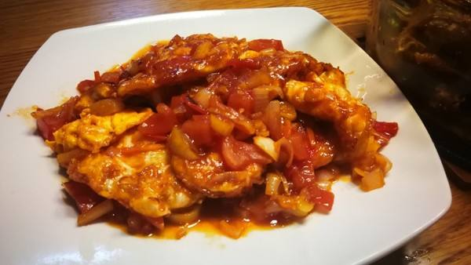

# 醋溜炸蛋的做法

醋溜炸蛋是一道简单易做的菜，东北又名：烧溜白果。材料容易购买，口感酸甜，色香味俱全，用鸡蛋做出肉的口感。一般初学者只需要 1 小时即可完成，成熟之后 30 分钟内即可搞定~ 

## 必备原料和工具

- 生鸡蛋
- 葱花
- 食用油
- 番茄酱
- 白醋
- 白糖
- 盐
- 水
- 姜
- 两个铲子或大漏勺

## 计算

每份：

- 生鸡蛋 8 个
- 姜 30 - 50g 
- 食用油 500 - 1000 ML（根据锅的大小调整）
- 白醋 50 克
- 水 100 克
- 白糖 30 克
- 盐 5 - 10 克
- 番茄酱 80 克
- 葱花 100 克
- 淀粉 20 克

## 操作

- 鸡蛋敲碎，打入碗中即可，不要搅拌。
- 姜，切丝备用。
- 水、白糖、盐、番茄酱、淀粉、白醋 倒入一个碗中，搅拌均匀，此为料汁，备用。
- 热锅倒入食用油，等待食用油 150℃ 倒入碗中的鸡蛋，不要翻动，等待鸡蛋下面成型，直到鸡蛋下面成型金黄，上面呈现白色。
- 用两个铲子或大漏勺把已经定型的鸡蛋坨翻面，等待两面都呈现金黄色，关火，将鸡蛋捞出，控油后放在菜板上，切「井」字形（可适当调整大小）。
- 将锅中的所有食用油倒出到容器收纳，不用刷锅，此时锅还保留一层底油，此时锅内还有温度，开小火。
- 放入一半的葱花 50 克，全部的姜丝，爆香。
- 将调制好的料汁导入锅中，开大火收汁儿，水收至 1/3 。
- 导入切好的炸蛋，倒入锅中翻炒 30 秒，此时炸蛋已经占满了粘稠的汤汁，关火，出锅，装盘。
- 最后在盘中撒上剩下的最后一半葱花提色。

## 附加内容

- 操作时，需要注意油温，不要过高，如果对油温掌握不好，宁可温度低逐渐掌握经验，也不可高温直接下锅，浪费食材。
 
如果您遵循本指南的制作流程而发现有问题或可以改进的流程，请提出 Issue 或 Pull request 。

