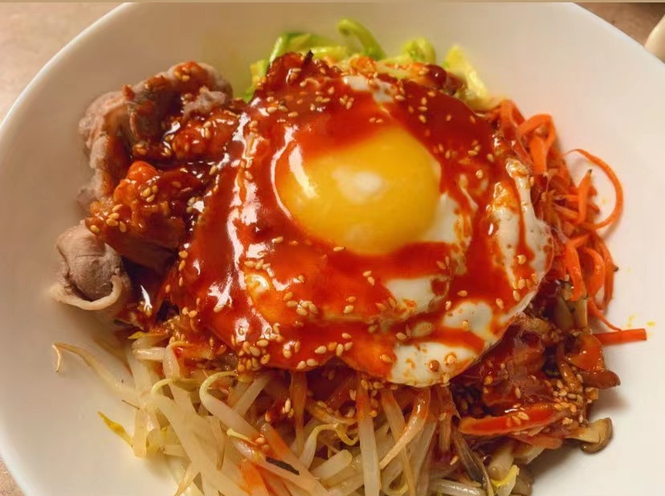

# 韩式拌饭的做法

## 必备原料和工具

- 米饭
- 鸡蛋
- 火锅牛肉卷
- 豆芽
- 蘑菇
- 胡萝卜
- 西葫芦
- 韩式辣酱
- 雪碧
- 芝麻
- 芝麻油

## 计算

每份：

- 米饭 1 碗
- 鸡蛋 1 颗
- 火锅牛肉卷 6 卷（随意）
- 豆芽 1 把
- 蘑菇 50g
- 胡萝卜 1/4 根
- 西葫芦 50g
- 韩式辣酱 2 勺
- 雪碧  2 瓶盖
- 芝麻 少许
- 芝麻油 1 勺
- 生抽 1勺

## 操作

- 蔬菜清洗 切丝 放锅中翻炒 食材变软 便可称出
- 煮水 等沸腾时 焯牛肉卷 只需煮熟 大概三分钟即可捞出  
- 煎溏心蛋 
    - 放少许油
    - 打蛋放入锅里
    - 放几滴水 
    - 盖上锅盖焖
    - 等蛋白凝固 蛋黄可以根据个人喜好 选择是否继续煎
- 将米饭放在一个碗里 然后倒扣在大碗
- 将准备好的蔬菜和肉卷依次绕圈放在米饭上面 将煎蛋放中间
- 备酱汁
    - 两勺韩式辣酱（甜辣口）+ 一勺生抽 + 两瓶盖雪碧（减肥的话 可以放无糖雪碧）+ 少许芝麻 + 一勺芝麻油
    - 搅拌上述酱汁 口重可以再加生抽和盐 
- 将备好的酱汁倒在摆好盘的碗中

## 附加内容

- 这是道非常简单的菜 过程会比较繁琐 但当将菜肉米饭酱汁搅拌起来吃会很满足
- 如果对外观有一定要求 可以用砂锅代替普通碗

如果您遵循本指南的制作流程而发现有问题或可以改进的流程，请提出 Issue 或 Pull request 。
