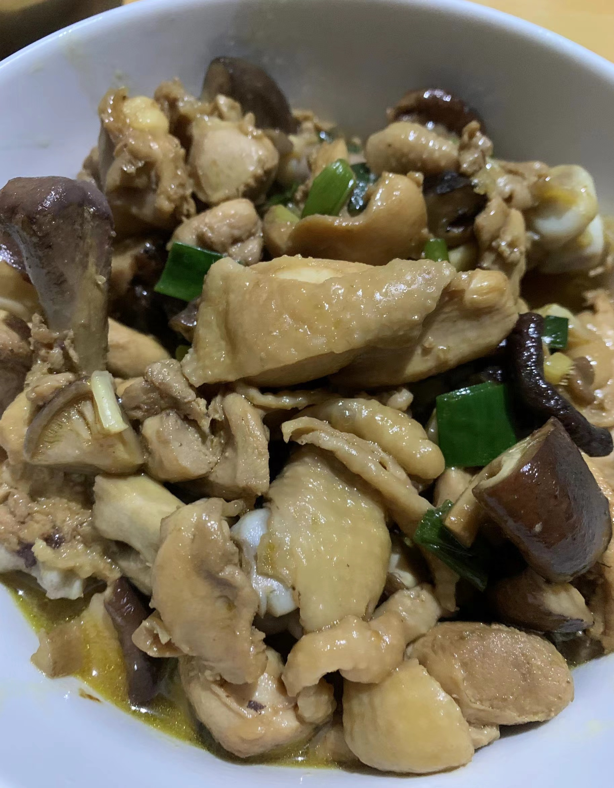

# 香菇滑鸡的做法

## 必备原料和工具

- 大鸡腿
- 干香菇
- 姜
- 葱
- 蒜

## 计算

每份：

- 大鸡腿 2 个
- 干香菇 5 粒
- 姜 2 片
- 葱 2 颗
- 蒜 2 瓣
- 温水（30-40 ℃） 1/2 碗
- 料酒 15ml
- 生抽 30ml
- 盐 1.5ml
- 老抽 15ml
- 糖 15ml
- 香油 5ml

## 操作

- 温水泡发干香菇
- 姜切小块，葱切段，蒜对半切小粒
- 鸡腿去骨（不去骨也可，只是略影响程序员吃饭的效率而已），切成小块
- 泡发的香菇一分为四，香菇水留着备用
- 鸡腿肉焯水 1 分钟，去除血沫和杂质
- 鸡腿肉中加料酒 15ml、生抽 15ml、盐 1.5ml、老抽 15ml，抓匀
- 油温 3 成，下入鸡腿肉煸炒，等鸡腿肉金黄后盛出备用
- 锅留底油，下入葱、姜、蒜炒香，香菇入锅，大火翻匀
- 等待 20 秒会有香菇香味从锅中飘出，此时下入煸炒过的鸡腿肉，下入香菇水（全部，**本程序员认为的灵魂操作**）、糖 15ml、生抽 30ml
- 转中火不盖盖，咕嘟 2 分钟收浓汤汁，淋入香油 5ml，撒上葱花后即可关火、装盘

## 附加内容

- 鸡腿去骨操作较复杂，本人经验可供参考：
  - 鸡腿于案板摆正，**骨头正对程序员**，从头部划一刀至最底部，刀口要深，确保有碰到骨头
  - 用手扒拉肉到两边
  - 用刀尖隔开骨头上沾着的肉
  - 鸡腿翻面，刀紧贴骨头插入，挑断骨头与肉的连接点
  - 用刀尖切断最后的粘连即可

如果您遵循本指南的制作流程而发现有问题或可以改进的流程，请提出 Issue 或 Pull request 。
