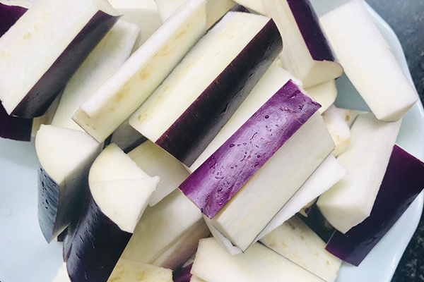
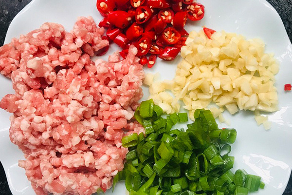
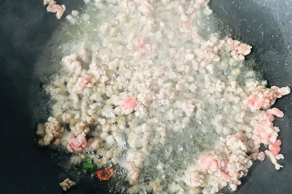
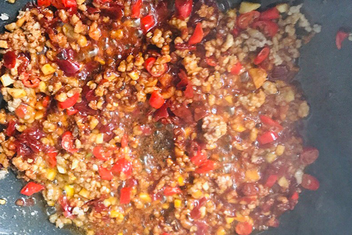
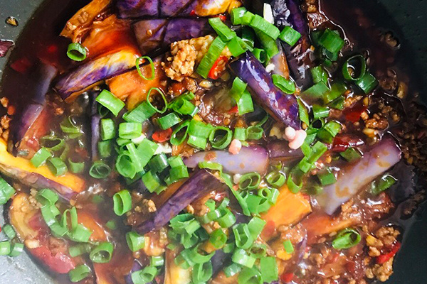

# 鱼香茄子的做法

这个菜真的超级下饭，当个干饭王吧。

## 必备原料和工具

* 茄子（2根）
* 肉末（20g）
* 盐（半勺）
* 糖（一勺）
* 味精（两勺）
* 生抽（半勺）
* 老抽（半勺）
* 醋（两勺）
* 水淀粉（一小碗）
* 豆瓣酱（一勺）
* 小葱、姜、蒜、小米辣 （根据自己口味）

## 计算

上述材料为一人份，多人可根据人数按比例增加配料的量。

## 操作

* 第一步：将茄子切成条。

* 第二步：将肉切成肉沫，葱姜蒜切碎、小米椒切丁。

* 第三部：调鱼香汁：碗中放入盐、味精、糖、生抽、老抽、醋、水淀粉搅拌均匀。
* 第四步：锅中倒入300ml油，等油温七成热（有烟冒出）放入茄子炸两分钟，当茄子边缘微黄就捞出。多出的油可以盛出以后炒菜用。

* 第五步：锅中留一点(15-30ml)油，倒入肉沫炒至颜色变白就盛出来。

* 第六步：锅中倒入15-30ml油，放入豆瓣酱、葱白、姜、蒜炒香，然后倒入肉沫翻炒均匀。

* 第七步：加入适量清水（不没过茄子），倒入茄子、倒入料汁，爆炒入味收汁。最后放入葱翻炒均匀，就可以起锅了。

## 附加内容

- 茄子看个人喜好，可以去皮。

### 参考资料

- [鱼香茄子详细步骤](https://www.zhms.cn/recipe/kbbrl.html?source=2)

如果您遵循本指南的制作流程而发现有问题或可以改进的流程，请提出 Issue 或 Pull request 。
