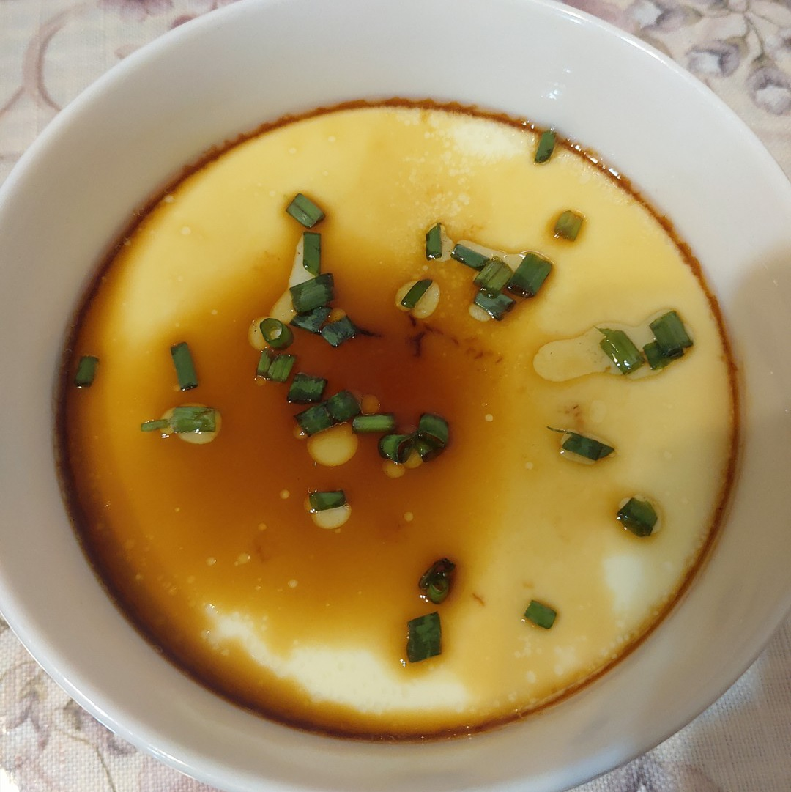

# 鸡蛋羹的做法

鸡蛋羹，又称水蒸蛋，不需要准备复杂的食材，是一道简单快捷易做的菜，当早餐或是正餐都可，制作时常约为 15 分钟。

## 必备原料和工具

- 鸡蛋
- 食用盐
- 香油
- 生抽 / 味极鲜
- 白醋（可选）

## 计算

按照 1 人的份量：

- 鸡蛋 2 个
- 食用盐 3g
- 白醋 2ml
- 香油 2-4ml
- 生抽 / 味极鲜 8ml

## 操作

- 两个鸡蛋放入碗中打散
- 加入食用盐 3g，增加底味
- 加入 2ml 白醋，去除鸡蛋的腥味（可选，加入米醋也行，但米醋的颜色会使鸡蛋微微发黑）
- 向碗中加入鸡蛋体积 1-1.5 倍的纯净水，搅拌均匀（1 倍的水鸡蛋更弹，1.5 倍的水鸡蛋更嫩）
- 过滤蛋液，去掉蛋液中的浮沫（可选，不过滤蒸出来的蛋会有气泡，不好看）
- 向任意一口锅中加入 50ml 清水，水烧开后，放入盛有鸡蛋的碗
- 蒸**10 分钟**后，关火，出锅
- 加入香油和生抽即可享用

## 附加内容

上面介绍的是“基类”水蒸蛋，可以在此基础上“继承”，添加诸如火腿肠、肉馅、虾皮等材料，丰富鸡蛋羹的口感。

如果您遵循本指南的制作流程而发现有问题或可以改进的流程，请提出 Issue 或 Pull request 。
