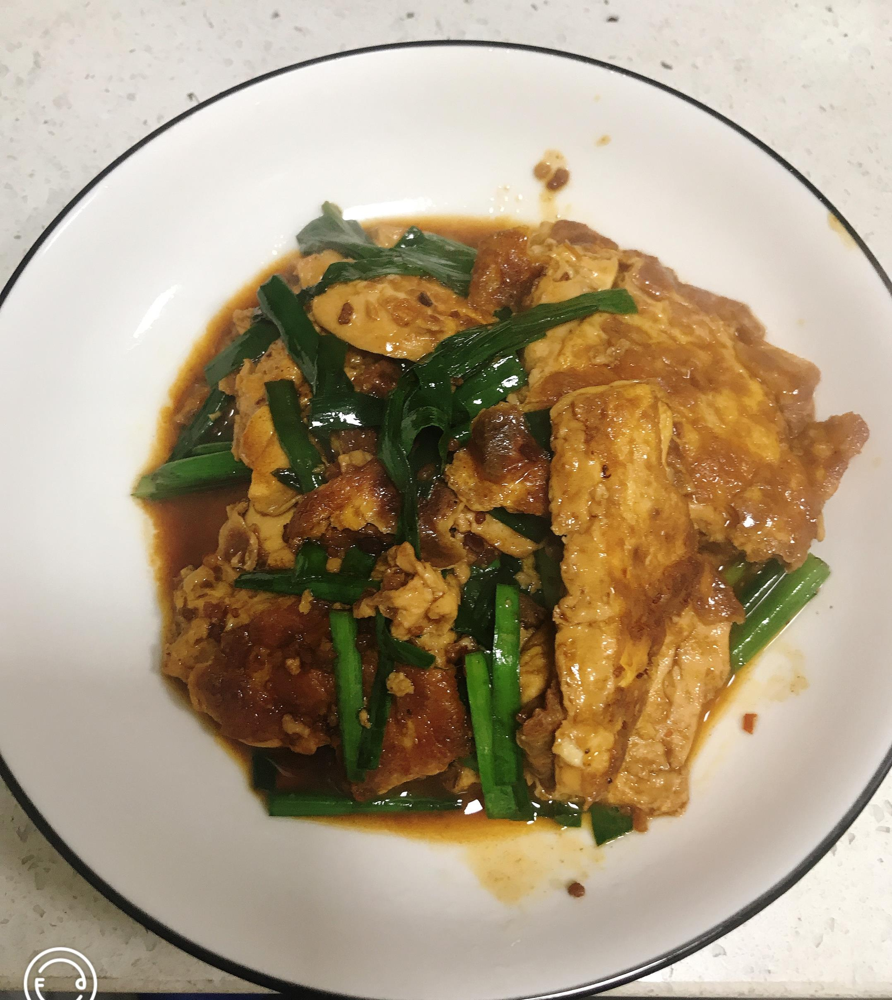

# 鸡蛋豆腐的做法

鸡蛋豆腐是一道非常简单美味的菜，做法非常简单且非常非常好吃。图片随手拍的……下次拍个好图在更新

## 必备原料和工具

- 不粘锅
- 五花肉
- 豆腐
- 正宗公鸡蛋
- 韭菜
- 生抽
- 耗油
- 食盐
- 食用油
- 料酒
- 小米椒
- 豆瓣酱
- 白糖

## 计算

每份：

- 五花肉 100g （不喜欢肉可不放）
- 老豆腐一块（不知道重量都是按块卖，武汉大概3块钱一块）
- 正宗公鸡蛋 2 个
- 韭菜 10根（每根真不知道多少克，男的可以多放点补那个啥子…）
- 生抽 15ml-20ml
- 耗油 15ml-20ml
- 食用盐 10g
- 食用油 30ml
- 料酒 10ml
- 小米椒 2个（喜欢辣的可以多放两个）
- 豆瓣酱 15g-20g
- 白糖 5g

## 操作

- 将豆腐洗干净，切成厚厚的薄片（1CM），放入碗中备用
- 小米椒洗干净切成小圈，放入盘中备用
- 韭菜洗干净切成3CM左右，放入盘中备用
- 偷2个正宗的公鸡蛋打到碗中搅拌好，将豆腐倒入鸡蛋中，拌均匀
- 5毛钱的五花肉切成末，放入盘中备用
- 准备一口大碗调汁：加入生抽（15ml-20ml我一般用勺子）、耗油（15ml-20ml）、盐(10g)、白糖(5g)、200ml水搅拌均匀
- 昨晚吃完没洗的锅上灶加热，加入油（30ml）烧热大概8秒
- 将豆腐一块块以66.66666度的角度整齐排放在锅里，中火煎8分钟左右，翻面在煎8分钟，直到两面金黄后入盘备用
- 锅中留底油放入五花肉小火慢炒，将肉中的油充分炒出来，加入料酒炒香，加入小米椒、豆瓣酱炒香
- 放入豆腐、倒入料汁、韭菜，改大火烧开，翻炒均匀收汁可出锅。

## 附加内容

如果您遵循本指南的制作流程而发现有问题或可以改进的流程，请提出 Issue 或 Pull request 。
