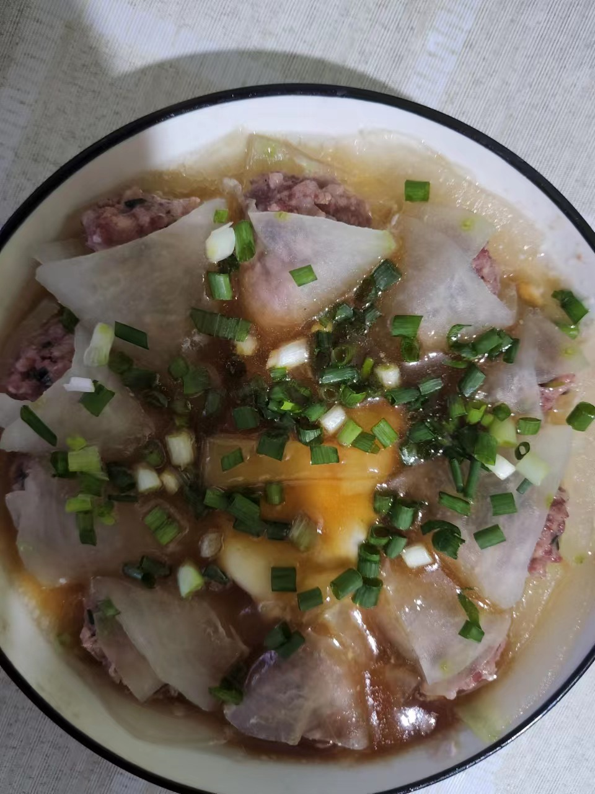
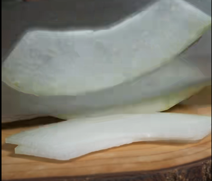
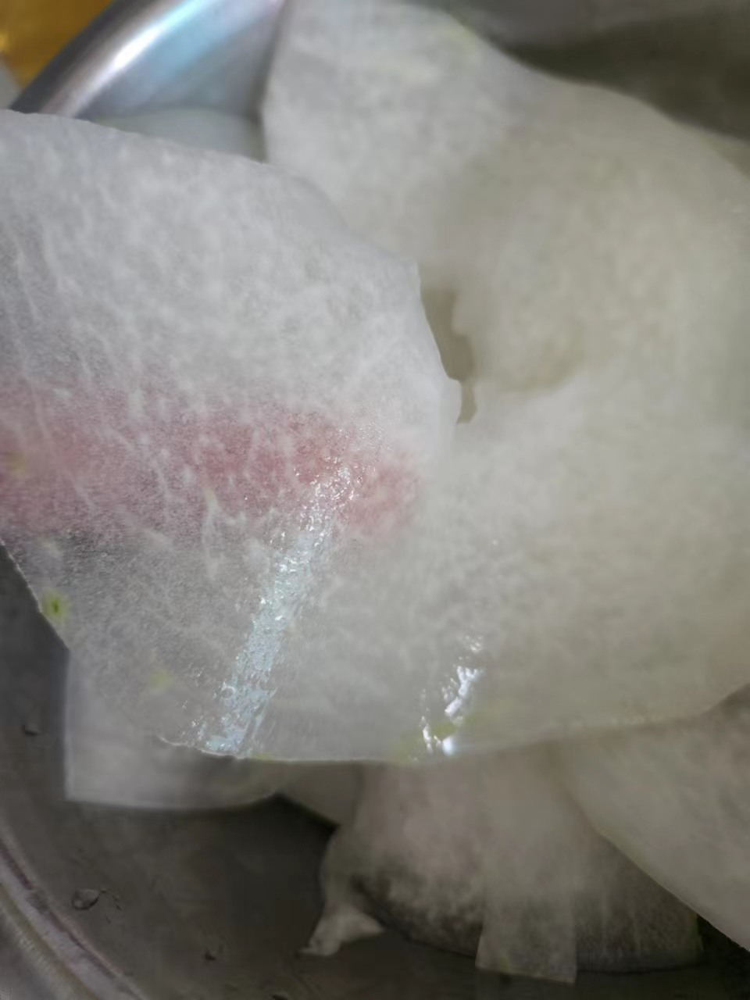
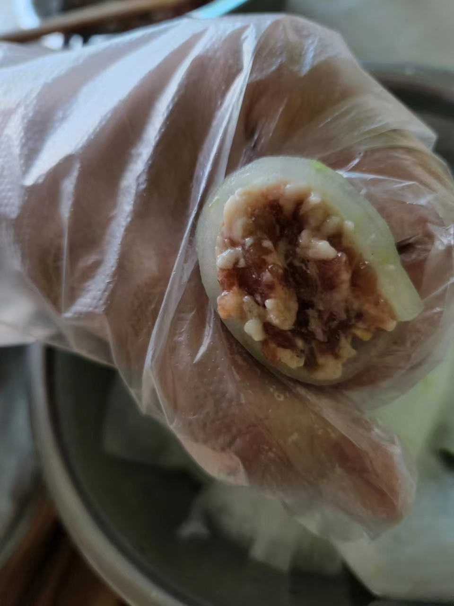
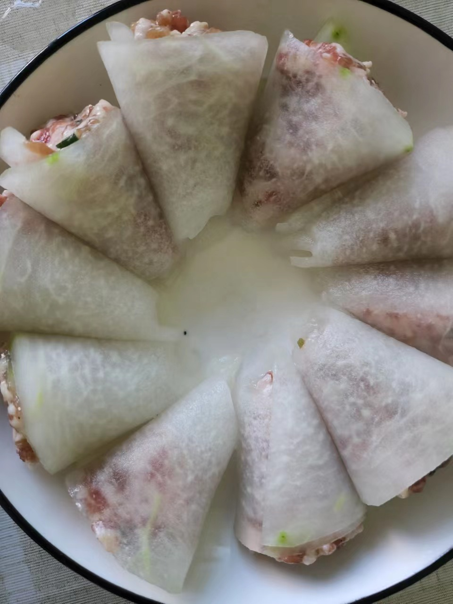

# 冬瓜酿肉的做法

荤素搭配，鲜嫩爽滑,做法简单。一般 30 分钟。

预估烹饪难度：★★★★

## 必备原料和工具

- 冬瓜
- 猪肉末
- 鸡蛋
- 葱
- 葱姜末
- 胡椒粉
- 生抽
- 淀粉

## 计算

每次制作前需要确定计划做几份。一份正好够 2 个人吃。

每份：

- 猪肉末 300g
- 鸡蛋 1 个（可选,不习惯的人可能会有点腥）
- 冬瓜 200g
- 葱花（一根,约 20g）
- 胡椒粉 5g
- 生抽 10ml
- 淀粉 5g
- 水淀粉 25g（淀粉 25g,水 50ml）
- 葱姜末（姜 3-4 片约 30g, 取上面一根葱花中的葱白部分即可）
- 盐 20g

## 操作

- 冬瓜去皮，切成 25cm 长 3cm 厚的片

- 将切好的冬瓜放入碗中，放入 15g 盐，将冬瓜抹匀，放置 10 分钟
- 放置冬瓜的同时，换个碗放入肉末，葱姜末， 5g 盐，淀粉 5g，胡椒粉，生抽，胡椒粉
- 使用筷子在肉末中进行顺时针搅拌，搅拌到食材颜色没有明显对比（约 2 分钟）
- 将腌制好的冬瓜（会变软）使用清水洗三遍

- 拿出 1 片冬瓜片卷起来，并把肉塞进去

- 放入碟子中摆到碟子的边缘

- 打入 1 个鸡蛋到中间圆圈处

- 放入普通铁锅中水烧开后，蒸 15 分钟，盖上锅盖
- 开盖，取出蒸好的冬瓜酿肉
- 将冬瓜酿肉碟子的水倒入锅中，放入水淀粉，加入 50ml 清水倒入锅中烧开
- 淋到冬瓜酿肉上

## 附加内容

- 操作时，拿出冬瓜酿肉时注意碟子很烫，小心操作。
- 参考资料：[b站视频](https://www.bilibili.com/video/BV1oF411F7wD?spm_id_from=333.337.search-card.all.click&vd_source=9f568660d497311d3f945e5dce319705)

如果您遵循本指南的制作流程而发现有问题或可以改进的流程，请提出 Issue 或 Pull request 。
