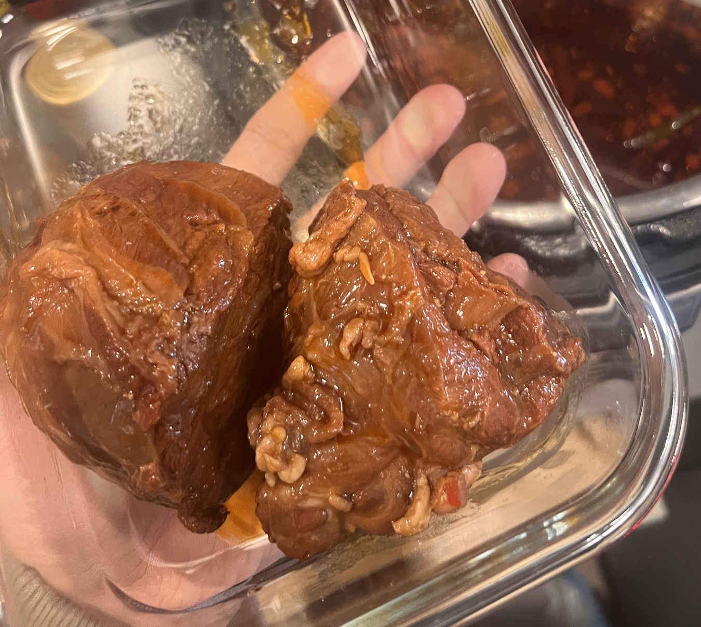
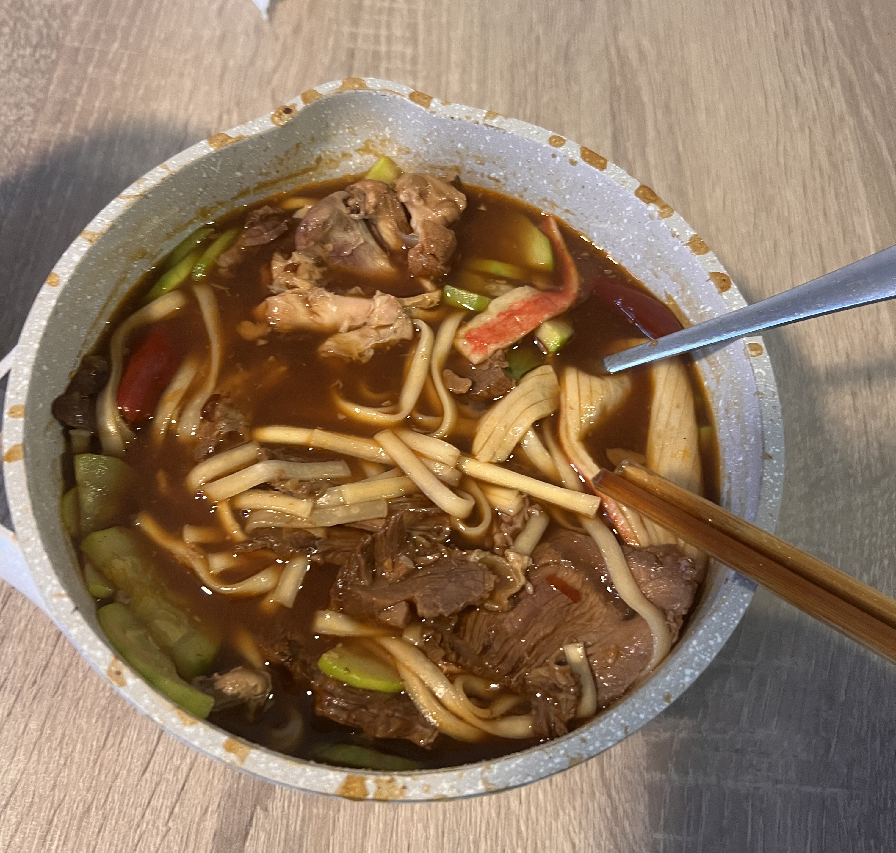

# 卤菜的做法

卤菜是一道经典的中式卤味料理，富含蛋白质和多种维生素。肉质鲜嫩多汁，香气四溢，入味程度可根据浸泡时间自行调整。这道菜适合作为凉菜、下酒菜或搭配主食食用，卤水还可多次使用，越陈越香。
本教程以卤牛肉为例，其他肉类同理。

预估烹饪难度：★★★

## 必备原料和工具

- 卤料包（超市即可购买）
- 黄豆酱
- 豆瓣酱
- 蚝油
- 南腐乳
- 洋葱
- 生姜
- 大蒜
- 干辣椒
- 生抽
- 老抽
- 盐
- 白糖（最好是黄冰糖，用于熬糖色）
- 啤酒
- 牛腱子（或其他肉类）
- 高压锅
- 滤网

## 计算

每次制作前需要确定计划做几份。一份约可供 2-3 人食用。

每份：

- 卤料包 1 包（约 10g）
- 黄豆酱 15ml
- 豆瓣酱 15ml
- 蚝油 15ml
- 南腐乳 15ml
- 洋葱 半个（约 100g）
- 生姜 30g
- 大蒜 40g
- 干辣椒 10g
- 生抽 120ml
- 老抽 60ml
- 盐 10-15g
- 白糖 30g（用于熬糖色）
- 啤酒 1 罐(330ml)
- 牛腱子 500g
- 清水 足量（需要没过所有肉类）

## 操作

建议在此之前查看炒[糖色](./../../condiment/糖色.md)教程

- 牛腱子提前浸泡在冷水中 3 小时以上，去除血水

### 准备卤水

- 准备糖色：锅中加入 30g 白糖，小火加热至糖完全融化并呈现棕褐色，加入 150ml 热水，搅拌均匀备用
- 将洋葱切块，生姜和大蒜拍碎，干辣椒掰断备用
- 在锅中加入足量的水，放入卤料包、洋葱、生姜、大蒜、干辣椒，大火烧开
- 加入黄豆酱、豆瓣酱、蚝油和南腐乳各 15ml，搅拌均匀
- 倒入准备好的糖色，混合均匀
- 加入生抽 120ml 和老抽 60ml，搅拌均匀
- 加入 10-15g 盐调味
- 倒入 1 罐啤酒(330ml)，再次烧开

### 卤制牛肉

- 牛腱子放入锅中焯水 2-3 分钟，捞出并用热水冲洗干净表面的浮沫
- 将焯水后的牛腱子放入已烧开的卤水中，确保卤水没过所有肉类
- 盖上高压锅盖，上汽后继续烹饪 25-30 分钟
- 烹饪完成后，不要开盖保温，自然冷却并浸泡一晚上（这样会更入味）
- 将卤好的肉取出放入冰箱冷藏，使其成型
- 食用前取出切片，可直接食用或凉拌

### 保存卤水

- 卤水重复使用方法：每次卤完肉后，将卤水过滤，去除所有固体内容物，重新烧开杀菌，冷却后可冷藏或冷冻保存。使用时按原配方比例重新添加调味料。（加水量根据卤水使用情况而定）
- 卤水保存得当可以使用很长时间，且越老越香。
- **重要提示**：如卤制素菜，必须另取一部分卤水，单独使用，并且卤制完素菜的卤水不可重复使用。

### 凉拌调料

- 将蒜末、葱花、白芝麻、辣椒粉按 1:1:1:1 的比例混合，依个人口味加小米辣，热植物油中加入少量芝麻油或藤椒油，分次泼在调料上，再加入生抽、醋、蚝油各 10ml，5ml 糖，味精/鸡精，最后 15ml 卤汤混合均匀。
- 凉拌时可搭配拍黄瓜、木耳、油炸花生米、香菜等配菜。

## 附加内容

- 卤水可另取一部分做牛肉面，作为白水面条的汤底，再加上自己喜欢的蔬菜，味道极佳。

卤水：

如果您遵循本指南的制作流程而发现有问题或可以改进的流程，请提出 Issue 或 Pull request 。
