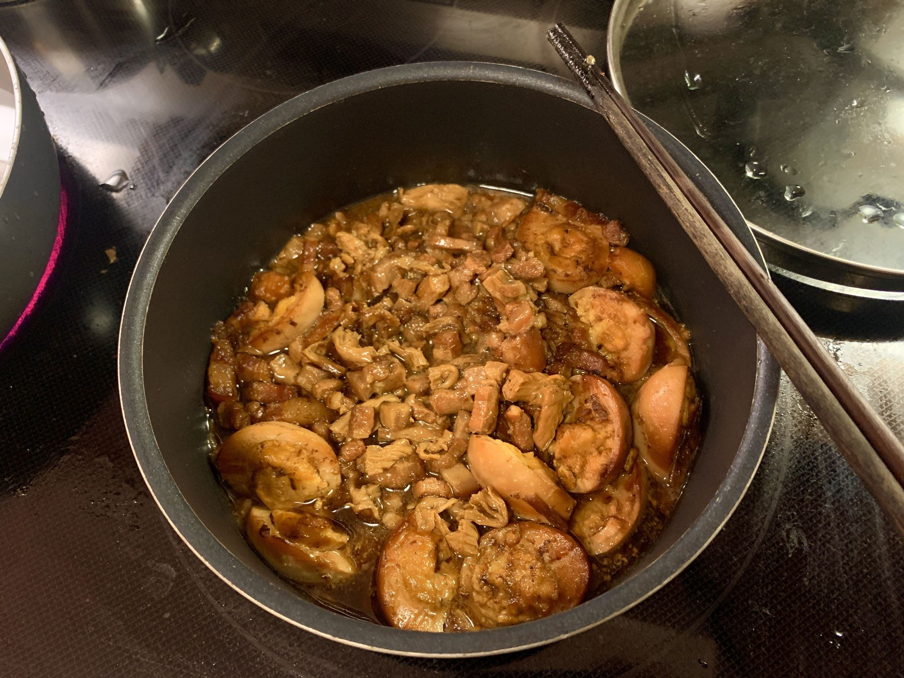
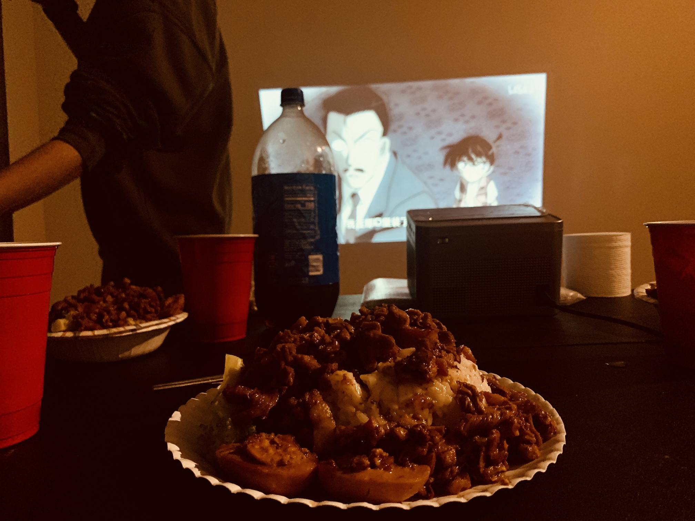

# 台式卤肉饭的做法

糖和脂肪是人类快乐的源泉，富含这二者的台式卤肉饭每一口都能带来直击灵魂的满足感。

本文提供一种操作简单但风味不减的台式卤肉饭做法，预计制作时间 4 小时（0.5 小时操作，3.5 小时炖煮）。

厨房小白可上手。

预估烹饪难度：★★★★★

## 必备原料和工具

- 原味可乐（不可使用无糖可乐）
- 红葱酥（可选，但强烈推荐）
- 洋葱
- 带皮五花肉
- 生抽酱油
- 蚝油（可选）
- 条状腐竹（可选，但强烈推荐，腐竹可极大提升风味）
- 鸡蛋（可选）
- 西兰花（可选，也可替换为其他蔬菜）
- 啤酒
- 料酒（去腥用）
- 十三香粉
- 香菇
- 米饭

## 计算

每次制作前需要确定计划做几份。一份可盛出 4 份快餐店分量的卤肉饭套餐。
每份：

- 原味可乐 250ml
- 红葱酥 5g （可根据个人喜好任意添加）
- 洋葱 $\frac{1}{4}$ 个
- 带皮五花肉 500g
- 生抽酱油 25ml($\pm$5ml)
- 蚝油 5ml
- 条状腐竹 5 根（可根据个人喜好任意添加）
- 鸡蛋 4 个（可任意修改鸡蛋个数）
- 西兰花 300g （可根据个人喜好任意修改）
- 食用油 10-15ml
- 啤酒 100ml
- 料酒 5ml
- 十三香粉 10g
- 香菇 3 个
- 米饭 （根据个人食量决定）

## 操作

- 可乐开盖放气，否则后续会在锅内产生大量泡沫
- 带皮五花肉切成 $0.7cm（长）\times 0.7cm（宽） \times 2.5cm（高）$ 的细长条

- 洋葱切成小块备用。
- 香菇切丁备用
- 腐竹切段备用
- 鸡蛋煮熟剥壳，并用刀划破蛋白（便于入味），备用。
- **大火**热锅，锅内放入 10ml - 15ml 食用油，让油滑满锅底即可。放油的目的是防止五花肉刚下锅时粘锅。等待 5s 使油温稍微升高。
- 放入五花肉条，翻炒至肉色稍微变白，沿锅边淋入料酒 5ml 。继续翻炒至五花肉不再出油。将半熟的五花肉控油盛出备用。**不要洗锅**。
- 将切好的洋葱块和香菇丁下入锅中，翻炒 1 分钟爆出香味
- 将五花肉再放入锅中，继续翻炒 1 分钟至炒匀。
- 加入啤酒至所有肉条 $\frac{1}{3}$ 处，继续翻炒 2 分钟至酒味散尽。
- 加入原味可乐至**刚好淹没所有肉条**，加入生抽 25ml ，蚝油 5ml ，红葱酥 5g ，十三香粉 10g ，搅拌均匀。
- 煮开后，转**中火**，加入腐竹段，煮熟的鸡蛋，搅拌均匀，加盖炖煮。
- 中火炖煮 **30 分钟** 后，转**小火**，继续加盖炖煮 **3 小时**
  - 小火炖煮过程中，每隔 **30 分钟** 搅拌检查一次，防止粘锅。
  - 如发现过干，则可加入 100ml 清水继续炖煮。
- 炖煮结束后，乘一碗米饭，将软烂的卤肉浇在米饭上，并加上卤蛋和西兰花，开始享用。

## 附加内容

- 对于五花肉切条步骤，定义：五花肉带皮面向上摆在桌上，此时肉皮所在平面为长宽形成的平面，垂直此平面的为高。肉条最终效果是肥瘦相间的细长条。（注意：此处肉条一定要细，即长宽较小。细肉条更易于炖煮软糯）。
- 五花肉切条小技巧：
  - 若五花肉是**未冷冻**的，可以放入冰箱**冷冻室 30 分钟** 再取出切条。
  - 若是**冷冻五花肉**，可以在**常温**下放置 **30 分钟** 后再切条。
  - 切条时可以较小的力度将刀刃与肉快速摩擦，如此更易于切割并保护五花肉肥瘦相间的结构。
- 可乐在此处的作用**仅仅是上色和提供甜味**，并不是主要味道来源。**请勿加入过量可乐**，否则成品会偏甜。
- 啤酒可以使肉带上麦香味并解腻。
- 参考资料：[不用加一滴水的！懒人！可乐卤肉饭！](https://www.bilibili.com/video/BV1kA4y1D7vT)

如果您遵循本指南的制作流程而发现有问题或可以改进的流程，请提出 Issue 或 Pull request 。
