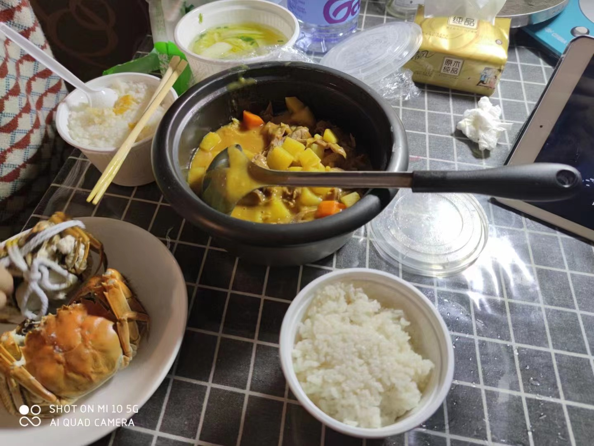

# 咖喱肥牛的做法

咖喱肥牛美味营养并且下饭，吃多了炒炸菜后再吃个咖喱肥牛相当美滋滋。

适合在家吃或者做成便当带去公司吃（微波炉加热也不会有太大味道~）。

并且所需材料少，容易购买，新手一般 40 分钟即可出锅。

预估烹饪难度：★★★★

## 必备原料和工具

- 香叶
- 纯牛奶（推荐卫岗鲜奶）
- 洋葱
- 胡萝卜
- 土豆
- 肥牛卷
- 咖喱块

## 计算

每次制作前需要确定计划做几份。一份正好够 2 个人吃。

每份：

- 香叶 1 片
- 纯牛奶 50ml
- 洋葱 100g
- 胡萝卜 150g
- 土豆 200g （挺饱腹的，酌情添加）
- 肥牛卷 300g （喜欢吃肉就多来点）
- 咖喱块 2 块 （大约 100g）

## 操作

- 洋葱切成条状、胡萝卜以及土豆切成块状，备用
- 烧一锅开水，水沸时将肥牛卷下锅，捞出血沫后放在一边沥水，备用
- 热锅，锅内放入 10ml - 15ml 食用油，**等待 10 秒让油温升高**
- 放入洋葱，翻炒至洋葱变软变透明
- 放入土豆以及胡萝卜**翻炒 2 分钟**
- 加入冷水至淹没所有食材即可
- 将香叶、咖喱块投入锅中，盖上锅盖，**待水沸腾后将火调小然后等待直至土豆块以及胡萝卜块炖至软烂（可用筷子确认）**
- 加入肥牛卷以及牛奶，盖上锅盖再小火煮 2-3 分钟即可出锅（用勺子搅拌食材，注意力度，避免肥牛卷破碎）

## 附加内容

- 咖喱块不用捣碎，直接整块投入即可。
- 操作时，需要注意搅拌食材，避免食材调味料不均匀。

如果您遵循本指南的制作流程而发现有问题或可以改进的流程，请提出 Issue 或 Pull request 。
