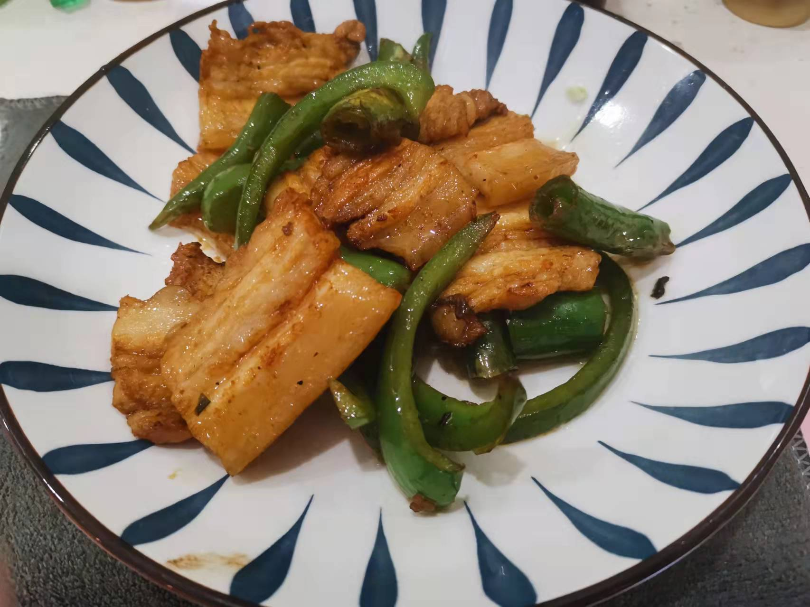

# 回锅肉的做法

预估烹饪难度：★★★★

## 必备原料和工具

- 五花肉
- 小葱
- 生姜
- 青红椒
- 蒜苗
- 料酒
- 豆瓣酱
- 生抽酱油
- 味精

## 计算

- 五花肉的用量为 0.5 斤/男人 0.3 斤/女人 （正宗回锅肉使用二刀肉[俗称：臀尖]制作，肉质坚实，肥瘦合适）
- 小葱 2 棵
- 生姜 10-40g
- 青红椒（根据受辣程度选择, 0-30g）
- 蒜苗 1 把
- 料酒 5ml
- 豆瓣酱 10ml
- 味精 5g
- 生抽 5ml

## 操作

### 五花肉一段处理

- 锅烧热，用手将五花肉紧紧压在锅上炙皮
  - 这一步是为了处理猪皮上的汗腺（或者买肉的时候让师傅烧一下皮，喜欢汗腺的可以无视）
- 用钢丝球把皮洗干净，不洗干净会有苦味
- 将五花肉放入锅中，放入能淹没五花肉的水，放入生姜片、料酒和小葱（取 2 棵小葱打结）
- 开大火煮，水开后撇去浮沫，继续煮 15 分钟，煮至瘦肉部分可以用筷子轻松刺穿

### 配菜处理

- 青红椒切圈
- 蒜苗切段
- 生姜切小薄片
- 将 5ml 豆瓣酱和 5ml 生抽提前混合

### 五花肉二段处理

- 将煮熟的五花肉捞出放入冷水晾凉
- 擦干五花肉的水，切成上肥下瘦的 2mm 的薄片（切厚了口感不好，而且很油）

### 开始炒肉

注意，此步骤**操作要迅速，小心糊锅**

1. 锅烧热，放入一层底油滑锅
2. 放入五花肉煸炒至肥肉透明，肉片微卷（欲称起灯盏窝），二刀肉效果最佳。
3. 倒入豆瓣生抽混合物，5g 味精翻炒 15 秒
4. 放入青红椒圈和小姜片，放入另 5ml 豆瓣酱翻炒 30 秒
5. 放入蒜苗翻炒 60 秒
6. 出锅

### 简易版本

- 选用冰冻五花肉常量放置 0.5 小时 或者鲜五花肉放冰箱冷藏 1 个小时，切成 2-5 mm 薄片
- 开中火，辣椒放过锅中干煸 30-45 秒后取出
- 锅烧热，放入一层底油滑锅，放入姜片煸炒 15 秒
- 倒入五花肉，间隔 10 S 翻炒一次，待五花肉出现焦黄色（翻炒时间越久五花肉口感越硬）
- 倒入之前干煸过的辣椒，生抽调味，继续翻炒 60 秒
- 出锅

## 附加内容

- 不喜欢蒜苗可以换成洋葱或者其他蔬菜，但是要注意蔬菜的易熟程度将蔬菜提前炒至，不然会出现蔬菜半生不熟的情况
- 如果回锅肉比较大块可以切成 5 厘米见方的块，五花肉煮至筷子稍微用力即可插入猪皮即可
- 回锅肉过冷水晾凉后肉质会更紧致
- 回锅肉擦干水是为了避免炒至的时候爆油溅伤
- 回锅肉切记不要切厚了，不然很腻
- 如果您遵循本指南的制作流程而发现有问题或可以改进的流程，请提出 Issue 或 Pull request 。

如果您遵循本指南的制作流程而发现有问题或可以改进的流程，请提出 Issue 或 Pull request 。
