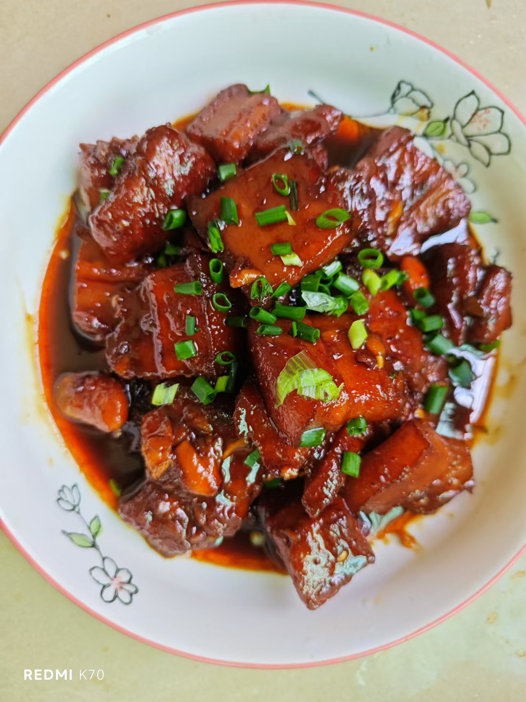

# 家庭版红烧肉的做法

家庭版红烧肉是利用一般家里厨房常见的材料做出美味的一道红烧肉菜肴。

预估烹饪难度：★★★★

## 必备原料和工具

* 五花肉
* 冰糖（或者白砂糖）
* 食用油
* 生抽
* 蚝油
* 老抽
* 姜片
* 蒜头
* 啤酒（或料酒）
* 葱
* 大料：八角，桂皮，香叶，草果
* 干辣椒
* 盐

## 计算

每份：

* 五花肉 300 g
* 冰糖（白砂糖） 100 g
* 食用油 200 g
* 生抽 10 ml
* 蚝油 5 ml
* 老抽 5 ml
* 姜片 2 片
* 蒜头 3 颗
* 料酒 100 ml
* 葱 1 根
* 盐 10 g

## 操作

* 将锅烧热，不放油，将猪皮朝锅底烫至焦黄（1—2min）。这步操作可以有效的去除猪肉的异味。
* 用菜刀将猪皮刮干净，洗干净。
* 焯水：将猪肉切成两段（先不切块），冷水下锅，放入姜片，料酒。开中火，将浮沫捞起倒掉。焯水3min.
* 焯水结束把猪肉放凉，切成麻将块大小，厚薄均匀。
* 锅烧热，不放油，将沥干水分的五花肉直接倒入锅中，中火，慢煎，直至五花肉猪油被煎出。这可以极大的减少五花肉的肥腻感，煎出的猪油可以用来炒菜，很香。
* 锅留底油，开小火，开始炒糖色：将冰糖或白砂糖倒入锅中，不断搅拌，使冰糖融化速度加快，直至冰糖化为枣红色并不断冒出密集的小泡。
* 保持最小火，倒入五花肉，将糖色均匀裹满每一块肉。（最小火是为了不使糖色炒过头而发苦）
* 放入大料：干辣椒，八角，桂皮，香叶。与五花肉一起翻炒出香味。
* 倒入生抽，老抽，啤酒，加开水没过五花肉。
* 先不加盐，过早加盐会使瘦肉变柴。
* 盖上锅盖，小火焖煮十五分钟后加盐，放入蒜子。
* 勤查看锅中水的状态
* 剩余少量汤汁时，将辅料捡去不要，大火收汁，不断翻动。
* 装盘，撒上葱花。

如果您遵循本指南的制作流程而发现有问题或可以改进的流程，请提出 Issue 或 Pull request 。
