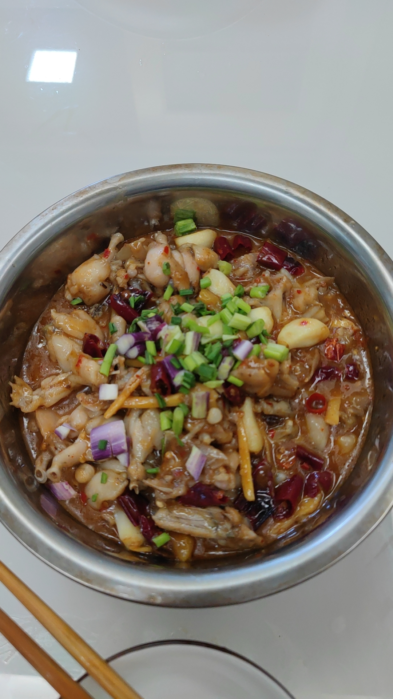

# 尖叫牛蛙的做法

尖叫牛蛙是一道容易完成的菜。一般初学者只需要 1-2 小时即可完成。该菜品味道鲜美之外，还具有开胃功效，非常适宜食欲不佳的时候做，老少皆宜。（能吃辣最好）

预估烹饪难度：★★★★

## 必备原料和工具

- 牛蛙肉
- 泡姜
- 泡椒
- 野山椒（也可以用干红辣椒替代）
- 青红辣椒
- 大蒜
- 豆瓣酱（推荐郫县豆瓣）
- 盐巴
- 胡椒粉
- 生粉（干淀粉也可）
- 啤酒（推荐雪花）
- 料酒
- 藤椒油（可选）
- 猪油（可选）
- 葱花

## 计算

1 份

每份：

- 牛蛙肉块 800g （买 3 斤活蛙，建议挑小个头的，肉质鲜嫩）
- 泡姜 20-30 克 （看个人口味，喜欢重口一点可以多放）
- 泡椒 5-10 克 （看个人吃辣的承受能力，不能吃辣的建议减半为 2.5 克，微微辣）
- 野山椒 10 克
- 青红辣椒 20 克
- 大蒜 30-50 克 （可以根据口味偏好调整，最好不低于 30 克）
- 豆瓣酱 20-30 克 （重口选 30，想吃清淡点 20 克。PS 这菜不可能太清淡，哈哈）
- 盐巴 15 克
- 胡椒粉 10 克
- 啤酒 400-500ml
- 料酒 10ml
- 藤椒油 5-10ml
- 生粉 30 克 （干淀粉可以平替）
- 猪油 20ml（没有猪油也可，用食用油替代）
- 食用油 200ml
- 葱花 5 克

## 操作

- 牛蛙肉洗净后控干水分，加入 10 克以上的盐巴和 50ml 以上的啤酒，用手抓 5 分钟，去除牛蛙肉的腥味
- 然后对着清水冲洗，直至不再流出血水和杂质，控干水分，放到合适的器皿中，准备腌制
- 加入 5 克盐，30 克生粉，10ml 料酒，5 克胡椒粉，用手抓均匀，腌制 5-10 分钟
- 将泡姜 泡椒 野山椒 切丝或者片（根据自己刀工选择），青红辣椒切成圈圈 大蒜拨开即可
- 起锅烧热，加入 200ml 食用油（锅底比较平的可以再加 100ml）,烧至 6 成油温（有小气泡出现），将腌制好的牛蛙倒入，快速过油炸制，10 秒钟后捞出（不能超时太多，否则会导致蛙肉老柴）
- 捞出蛙肉后，控油，并将锅中的热油倒出到碗中，保留 30ml,加入 20ml 猪油（如果没有，则在锅中保留总共 50ml 食用油）
- 待油温 6 成热，加入泡姜、泡椒、野山椒、大蒜，超出香味，加入豆瓣酱 20 克，中火翻炒至出红油（时间控制在 30 秒），倒入 400ml 啤酒，
- 然后倒入炸过的牛蛙肉，用勺子推着翻，不要用力搅拌，加入 5 克胡椒粉，加入 5ml 藤椒油，中火慢焖 3 分钟
- 加大火力，大火收汁半分钟，加入青红辣椒圈，再煮 10 秒准备起锅
- 盛到盆里，撒上葱花，可以开动了！

## 附加内容

- 控干水分的时候可以选择漏勺按压
- 生粉抓揉的时候要均匀覆盖蛙肉

如果您遵循本指南的制作流程而发现有问题或可以改进的流程，请提出 Issue 或 Pull request 。
