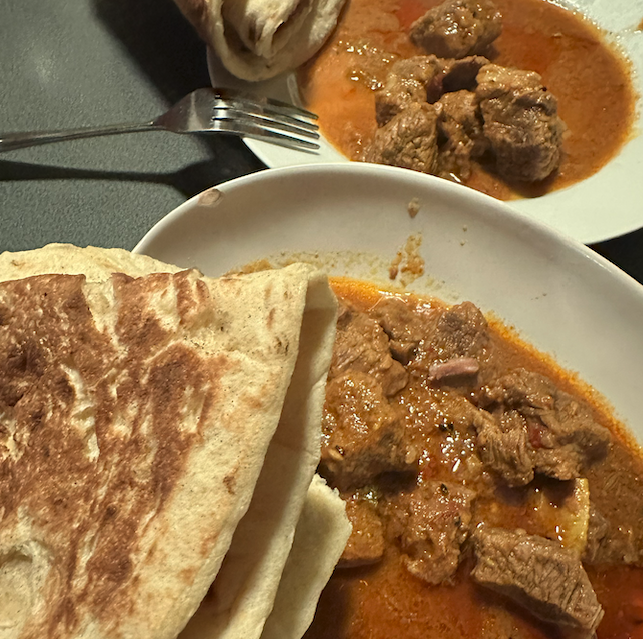
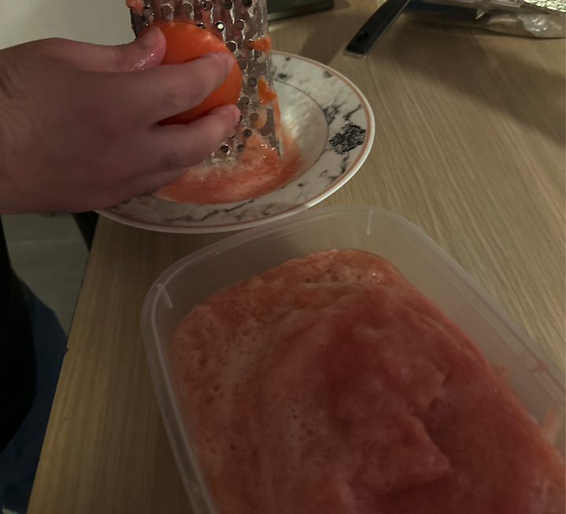
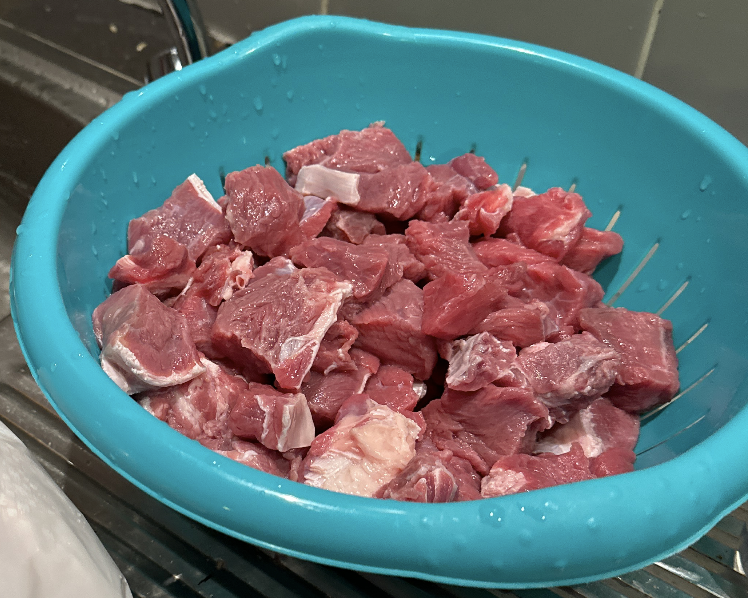
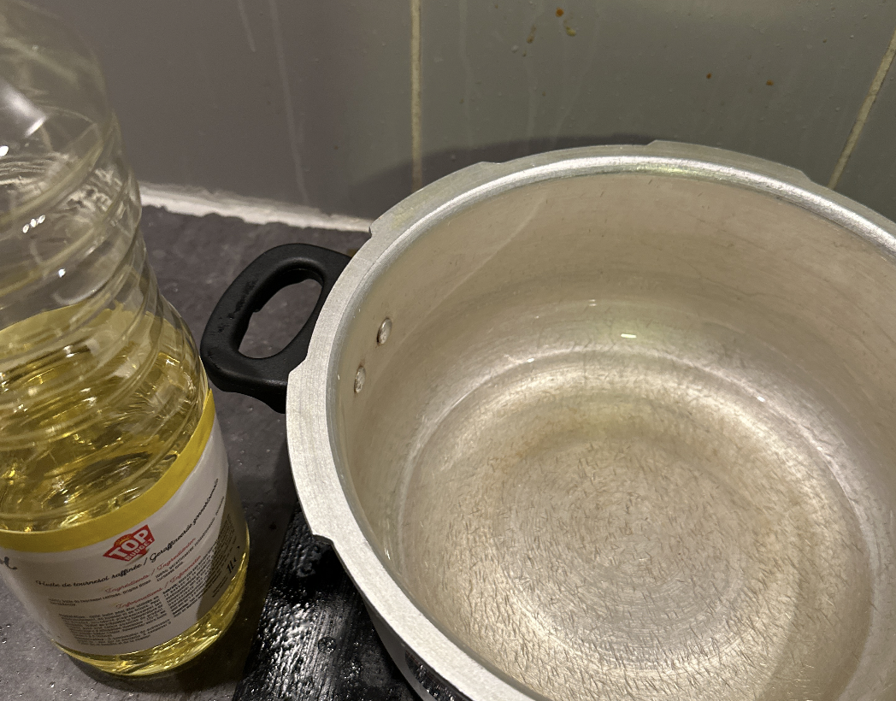
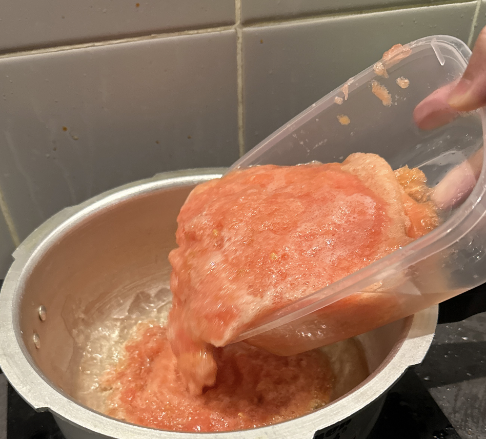
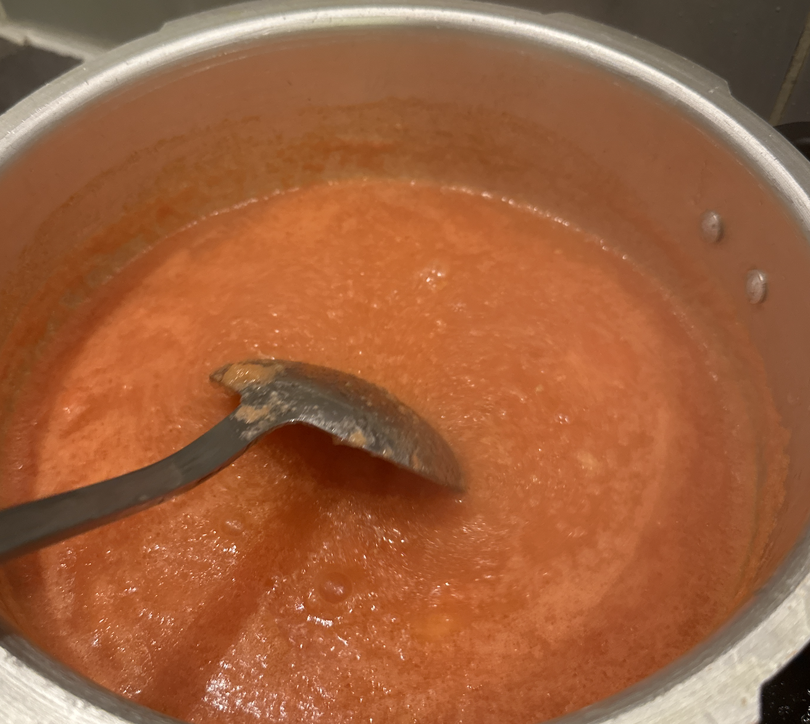

# 巴基斯坦牛肉咖喱的做法

Achar gosht（巴基斯坦牛肉咖喱）是一道来自巴基斯坦的特色咖喱菜品。这道菜融合了咖喱的香浓和牛肉的软糯口感，风味独特，偏辣口。它富含优质蛋白质和多种维生素，营养价值丰富。制作过程需要 2.5 小时，步骤并不复杂，是一道适合在周末慢慢烹饪的美味佳肴。

预估烹饪难度：★★★★★

## 必备原料和工具

- 普通的炒锅
- 电饭煲/电炖锅
- Masala 粉（品牌可选 Shan）
- 牛肉
- 番茄
- 螺丝椒
- 原味酸奶
- 蒜粉
- 姜粉

## 计算

这里以 1kg 牛肉的所需要的配菜量作为标的，可以通过它计算出不同菜量。1kg 牛肉做出的咖喱大概够 5 个人吃。

1kg 牛肉所需要的配菜量：

- 番茄🍅 4 个
- 螺丝椒 2 个（大个的）
- 原味酸奶 1 盒
- Masala 粉一包 50g
- 蒜粉 5g
- 姜粉 5g

## 操作

- 全部螺丝椒切成段状，备用
- 全部番茄打成番茄蓉，备用

- 牛肉切成 2cm 的小块，洗净备用

- 炒锅中倒入一层油（用来防止番茄蓉沸腾蒸发）

- 倒入番茄蓉，持续搅拌 2-3 分钟，等待它越变越红

- 加入 5g 蒜粉，5g 姜粉和 1 包 50g 的 Masala 粉，搅拌均匀
- 加入牛肉和螺丝椒段，搅拌均匀
- 加入 1 盒酸奶（为了让整个酱汁变得粘稠），搅拌均匀
- 将整锅材料转移到电饭煲/电炖锅，并加入 250 ml 的水，开启炖肉/慢炖档，设定时间 2-3 个小时
- 等待完成，开锅检查牛肉软糯，就可以吃了

## 附加内容

这道菜是从一个巴基斯坦的朋友那里偷师而来，特地整理了笔记，绝对正宗。

通常配以 烙饼(roti)、馕(naan) 或 米饭 食用。

如果想做 Chicken karahi 流程几乎是一样的，除了是先用油和各种花椒胡椒煎鸡肉变黄。

如果您遵循本指南的制作流程而发现有问题或可以改进的流程，请提出 Issue 或 Pull request 。
