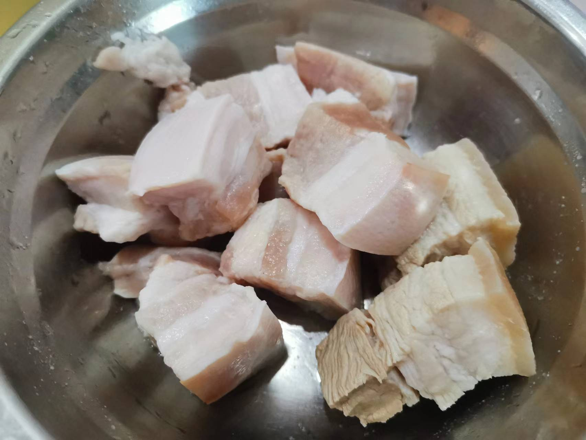
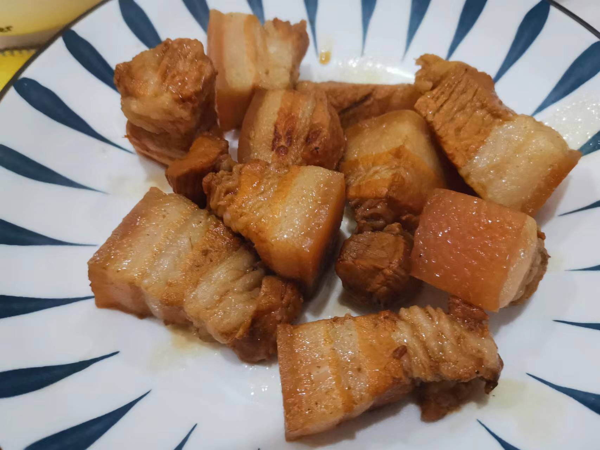

# 徽派红烧肉的做法

徽式红烧肉是一道由五花肉等食材制成的菜肴。

预估烹饪难度：★★★★

## 必备原料和工具

* 五花肉
* 白砂糖
* 食用油
* 生抽
* 蚝油
* 老抽
* 姜片
* 蒜头
* 料酒
* 葱
* 五香粉
* 盐

## 计算

每份：

* 五花肉 300 g
* 白砂糖 100 g
* 食用油 200 g
* 生抽 10 ml
* 蚝油 5 ml
* 老抽 5 ml
* 姜片 2 片
* 蒜头 3 颗
* 料酒 100 ml
* 葱 1 根
* 五香粉 10 g
* 盐 10 g

## 操作

* 五花肉切块，每块 2-3 cm 大小
* 锅中加入 150 ml 食用油，倒入五花肉，煎炸 2 分钟 后，加入盐，翻炒五花肉，2 分钟 后出锅
* 锅中加入 50 ml 食用油，倒入白砂糖，翻炒到咖啡色
* 倒入五花肉，翻炒 30 S ，加入姜片、蒜头后翻炒 30 S
* 加入料酒，五香粉、葱，加入水没过五花肉，盖上锅盖煮 10 分钟
* 加入生抽、老抽、蚝油，中火煮 20 分钟
* 开锅，大火烧汁，端盘

## 附加内容

* 葱是整根，不需要切碎
* 步骤二加盐的目的是锁住五花肉的油脂
* 制作过程，用部分五花肉做了水煮处理，跟未处理的一起做后续制作，发现未水煮的肉质更 Q 弹

如果您遵循本指南的制作流程而发现有问题或可以改进的流程，请提出 Issue 或 Pull request 。
