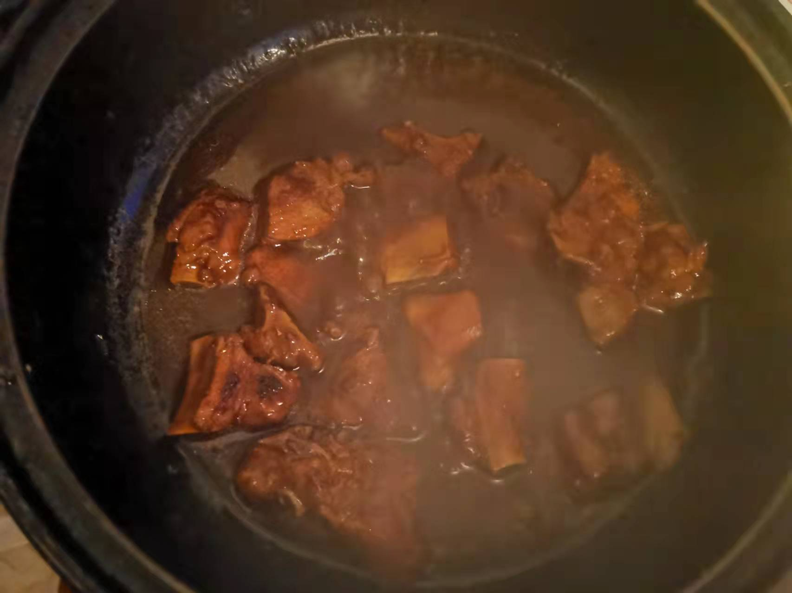
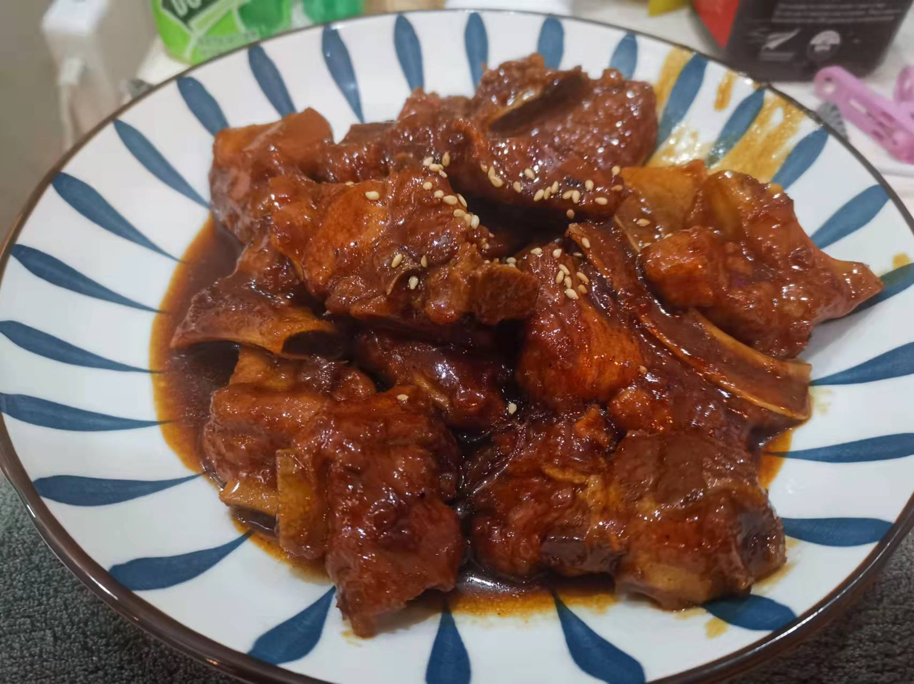

# 糖醋排骨的做法

是糖醋味型中具有代表性的一道大众喜爱的特色传统名菜

预估烹饪难度：★★★★

## 必备原料和工具

* 排骨
* 白砂糖
* 食用油
* 生抽
* 蚝油
* 老抽
* 鸡精
* 姜片
* 芝麻
* 番茄酱
* 香醋
* 五香粉

## 计算

每份：

* 排骨 300 g
* 白砂糖 20 g
* 食用油  350 ml
* 生抽 5 ml
* 蚝油 5 ml
* 老抽 5 ml
* 鸡精 2 g
* 姜片 2 片
* 芝麻 2 g
* 番茄酱 10 g
* 香醋 5 ml
* 五香粉 2 g

## 操作

* 排骨+姜片冷水下锅，煮开后用勺子舀去白色油沫，2-3 分钟后出锅
* 冷水清洗排骨，清洗 2-3 遍
* 锅中加入 300 ml 食用油，油开后倒入排骨，煎炸 3-5 分钟后出锅
* 小火起锅，加入 50 ml 食用油，加入白砂糖 30 g ，轻轻搅拌到糖水变成黄色
* 倒入排骨翻炒 30 S 后，加入香醋、生抽、蚝油、鸡精、番茄酱、五香粉 翻炒 30 S 后，加入清水没过排骨
* 中火煮 20 分钟，加入老抽上色，开锅烧汁
* 起锅摆盘，散上芝麻

## 附加内容

* 步骤三油炸排骨时，可以根据实际情况选择加入淀粉包裹排骨
* 步骤六可以加少量水淀粉，但汤汁的自勾芡已经足够定性排骨
* 烧汁过程中，可以根据汤汁酸甜度选择再加 3-5 g 白砂糖、2-5 ml 香醋

如果您遵循本指南的制作流程而发现有问题或可以改进的流程，请提出 Issue 或 Pull request 。
