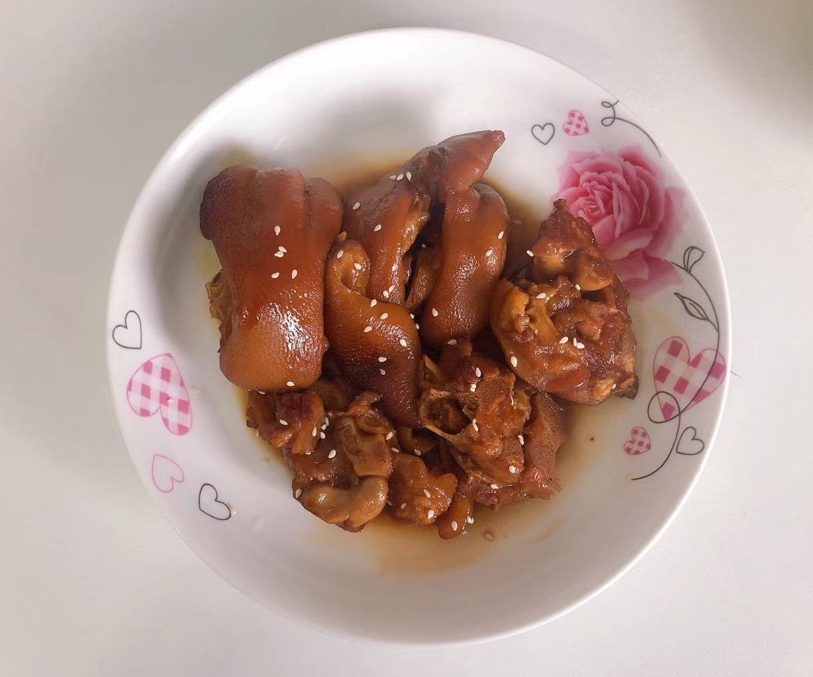

# 红烧猪蹄的做法

红烧猪蹄营养丰富，味道香，汤汁浓郁、下饭强。

预估烹饪难度：★★★★

## 必备原料和工具

- 猪蹄
- 香叶
- 姜
- 葱
- 老抽
- 桂皮
- 冰糖
- 料酒
- 生抽
- 盐
- 八角
- 食用油

## 计算

一份正好够 3-4 人吃。

- 猪蹄：2~3 根
- 食用油：30ml
- 香叶 2 片
- 姜 5 片
- 葱半根
- 桂皮 1 块
- 冰糖 7-8 粒
- 料酒 30 ml
- 生抽 20 ml
- 老抽 20 ml
- 盐 8 克
- 八角 4 个

## 操作

### 开始制作

* 冷水锅中放入热心摊主剁好的猪蹄，加入 20 ml 料酒与葱姜，煮 15 分钟去掉血腥
* 热锅冷油，倒入 30ml 食用油，放入 7-8 粒冰糖，开小火，熬成糖色，期间用锅铲把冰糖压碎，大概熬 2 分钟
* 熬成糖色后，放入焯过水的猪蹄，继续小火，翻炒猪蹄，直至所有猪蹄两面微黄
* 加入香叶 2 片、桂皮 1 块、八角 4 个、生抽 20 ml、老抽 20 ml、料酒 10 ml、姜 3 片、盐 8 克，转中火、继续翻炒 1 分钟
* 加入开水或者冷水，水需要没过猪蹄，盖上锅盖，大火烧开，烧开之后关火
* 把锅内的食材全部倒入高压锅中，高压锅中需要 15 分钟（如果同学没有高压锅，可放在锅中大火转小火熬制即可）
* 15 分钟之后，把高压锅的食材倒入炒锅中，开大火收汁，此时可用筷子尝下味道、淡的话可以加 2~3g 盐
* 大火收汁时长根据锅中的水来算，一般 30 秒即可，多留点也无碍、红烧猪蹄汤也是很下饭的

## 附加内容

如果您遵循本指南的制作流程而发现有问题或可以改进的流程，请提出 Issue 或 Pull request 。
