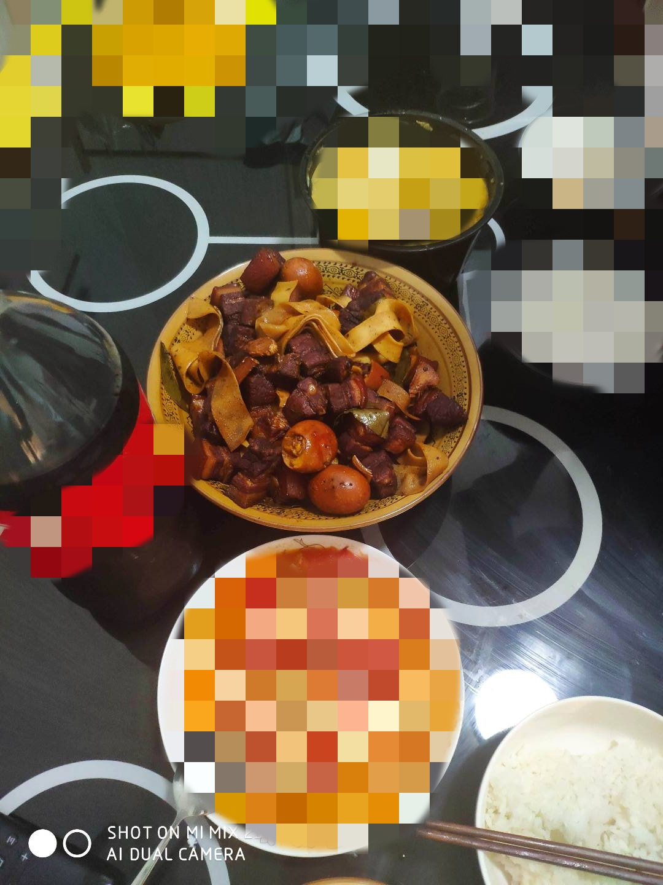

# 简易红烧肉的做法

这份红烧肉教程是一道新手不败的菜谱。配着米饭好吃的停不下来，香糯无敌棒色泽诱人肥而不腻。建议搭配米饭食用。

预估烹饪难度：★★★

## 必备原料和工具

- 注：如果有可能，请尽量把刀磨的锋利一些。
- 主料：`大肉`、`鸡蛋`（可选）、`豆皮`（可选）
- 辅料：`生姜`、`冰糖`、`生抽`、`老抽`、`料酒`、`香叶`、`八角`、`盐`、`水`、`葱`（记得要开水）

## 计算

每次制作前需要确定计划做几份。一份正好够 2-3 个人吃。

如果只有 1 人食用，可以考虑食材减半。

- 猪五花肉：约 3~4 斤
- 姜： 6 片
- 冰糖：15 克（约 7 块）
- 生抽：10ml
- 老抽：15ml
- 料酒：5ml
- 开水：没过食材的量，需要 600ml-900ml
- 香叶：3 片
- 八角：2 个
- 鹌鹑蛋（可选，没有鹌鹑蛋，可以用同等重量的鸡蛋代替）：0-2 个
- 豆皮（可选）：0-80g
- 盐：2-3g

## 操作

### 原材料准备

- `猪五花肉`切大块（约 4.5cm ，冷冻半小时至一小时更好切）
- `豆皮`切 2cm 的宽度
- `生姜`切片（每片厚度约 3mm ）
- `水`烧开
- `鹌鹑蛋`煮熟并用`叉子`/`牙签`扎孔（尽量多些好入味）
- `大葱`大葱白色的部分`葱白`

### 开始制作

- 冷水锅中放入切好的`猪五花肉`，加入料酒与葱姜，煮 15 分钟去掉血腥
- 锅中放入两片`生姜`提味
- 开中小火后直接加入`五花肉`，不需要放入食用油，每块`五花肉`六个面都煎一下，煎至出油即可
- 将煎出的油倒出备用，并将`五花肉`推至一边，加入 15g `冰糖`，翻炒至`冰糖`融化；
- 融化后将五花肉与冰糖炒至融合上色，加入
  - `生抽` 10ml
  - `老抽` 15ml
  - `料酒` 5ml
  - 翻炒至上色；
- 加入`烧好的开水`炖煮 40 分钟（刀工差的同学切的过大请自觉延长炖煮时间），并放入
  - `生姜` 2 片
  - `香叶` 3 片
  - `八角` 2 个
- 盖上锅盖煮至沸腾后，加入煮好扎好孔的`鹌鹑蛋`和`豆皮`，开中小火，等待 40 分钟。（中途可适当翻搅防止粘锅）；
- 打开锅盖，待汤汁快没有的时候开大火收汁（切记不可收干）；
- 加入 2-3g `盐`，翻炒一下，就可以出锅了。

## 附加内容

如果您遵循本指南的制作流程而发现有问题或可以改进的流程，请提出 Issue 或 Pull request 。
